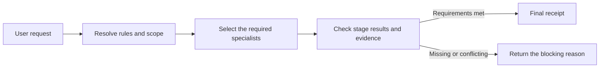

# Agent Governance Suite

[한국어](README.md) | English

Agent Governance Suite is a local Codex plugin that keeps scope, risky changes, verification evidence, and independent review in one workflow.

When an agent says a task is finished, the suite checks whether the required conditions were actually met. A workflow cannot finish when test evidence is missing, the implementer audits their own work, or an old audit is reused after the target has changed.

The current release is `v1.0.3`. It includes ten specialist skills and one orchestrator.

## How it works



The orchestrator selects only the checks required by the request and puts them in order. The local MCP server freezes that plan, then validates stage order, result shapes, evidence, and audit conditions. It issues a final receipt only after every required gate passes.

### Example: a production deployment

1. Before work starts, the suite resolves the applicable instructions, repository conventions, allowed scope, and completion criteria.
2. For a hard-to-reverse change, it checks the target, authority, and recovery plan before execution.
3. When several agents work together, it assigns ownership and keeps implementation separate from audit.
4. After the change, it compares the result with the original scope and checks the test evidence.
5. It refuses completion if the auditor also implemented the change, the audit targets an older result, or a blocking finding remains open.

These checks run in the MCP workflow layer. They are not recommendations that an agent can silently skip.

## Terms used in this project

| Term | Meaning here |
| --- | --- |
| Specialist skill | Handles one job, such as checking scope, mutation risk, or completion evidence. |
| Orchestrator | Selects the required specialists and manages their order and handoffs. |
| MCP server | Checks the plan and stage results against local workflow contracts. |
| Evidence | A record used to support completion, such as test output, a file locator, or a digest. |
| Final receipt | A structured result showing that every required stage and gate passed. |

## Problems it handles

| Common failure | What the suite does |
| --- | --- |
| Several `AGENTS.md` files make instruction scope unclear | Resolves which instruction files apply to the actual work target and in what order. |
| An agent edits files outside the requested scope | Captures a baseline before the change and compares it with the final result. |
| A destructive action, deployment, or permission change starts without preparation | Checks the target, authority, approval requirements, and recovery path before execution. |
| An agent reports completion without running the required checks | Requires current evidence for each acceptance criterion. |
| An implementer audits their own work or reuses an old audit | Checks actor separation, target identity, and audit freshness. |
| The same failure is retried without new evidence | Groups failure episodes and identifies the next useful diagnostic check. |

The orchestrator does not run all ten skills for every request. It selects the roles the task needs, and a simple request can call one specialist directly.

## Install and try it

Node.js 22.13.0 or later is required.

```bash
codex plugin marketplace add jaeseongs95/agent-governance-suite --ref v1.0.3
codex plugin add agent-governance-suite@agent-governance
```

Start a new Codex session after installation so Codex can load the bundled skills and MCP tools. Then call the orchestrator:

```text
Use $orchestrator to define the scope and success criteria for this task, then manage the required checks and completion evidence: <your task>
```

You can also call one specialist directly:

```text
Use $mutation-risk-preflight before making this destructive change.
Use $acceptance-evidence-validator to verify that each acceptance criterion has current evidence.
```

Check the installed runtime from the plugin root:

```bash
node scripts/check-runtime.mjs
```

The MCP server stores workflow state and its plan-signing key in SQLite. By default, it creates the database in the operating system's per-user state directory. Set `AGENT_GOVERNANCE_DB_PATH` to an absolute SQLite file path, or to a path relative to the MCP working directory, when you need to control its location. Protect that directory so only the account running the MCP server can access it.

```bash
AGENT_GOVERNANCE_DB_PATH=/absolute/path/workflows.sqlite3 pnpm dev
```

Each specialist remains available when the MCP server is unavailable. Orchestrated runs that enforce stage order and issue a final receipt require the MCP server.

## Included skills

| When | Skill | Version | Responsibility |
| --- | --- | --- | --- |
| Before work | `instruction-scope-resolver` | 0.1.0 | Finds the instructions and precedence rules that apply to the work target. |
| Before work | `workspace-convention-profiler` | 0.1.1 | Records repository structure, commands, and test conventions with evidence. |
| Before work | `task-contract` | 0.1.0 | Defines the objective, scope, risk, and completion criteria. |
| During work | `coordinate-subagents` | 0.1.2 | Splits independent work and assigns ownership and verification duties. |
| During work | `independent-deliberation-panel` | 1.0.0 | Reviews evidence and counterarguments for complex decisions. |
| Before and after changes | `change-scope-guardian` | 0.1.1 | Captures a baseline and checks whether the final change stayed in scope. |
| Before changes | `mutation-risk-preflight` | 0.1.1 | Checks the target, authority, approval, and recovery conditions for risky mutations. |
| Before completion | `acceptance-evidence-validator` | 0.1.0 | Verifies current evidence for every acceptance criterion. |
| Before completion | `independent-audit-gate` | 0.1.1 | Requires a reviewer who is independent from the implementer for high-risk results. |
| After a failure | `blocker-diagnostician` | 0.1.0 | Classifies repeated failures and selects the next diagnostic step. |

Every specialist can run on its own. Use `$orchestrator` when a request needs more than one role. Exact source tags, commits, and checksums are pinned in `skills/source-lock.json`.

## Enforcement scope and limits

The MCP server reads capabilities, execution phases, and artifact dependencies from `SkillDescriptor.v2`. It creates a plan with schema checksums and an HMAC signature, then checks:

- whether the plan changed after the run started
- whether each stage used the expected order and revision
- whether provider results match their declared schemas and state mappings
- whether required artifacts and verified evidence exist before dependent stages run
- whether deliberation and mandatory audit results match the current target and policy conditions
- whether any blocking item remains unresolved

The MCP server is not a security boundary against a hostile caller. Specialist skills and callers submit `verified` flags, evidence locators, and actor identifiers as trusted inputs. The server checks their structure and consistency across workflow stages, but it does not authenticate a real person or prove that the source evidence is genuine.

Active runs, their current revisions, the run ID sequence, and the plan-signing key are stored in SQLite, so they remain available after an MCP server restart. SQLite stores the complete `WorkflowReceipt` as plaintext JSON, including each `StageResult` provider output, evidence notes, findings, blockers, and errors. Source code, raw logs, secrets, or personal data submitted in those fields will therefore remain in the database. The server has no automatic retention or deletion policy: callers must avoid submitting sensitive source material and manage access permissions and retention for the database and its directory. The default `WorkflowService` constructor keeps its in-memory behavior for tests and embedded use. Environments that require authenticated identity, encrypted long-term retention, or evidence integrity against hostile actors still need a separate identity and evidence service.

## Repository layout

```text
.codex-plugin/plugin.json  Plugin metadata
.mcp.json                  Local STDIO MCP server configuration
skills/                    The orchestrator and specialist skills
mcp-server/                MCP server implementation
contracts/                 Shared JSON Schema contracts
scripts/                   Validation, build, and skill import tools
tests/                     Regression and integration tests
```

`skills/orchestrator/` handles classification, ordering, handoffs, and result integration. It does not replace specialist judgment or independent audit. The MCP server routes providers through capabilities and declarative contracts in `skills/registry.json`, without branching on specialist names.

## Development and validation

Development requires Node.js 22.13.0 or later and Corepack.

```bash
corepack enable
pnpm install --frozen-lockfile
pnpm lint
pnpm build
pnpm test
pnpm bundle:check
pnpm validate:all
```

In a Codex development environment, you can also run the official validators from the system `skill-creator` and `plugin-creator`. If Python 3 is not on the system path, set `PYTHON` to its absolute executable path.

```bash
pnpm validate:official
```

Run `git diff --check` after documentation changes. Start the local MCP server with `pnpm dev`.

## Adding and importing skills

Create a specialist skeleton with normal, boundary, and expected-failure fixtures:

```bash
pnpm new:skill --name evidence-normalizer --phase validation --capability evidence-normalization
```

Only import clean tags or commits from another repository. The importer uses `integration/skill-descriptor.json` when present. For a legacy skill, `--phase` and `--capability` can supply a single provider definition.

```bash
pnpm import:skill --source <path-or-url> --ref <tag-or-sha> --skill-path <path> --phase <phase> --capability <capability>
pnpm import:skill --source <path-or-url> --ref <new-tag-or-sha> --skill-path <path> --replace true
pnpm validate:skill --name <skill-name>
```

The importer reads only the requested Git ref from a temporary checkout. It excludes `.git`, `__pycache__`, `evals/results`, and ordinary build output, then records the source ref, commit, and checksum in `skills/source-lock.json`. Replace generated fixtures with real behavior cases before submitting an import pull request.

Public contracts use JSON Schema 2020-12 under `contracts/`. Compatible skill additions are minor releases, fixes are patch releases, and incompatible changes to contracts, authority, or identifiers require a major release.

## Documentation and contributing

- [Architecture](docs/architecture.md) (Korean)
- [Release checklist](docs/release.md) (Korean)
- [Additional skill implementation plan](docs/additional-skills-implementation-plan.md) (Korean)
- [Contributing](CONTRIBUTING.md)
- [Security policy](SECURITY.md)

## License

[MIT License](LICENSE)
