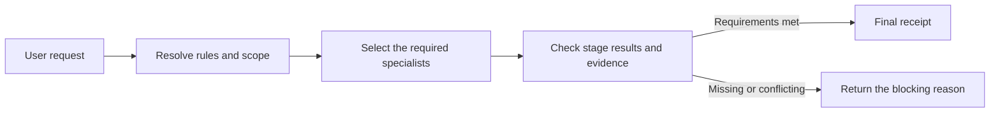

# Agent Governance Suite

[한국어](README.md) | English

Agent Governance Suite is a local Codex plugin that keeps scope, risky changes, verification evidence, and independent review in one workflow.

When an agent says a task is finished, the suite checks whether the required conditions were actually met. A workflow cannot finish when test evidence is missing, the implementer audits their own work, or an old audit is reused after the target has changed.

<!-- release-version:start -->
The current public release is `v1.16.1` and includes fifteen governance specialist skills, one local task-continuity infrastructure skill, and one Korean prose workflow. This release changes only how the Claude Code distribution is generated; skills, the MCP server, and the Codex distribution behave as in v1.16.0. Claude-only wording now lives in per-skill files, so changes to shared skills or Codex-only files no longer have to update the generated Claude plugin in the same change. The candidate-v2 policies applied to `korean-prose-editor` in v1.16.0 were not covered by the quality-gate pass (`0.3.0-gate-1`) and have not been quality-evaluated yet.
<!-- release-version:end -->

## Problems it handles

| Common failure | What the suite does |
| --- | --- |
| Several `AGENTS.md` files make instruction scope unclear | Resolves which instruction files apply to the actual work target and in what order. |
| An agent edits files outside the requested scope | Captures a baseline before the change and compares it with the final result. |
| A destructive action, deployment, or permission change starts without preparation | Checks the target, authority, approval requirements, and recovery path before execution. |
| An agent reports completion without running the required checks | Requires current evidence for each acceptance criterion. |
| An implementer audits their own work or reuses an old audit | Checks actor separation, target identity, and audit freshness. |
| The same failure is retried without new evidence | Groups failure episodes and identifies the next useful diagnostic check. |

The orchestrator does not run every specialist for every request. It selects the roles the task needs, and a simple request can call one specialist directly.

## How it works



The orchestrator selects only the checks required by the request and puts them in order. The local MCP server freezes that plan, then validates stage order, result shapes, evidence, and audit conditions. It issues a final receipt only after every required gate passes.

For orchestrated workflows, the plan now also binds the execution capability of semantic stages. Bootstrap and each semantic stage receive a minimum model class and reasoning-effort floor based on role and risk. If the actual runtime metadata is missing or below that floor, the MCP layer rejects a `passed` result. The policy therefore prevents a weaker session configuration from silently satisfying a higher-assurance stage without pinning the suite to one product model.

## Install and try it

Node.js 22.13.0 or later is required.

<!-- release-install:start -->
```bash
codex plugin marketplace add jaeseongs95/agent-governance-suite --ref v1.16.1
codex plugin add agent-governance-suite@agent-governance
```
<!-- release-install:end -->

Start a new Codex session after installation so Codex can load the bundled skills and MCP tools. Then call the orchestrator:

The task-continuity lifecycle hook runs only after you review and trust its current definition in Codex `/hooks` following installation or a hook change. Existing specialist skills and workflow MCP operations continue to work when the untrusted hook is skipped.

```text
Use $orchestrator to define the scope and success criteria for this task, then manage the required checks and completion evidence: <your task>
```

You can also call one specialist directly:

```text
Use $mutation-risk-preflight before making this destructive change.
Use $acceptance-evidence-validator to verify that each acceptance criterion has current evidence.
```

Check the installed runtime from the plugin root:

```bash
node scripts/check-runtime.mjs
```

Each specialist remains available when the MCP server is unavailable. Orchestrated runs that enforce stage order and issue a final receipt require the MCP server.

### Use with Claude Code

The Claude Code distribution lives separately in `claude-plugin/`. It shares no files, hooks, MCP configuration, or state databases with the Codex plugin.

```text
/plugin marketplace add jaeseongs95/agent-governance-suite
/plugin install agent-governance-suite@agent-governance-claude
```

Start a new session after installation and call skills as `/agent-governance-suite:orchestrator` or `/agent-governance-suite:mutation-risk-preflight`. Differences from Codex:

- Workflow and continuity state is stored in the per-plugin data directory Claude Code provides (`${CLAUDE_PLUGIN_DATA}`).
- `codex-token-usage-analyzer` is omitted because it reads Codex session logs only.
- Independent audits and deliberation use the `independent-auditor` and `deliberation-reviewer` subagents, which do not inherit the parent conversation.
- `instruction-scope-resolver` checks the `CLAUDE.md` hierarchy in addition to the `AGENTS.md` chain.
- The Anthropic API rejects tool schemas with a top-level `oneOf`, so the Claude distribution sets `AGENT_GOVERNANCE_TOOL_SCHEMA_PROFILE=anthropic` to flatten only the advertised `plan_workflow` schema. Server-side validation still uses the same contract, and without this value the server advertises the existing schemas unchanged.
- With the same value the server also advertises session `instructions`, which Claude Code places in its system prompt at session start: an intake rule to classify the failure impact of a request before editing files or running commands and, when the impact is high, to call the orchestrator first to decide which specialist stages the request needs and which it does not, then to invoke the chosen stages at their point in the work. Without the value the server advertises no `instructions`.
- Orchestrated workflows that require execution assurance return `BINDING_REQUIRED` and do not start, because no trusted execution observation is available. The Codex distribution server behaves the same way under the same conditions.

`claude-plugin/` is generated by `pnpm claude:build`; do not edit it directly. Shared sources (`skills/`, `runtime/`, `contracts/`, and the MCP server bundle) are copied unchanged. Claude-only files live in `claude-overlay/`, and per-skill Claude wording lives in `claude-overlay/adaptations/<skill>.json`. Changing a shared source does not require regenerating the Claude plugin in the same change: CI only warns about the difference, and the plugin is regenerated when preparing a release or doing Claude-side work.

## Included skills

`When` identifies the work situation in which a skill is reviewed or called. It is not a fixed order to run from top to bottom; select only the skills that match the risk and current state of the request. Each phase is defined in [Operations and reference](docs/operations.md) (Korean).

| When | Skill | Version | Responsibility |
| --- | --- | --- | --- |
| On request | `model-effort-advisor` | 0.1.0 | Compares an observed current model and reasoning effort with the request's difficulty and risk, then reports only material mismatches. |
| On explicit request | [`codex-token-usage-analyzer`](https://github.com/jaeseongs95/codex-token-usage-analyzer/tree/v0.1.0/skills/codex-token-usage-analyzer) | 0.1.0 | Aggregates local Codex token observations for threads, descendants, or projects and returns JSON with optional Markdown. |
| Before work | `instruction-scope-resolver` | 1.0.0 | Finds the instructions and precedence rules that apply to the work target. |
| Before work | `workspace-convention-profiler` | 1.0.0 | Records repository structure, commands, and test conventions with evidence. |
| Before work | `task-contract` | 1.0.0 | Defines the objective, scope, risk, and completion criteria. |
| During work | `coordinate-subagents` | 1.0.0 | Splits independent work and assigns ownership and verification duties. |
| During work | `independent-deliberation-panel` | 1.0.0 | Reviews evidence and counterarguments for complex decisions. |
| Convergence review | [`iteration-frame-auditor`](skills/iteration-frame-auditor/) | 1.0.0 | Independently compares iteration contracts and frame changes before a new epoch can open. |
| Before and after changes | `change-scope-guardian` | 1.0.0 | Captures a baseline and checks whether the final change stayed in scope. |
| Before changes | `mutation-risk-preflight` | 1.0.0 | Checks the target, authority, approval, and recovery conditions for risky mutations. |
| Before completion | `acceptance-evidence-validator` | 1.0.0 | Verifies current evidence for every acceptance criterion. |
| Before completion | `independent-audit-gate` | 1.0.0 | Requires a reviewer who is independent from the implementer for high-risk results. |
| After a failure | `blocker-diagnostician` | 1.0.0 | Classifies repeated failures and selects the next diagnostic step. |
| When selecting recovery | [`recovery-strategy-selector`](skills/recovery-strategy-selector/) | 0.1.0 | Applies an Objective Gate to strategies for a confirmed cause and creates a `RecoveryHandoff.v1` for a new task. |
| Before and after evaluation | [`evaluation-validity-auditor`](https://github.com/jaeseongs95/evaluation-validity-auditor/tree/v1.0.0) | 1.0.0 | Independently audits a frozen evaluation's design, inputs, judgments, and aggregation; only a `post-execution PASS` qualifies as quality or release evidence. |

Every specialist can run on its own. Use `$orchestrator` when a request needs more than one role. `skills/source-lock.json` pins upstream paths, tags or commits, upstream/integrated checksums, and update policies, including the repository-native `model-effort-advisor`, `iteration-frame-auditor`, and `recovery-strategy-selector`; the `orchestrator` is tracked by current Git history.

## Development and validation

Development requires Node.js 22.13.0 or later and Corepack.

```bash
corepack enable
pnpm install --frozen-lockfile
pnpm bundle:check
pnpm claude:drift
pnpm lint
pnpm build
pnpm test
pnpm runtime:check
pnpm validate:all
pnpm validate:official
git diff --check
```

`claude:drift` reports when `claude-plugin/` differs from a fresh render of the current sources, without failing. When preparing a release or doing Claude-side work, run `pnpm claude:build` and then `pnpm claude:check` to confirm the generated plugin is current. Keep this order because `bundle:check` must detect a stale committed bundle before a build can overwrite it. In a Codex development environment, `validate:official` runs the system `skill-creator` and `plugin-creator` validators. If Python 3 is not on the system path, set `PYTHON` to its absolute executable path. Start the local MCP server with `pnpm dev`.

## Documentation and contributing

- [Architecture](docs/architecture.md) (Korean)
- [Operations and reference](docs/operations.md) (Korean)
- [Development reference](docs/development.md) (Korean)
- [Release checklist](docs/release.md) (Korean)
- [Additional skill implementation plan](docs/additional-skills-implementation-plan.md) (Korean)
- [Contributing](CONTRIBUTING.md)
- [Security policy](SECURITY.md)

## License

[MIT License](LICENSE)
