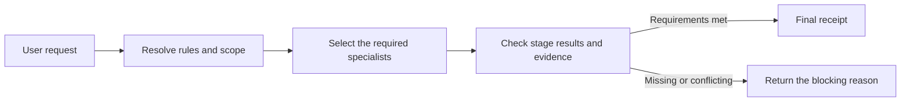

# Agent Governance Suite

[한국어](README.md) | English

Agent Governance Suite is a local Codex plugin that keeps scope, risky changes, verification evidence, and independent review in one workflow.

When an agent says a task is finished, the suite checks whether the required conditions were actually met. A workflow cannot finish when test evidence is missing, the implementer audits their own work, or an old audit is reused after the target has changed.

The current public release is `v1.4.0`. It includes eleven governance specialist skills, one local task-continuity infrastructure skill, and one Korean prose workflow. The Korean prose workflow remains disabled in the registry, its direct descriptor, and Codex's implicit-invocation setting until it passes the prose-quality improvement threshold. Its fail-closed skill instructions also refuse direct calls without running providers or local scripts.

## How it works



The orchestrator selects only the checks required by the request and puts them in order. The local MCP server freezes that plan, then validates stage order, result shapes, evidence, and audit conditions. It issues a final receipt only after every required gate passes.

### Example: a production deployment

1. Before work starts, the suite resolves the applicable instructions, repository conventions, allowed scope, and completion criteria.
2. For a hard-to-reverse change, it checks the target, authority, and recovery plan before execution.
3. When several agents work together, it assigns ownership and keeps implementation separate from audit.
4. After the change, it compares the result with the original scope and checks the test evidence.
5. It refuses completion if the auditor also implemented the change, the audit targets an older result, or a blocking finding remains open.

These checks run in the MCP workflow layer. They are not recommendations that an agent can silently skip.

## Terms used in this project

| Term | Meaning here |
| --- | --- |
| Specialist skill | Handles one job, such as checking scope, mutation risk, or completion evidence. |
| Orchestrator | Selects the required specialists and manages their order and handoffs. |
| MCP server | Checks the plan and stage results against local workflow contracts. |
| Evidence | A record used to support completion, such as test output, a file locator, or a digest. |
| Final receipt | A structured result showing that every required stage and gate passed. |

## Problems it handles

| Common failure | What the suite does |
| --- | --- |
| Several `AGENTS.md` files make instruction scope unclear | Resolves which instruction files apply to the actual work target and in what order. |
| An agent edits files outside the requested scope | Captures a baseline before the change and compares it with the final result. |
| A destructive action, deployment, or permission change starts without preparation | Checks the target, authority, approval requirements, and recovery path before execution. |
| An agent reports completion without running the required checks | Requires current evidence for each acceptance criterion. |
| An implementer audits their own work or reuses an old audit | Checks actor separation, target identity, and audit freshness. |
| The same failure is retried without new evidence | Groups failure episodes and identifies the next useful diagnostic check. |

The orchestrator does not run all eleven skills for every request. It selects the roles the task needs, and a simple request can call one specialist directly.

## Install and try it

Node.js 22.13.0 or later is required.

```bash
codex plugin marketplace add jaeseongs95/agent-governance-suite --ref v1.4.0
codex plugin add agent-governance-suite@agent-governance
```

Start a new Codex session after installation so Codex can load the bundled skills and MCP tools. Then call the orchestrator:

The task-continuity lifecycle hook runs only after you review and trust its current definition in Codex `/hooks` following installation or a hook change. Existing specialist skills and workflow MCP operations continue to work when the untrusted hook is skipped.

```text
Use $orchestrator to define the scope and success criteria for this task, then manage the required checks and completion evidence: <your task>
```

You can also call one specialist directly:

```text
Use $mutation-risk-preflight before making this destructive change.
Use $acceptance-evidence-validator to verify that each acceptance criterion has current evidence.
```

Check the installed runtime from the plugin root:

```bash
node scripts/check-runtime.mjs
```

The MCP server stores workflow state and its plan-signing key in `workflows.sqlite3`. Optional task continuity uses a separate `continuity.sqlite3` in the same per-user state directory. Set `AGENT_GOVERNANCE_DB_PATH` and `AGENT_GOVERNANCE_CONTINUITY_DB_PATH`, respectively, to absolute SQLite paths or paths relative to the MCP working directory. Protect that directory so only the account running the MCP server can access it.

```bash
AGENT_GOVERNANCE_DB_PATH=/absolute/path/workflows.sqlite3 pnpm dev
```

### Plugin update checks

On the first MCP use after the cache expires, the server checks the fixed public repository for a stable plugin release tag. Successful results are cached in SQLite for 24 hours. A failed check never blocks the requested workflow operation, preserves the last successful result, and becomes eligible for retry after one hour. When a newer stable version is available, the server appends one `plugin-update-notice` content block for that version.

```text
check_for_updates { "force": false }
```

Set `force: true` to bypass the cached check time. This feature only reports that a release exists. It never modifies plugin files, installation caches, or marketplace settings, and it never installs the update automatically. Direct specialist-skill calls that do not use the MCP server do not perform this check.

Each specialist remains available when the MCP server is unavailable. Orchestrated runs that enforce stage order and issue a final receipt require the MCP server.

`v1.2.0` upgrades the SQLite schema from v2 to v3 to preserve convergence roots, epochs, attempts, leases, reviews, and workflow links. If you may need to return to the v2 server, stop the MCP server and create a consistent SQLite backup before upgrading. A v3 database cannot be opened by the v2 server, so reinstalling only the plugin is not a rollback. Restore the pre-upgrade v2 backup while the MCP server is stopped.

## Included skills

### How to read the `When` column

`When` identifies the **work situation in which a skill should be considered or invoked**. It is lifecycle guidance, not a fixed instruction to run every skill from top to bottom. In practice, select only the skills justified by the request's risk and current state; when multiple skills are connected, the orchestrator determines their required execution order.

- **Before work**: Before editing files or running commands, resolve applicable instructions and repository conventions, then define the objective, scope, and completion criteria.
- **During work**: When work needs to be divided into independent units or a complex, high-cost decision needs review from multiple perspectives.
- **Convergence review**: When the attempt budget is exhausted or the objective, evaluation criteria, or inputs may change, compare the invariant contract with the proposed change before opening a new attempt epoch.
- **Before and after changes**: Capture the Git baseline before editing, then compare the resulting diff with that baseline to detect files outside the requested scope.
- **Before changes**: Immediately before a high-impact or difficult-to-reverse action such as deletion, deployment, or migration, check the target, authority, and recovery conditions.
- **Before completion**: After implementation and testing but before declaring completion, verify evidence for every acceptance criterion and, for high-risk work, confirm that the independent audit passed.
- **After a failure**: When failures repeat or an unclear cause blocks progress, separate observations from hypotheses and choose the next discriminating diagnostic check.

| When | Skill | Version | Responsibility |
| --- | --- | --- | --- |
| Before work | `instruction-scope-resolver` | 1.0.0 | Finds the instructions and precedence rules that apply to the work target. |
| Before work | `workspace-convention-profiler` | 1.0.0 | Records repository structure, commands, and test conventions with evidence. |
| Before work | `task-contract` | 1.0.0 | Defines the objective, scope, risk, and completion criteria. |
| During work | `coordinate-subagents` | 1.0.0 | Splits independent work and assigns ownership and verification duties. |
| During work | `independent-deliberation-panel` | 1.0.0 | Reviews evidence and counterarguments for complex decisions. |
| Convergence review | [`iteration-frame-auditor`](skills/iteration-frame-auditor/) | 1.0.0 | Independently compares iteration contracts and frame changes before a new epoch can open. |
| Before and after changes | `change-scope-guardian` | 1.0.0 | Captures a baseline and checks whether the final change stayed in scope. |
| Before changes | `mutation-risk-preflight` | 1.0.0 | Checks the target, authority, approval, and recovery conditions for risky mutations. |
| Before completion | `acceptance-evidence-validator` | 1.0.0 | Verifies current evidence for every acceptance criterion. |
| Before completion | `independent-audit-gate` | 1.0.0 | Requires a reviewer who is independent from the implementer for high-risk results. |
| After a failure | `blocker-diagnostician` | 1.0.0 | Classifies repeated failures and selects the next diagnostic step. |

Every specialist can run on its own. Use `$orchestrator` when a request needs more than one role. `skills/source-lock.json` pins the upstream sources and the creation commit and checksum of the repository-native `iteration-frame-auditor`; the `orchestrator` is tracked by current Git history.

### Shared infrastructure skill

[`context-continuity`](skills/context-continuity/) is local lifecycle infrastructure, not a specialist judgment provider. It writes replacement checkpoints only for direct-task state whose loss would change scope, authority, branching, or verification decisions. Resume and direct compact hooks inject metadata and an opaque restore token, never snapshot body text; the body is returned only by an explicit `load_context` call. For orchestrated workflows, compact restoration may inject only a bounded structural card projected from the existing `TaskEnvelope`, receipt, and convergence root. This skill is intentionally absent from `skills/registry.json` and the specialist count above.

The lifecycle hook never reads or stores raw transcripts and records installation-keyed HMAC correlations instead of raw session, turn, or request identifiers. `clear` rotates the epoch and suppresses old restoration without automatically deleting payloads. `suppress_context_restore` stops candidate delivery, while the explicitly destructive `purge_direct_context` deletes only direct payloads and leaves a hash tombstone. Continuity database failures do not block workflow operations or Codex compaction.

The snapshot `core` and `evidenceRefs` are stored as plaintext JSON in the local `continuity.sqlite3` and do not expire automatically. Do not checkpoint secrets, personal data, raw logs or code, or chain-of-thought; manage access and retention for the database file directly.

## Enforcement scope and limits

The MCP server reads capabilities, execution phases, and artifact dependencies from `SkillDescriptor.v2`. It creates a plan with schema checksums and an HMAC signature, then checks:

- whether the plan changed after the run started
- whether each stage used the expected order and revision
- whether provider results match their declared schemas and state mappings
- whether required artifacts and verified evidence exist before dependent stages run
- whether deliberation and mandatory audit results match the current target and policy conditions
- whether any blocking item remains unresolved
- whether each new orchestrated run consumed a root-bound one-time lease and respected the three-attempt epoch budget and frame invariants

Convergence roots, epochs, attempts, leases, reviews, and workflow links are also stored as append-only history in the same SQLite database, so budgets and active attempts survive an MCP process restart. The stdio server in `.mcp.json` starts on demand; no port, account, or persistent daemon is required.

The orchestrator first derives candidate capabilities from the skill descriptions exposed at installation, then runs `skills/orchestrator/scripts/query-registry.mjs` to read only active-provider execution metadata. It uses the compact `--all` catalog only when it cannot identify candidates and never sends the complete `skills/registry.json` to the model context.

Omitting public MCP response options preserves the existing full receipts and convergence histories. The orchestrator's normal path uses `responseMode: "compact"` and `detail: "compact"` to receive a fixed-size summary without plans, accumulated `stageResults`, provider output, raw task/frame values, or history arrays. It performs a single `full` status read only when it needs error causes, prior results, or audit material. A compact attempt claim restores the root-bound task envelope and frame, while a guarded start without a plan uses the proposal plan bound to its one-time lease. The persisted full `WorkflowReceipt` and SQLite schema v3 remain unchanged by this transport choice.

The MCP server is not a security boundary against a hostile caller. Specialist skills and callers submit `verified` flags, evidence locators, and actor identifiers as trusted inputs. The server checks their structure and consistency across workflow stages, but it does not authenticate a real person or prove that the source evidence is genuine.

Active runs, their current revisions, the run ID sequence, the plan-signing key, and plugin update-check state are stored in SQLite, so they remain available after an MCP server restart. Update state is limited to versions, tag and commit identifiers, the ETag, check and retry timestamps, the last notified version, and an error code. SQLite stores the complete `WorkflowReceipt` as plaintext JSON, including each `StageResult` provider output, evidence notes, findings, blockers, and errors. For ordinary providers, callers must not submit sensitive source material. A provider that declares `receiptPolicy.mode: reference-only` is checked before persistence: its closed output schema may retain only digests, artifact references, and fixed tokens, and free text is also rejected from notes, locators, findings, blockers, and errors. When both `actorIdPointer` and `uniqueness: run` are declared, the server rejects reuse of a canonical lowercase UUID actor ID across policy stages, including after restart. The server has no automatic retention or deletion policy, so callers must manage access and retention for the database and its directory. The default `WorkflowService` constructor keeps its in-memory behavior for tests and embedded use. This policy is a structural raw-content persistence boundary, not identity authentication. Environments that require authenticated identity, encrypted long-term retention, or evidence integrity against hostile actors still need a separate identity and evidence service.

## Repository layout

```text
.codex-plugin/plugin.json  Plugin metadata
.mcp.json                  Local STDIO MCP server configuration
skills/                    The orchestrator and specialist skills
mcp-server/                MCP server implementation
contracts/                 Shared JSON Schema contracts
scripts/                   Validation, build, and skill import tools
tests/                     Regression and integration tests
```

`skills/orchestrator/` handles classification, ordering, handoffs, and result integration. It does not replace specialist judgment or independent audit. The MCP server routes providers through capabilities and declarative contracts in `skills/registry.json`, without branching on specialist names.

## Development and validation

Development requires Node.js 22.13.0 or later and Corepack.

```bash
corepack enable
pnpm install --frozen-lockfile
pnpm bundle:check
pnpm lint
pnpm build
pnpm test
pnpm runtime:check
pnpm validate:all
pnpm validate:official
git diff --check
```

Keep this order because `bundle:check` must detect a stale committed bundle before a build can overwrite it. In a Codex development environment, `validate:official` runs the system `skill-creator` and `plugin-creator` validators. If Python 3 is not on the system path, set `PYTHON` to its absolute executable path. Start the local MCP server with `pnpm dev`.

## Adding and importing skills

Create a specialist skeleton with normal, boundary, and expected-failure fixtures:

```bash
pnpm new:skill --name evidence-normalizer --phase validation --capability evidence-normalization
```

Only import clean tags or commits from another repository. The importer uses `integration/skill-descriptor.json` when present. For a legacy skill, `--phase` and `--capability` can supply a single provider definition.

```bash
pnpm import:skill --source <path-or-url> --ref <tag-or-sha> --skill-path <path> --phase <phase> --capability <capability>
pnpm import:skill --source <path-or-url> --ref <new-tag-or-sha> --skill-path <path> --replace true
pnpm validate:skill --name <skill-name>
```

The importer reads only the requested Git ref from a temporary checkout. It excludes `.git`, `__pycache__`, `evals/results`, and ordinary build output, then records the source ref, commit, and checksum in `skills/source-lock.json`. Replace generated fixtures with real behavior cases before submitting an import pull request.

Public contracts use JSON Schema 2020-12 under `contracts/`. Compatible skill additions are minor releases, fixes are patch releases, and incompatible changes to contracts, authority, or identifiers require a major release.

## Documentation and contributing

- [Architecture](docs/architecture.md) (Korean)
- [Release checklist](docs/release.md) (Korean)
- [Additional skill implementation plan](docs/additional-skills-implementation-plan.md) (Korean)
- [Contributing](CONTRIBUTING.md)
- [Security policy](SECURITY.md)

## License

[MIT License](LICENSE)
