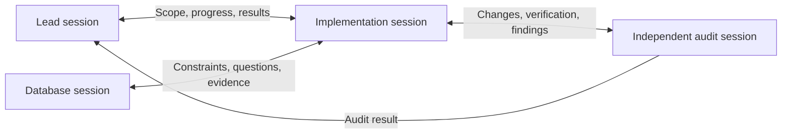

# Agent Governance Suite

[한국어](README.md) | English

**Connect AI work, collaboration, and verification into one continuous workflow.**

Agent Governance Suite (AGS) is a local plugin for running ongoing AI work in Codex and Claude Code. It helps define goals and ownership, lets sessions collaborate directly from their own working context, and records the evidence used to verify their results.

Use it for investigation, implementation, and review within one session, or for long-running work shared across sessions with distinct responsibilities. Specialist skills provide methods and judgment criteria. The local runtime handles inter-session communication, work records, and checks on required stages and completion conditions.

[How work continues](#how-work-continues) · [Installation](#installation) · [Try session collaboration](#try-it-with-two-sessions) · [Main features](#main-features) · [Architecture](#architecture)

## How work continues

Suppose a Claude Code session responsible for the database discovers a constraint that affects an API implementation. The Codex session handling that implementation already has its own working context, and a separate session is responsible for the audit.

The database specialist finds the implementer on the shared board and sends the constraint and supporting evidence directly. The implementer reviews it in its existing context and continues within its authorized scope. The auditor independently checks the changes and verification evidence, then sends any findings back to the responsible session. The lead brings those results together to identify what is complete and what remains unresolved.


```mermaid
flowchart LR
    L["Lead session"] <-->|"Scope, progress, results"| I["Implementation session"]
    D["Database session"] <-->|"Constraints, questions, evidence"| I
    I <-->|"Changes, verification, findings"| A["Independent audit session"]
    A -->|"Audit result"| L
```

This is an example of a team with assigned roles and work scopes. Sessions consult the shared board to find the right collaborator and communicate through **PEER messages**. Where the receiving environment supports and enables automatic wake, a message can prompt an idle session to resume work.

Each specialist can build on its own investigations and decisions. Other sessions receive the relevant summary, artifact locations, and verification evidence. Users can focus on goals, authorized scope, and important decisions while sessions exchange the messages needed to continue their work.

AGS supports this workflow with task contracts, specialist skills, the session board, messaging, context continuity, and verification procedures. See the [collaboration and execution architecture](docs/architecture.md) for details.

## Installation

You need Node.js **24.0.0 or later** and plugin support in the host you use. Install AGS in each participating host. Using the plugin does not require cloning this repository or running `pnpm install`.

<!-- release-version:start -->
This is a 2.9.0 publication preparation guide; after publication, the current public release is `v2.9.0`. It includes seventeen governance specialist skills, two engineering specialist skills, one implementation-step skill, two local infrastructure skills, and one Korean prose workflow. Version 2.8.1 has been published; use the v2.9.0 installation example below after the tag and Release are published. This candidate connects engineering evidence, prepares inactive shared-state adapters, and fixes the read-only wake-verification path. Production database migration, shared MCP cutover, and current-candidate testing in both Clouds and native hosts are not claimed complete.
<!-- release-version:end -->

### Claude Code

Run inside Claude Code:

```text
/plugin marketplace add jaeseongs95/agent-governance-suite
/plugin install agent-governance-suite@agent-governance-claude
```

Start a new session after installation.

### Codex

Run in a terminal:

<!-- release-install:start -->
```bash
codex plugin marketplace add jaeseongs95/agent-governance-suite --ref v2.9.0
codex plugin add agent-governance-suite@agent-governance
```
<!-- release-install:end -->

Start a new Codex session after installation. Review and trust the installed hooks in `/hooks` to enable context continuity, the session board, and execution observation. Review them again when their definitions change.

## Quick start

Describe the work and what you want checked in your usual language. The agent uses the installed skills' descriptions and applicability rules to select the skills it needs.

```text
Implement and verify this feature. First define the change scope and acceptance criteria.
In the final result, include the checks you actually ran and any unresolved issues.
```

When several specialist results need to be connected, the `orchestrator` arranges their sequence and inputs and outputs. You can also use an individual specialist directly. To name a skill explicitly, use a request such as `$orchestrator` in Codex or `/agent-governance-suite:orchestrator` in Claude Code.

### Try it with two sessions

Open the same project in two sessions on the same computer. Both need working AGS MCP connections and hooks, with access to the same shared-state location. You can use one Codex session and one Claude Code session.

This example **investigates how to run the project's tests, then asks another session to check the evidence and reply**. It exercises the board, message delivery, review, and a return message without modifying code.

**First, give the review session this request:**

```text
You are the reviewer for this exercise.
Record your current work on the AGS board as
"AGS-DEMO-REVIEW · Review test instructions".

When the research session requests a review through a PEER message,
read the referenced files yourself and check whether its explanation is correct.
Acknowledge processing the message (ACK), then send your review result and evidence
back to the requesting session in a separate PEER message.
Do not modify files or run tests.
```

**Then give the research session this request:**

```text
Record your current work on the AGS board as
"AGS-DEMO-RESEARCH · Investigate test instructions".
Find how to run this project's tests in its documentation and configuration.
Briefly summarize the command and supporting file locations.
Do not modify files or run tests.

Find the session handling "AGS-DEMO-REVIEW" on the board.
Use its returned host and session ID to send your findings in a PEER message
and request a review. Distinguish the processing acknowledgment (ACK)
from the actual review result.
When its reply arrives, compare it with your findings and report the final conclusion.
```

Look for **the research session's send record → the reviewer receiving the body and checking the evidence → the review result arriving back at the research session**. Check message submission and completion of the review as separate outcomes.

After the reply, continue in the research session:

```text
Using the instructions we just reviewed, summarize what a new developer needs
before running the tests. Ask the same reviewer about anything that needs
further confirmation.
```

The same sessions continue their work, with targeted questions sent to the relevant collaborator.

> **If the message has not arrived:** delivery timing depends on the receiving host's hooks and wake configuration. Codex may defer delivery until the next supported tool boundary by default. To try automatic wake, apply the [Codex queue-wake configuration](docs/input-boundaries.md#codex-queue-wake-설정), then start or resume the receiving session. Query status using the same `messageId`; do not repeatedly send an uncertain delivery under new IDs. See [message lifecycle](docs/session-message-lifecycle.md) for the detailed procedure.

## Main features

### Keep goals and acceptance criteria attached to the work

At the start of a task, establish applicable instructions, repository conventions, change scope, acceptance criteria, and authority. During the task, compare current changes with the baseline and review whether repeated attempts have changed the goal or scope.

High-impact work such as deployments, permission changes, and data deletion calls for preflight checks on the target, approval, impact, and recovery conditions, together with an independent audit. Select the relevant decisions and checks for the task at hand.

Related skills: [Task contract](skills/task-contract/), [Change scope](skills/change-scope-guardian/), [Risk preflight](skills/mutation-risk-preflight/), [Iteration audit](skills/iteration-frame-auditor/).

### Find the responsible session and collaborate directly

The shared board shows the host, session, working directory, and current work. Sessions read that information to find collaborators. PEER messages carry the actual requests, review results, and blockers.

Messages are tracked by system-issued IDs, with submission, body delivery, and processing acknowledgment (ACK) recorded separately. Automatic wake uses supported host integrations, while message bodies and delivery state are managed separately in the local queue. **ACK confirms message processing; task completion and execution approval are checked separately.**

Related documentation: [Session board](skills/session-board/), [Message lifecycle and retries](docs/session-message-lifecycle.md), [Input and delivery boundaries](docs/input-boundaries.md), [Waiting and resuming work](docs/peer-wait-policy.md).

### Continue long tasks from context and records

A responsible session can continue from its own investigations and decisions. When collaborating, sessions exchange the conclusions and evidence that matter and make roles and write ownership explicit.

For long direct tasks, `context-continuity` can save scope, decisions, open issues, and evidence references in a local checkpoint. On resumption, it presents saved metadata and restoration options first; the body is loaded through an explicit `load_context` call. Integrated MCP workflows continue from their existing task contracts and execution records.

Related documentation: [Context continuity](skills/context-continuity/), [Delegation and ownership](skills/coordinate-subagents/).

### Decide completion from evidence for the current result

Specialists compare acceptance criteria with actual artifacts and verification results. High-risk changes require a separate auditor who did not implement the work to inspect the requirements, final changes, and plausible failure modes. If the audited area changes later, the affected portion is checked again.

The MCP workflow checks planned stage order, result schemas, required evidence, and audit conditions. It issues a completion receipt only when all required conditions pass and no unresolved items remain. **Specialists assess the substance of the work; the runtime checks the procedure, records, and completion conditions.**

Related skills: [Acceptance evidence](skills/acceptance-evidence-validator/), [Independent audit](skills/independent-audit-gate/).

### Diagnose failure and prepare the next attempt

When a problem repeats, separate observed facts from possible causes and choose the next check that can distinguish between them. Once the cause is established, compare recovery strategies and prepare a handoff for the next task.

Recovery in an integrated workflow preserves the previous run and creates a new task contract and execution linked to the recovery handoff. The record shows what failed and why the approach changed.

Related skills: [Blocker diagnosis](skills/blocker-diagnostician/), [Recovery strategy](skills/recovery-strategy-selector/).

### Bring specialist capabilities into the workflow

Test design and evidence review, fixed-change code review, security audits, independent deliberation, Korean prose editing, and Codex token-usage analysis are also available in the plugin. Each specialist owns its judgments and output format; the `orchestrator` connects the required results in the appropriate order.

<details>
<summary>Browse all specialist skills</summary>

| Skill | Responsibility |
| --- | --- |
| [`model-effort-advisor`](skills/model-effort-advisor/) | Checks observed model and reasoning effort against the task's difficulty and risk. |
| [`instruction-scope-resolver`](skills/instruction-scope-resolver/) | Resolves applicable instructions and their precedence. |
| [`workspace-convention-profiler`](skills/workspace-convention-profiler/) | Investigates repository structure, conventions, tools, and verification commands. |
| [`task-contract`](skills/task-contract/) | Defines goals, scope, acceptance criteria, risk, and authority. |
| [`coordinate-subagents`](skills/coordinate-subagents/) | Manages delegation decisions, ownership, context handoff, and verification responsibilities. |
| [`ponytail`](skills/ponytail/) | Guides the agent toward the simplest implementation that satisfies the request. |
| [`change-scope-guardian`](skills/change-scope-guardian/) | Compares the baseline with current changes to find out-of-scope files. |
| [`mutation-risk-preflight`](skills/mutation-risk-preflight/) | Checks the target, approval, impact, and recovery conditions of risky changes. |
| [`independent-deliberation-panel`](skills/independent-deliberation-panel/) | Reviews evidence and counterarguments from independent perspectives. |
| [`iteration-frame-auditor`](skills/iteration-frame-auditor/) | Audits changes to the task contract and decision frame across iterations. |
| [`acceptance-evidence-validator`](skills/acceptance-evidence-validator/) | Compares acceptance criteria with evidence for the current result. |
| [`independent-audit-gate`](skills/independent-audit-gate/) | Uses an auditor separate from the implementer to review high-risk changes and evidence. |
| [`blocker-diagnostician`](skills/blocker-diagnostician/) | Separates observations from hypotheses and chooses the next discriminating check. |
| [`recovery-strategy-selector`](skills/recovery-strategy-selector/) | Prepares a recovery strategy and handoff for an established cause. |
| [`korean-prose-editor`](skills/korean-prose-editor/) | Edits and verifies Korean prose while preserving facts, numbers, links, code, and claim strength. |
| [`codex-token-usage-analyzer`](skills/codex-token-usage-analyzer/) | Aggregates task and project token usage from local Codex logs. |
| [`software-security-auditor`](skills/software-security-auditor/) | Audits web/API and CLI/MCP attack paths, controls, and verification gaps. |
| [`evaluation-validity-auditor`](skills/evaluation-validity-auditor/) | Independently audits a frozen evaluation's design, inputs, judgments, and aggregation. |
| [`cs-engineering`](skills/cs-engineering/) | Derives CS constraints and verification obligations, then checks candidate/evidence consistency. (v0.2.0) |
| [`test-engineering`](skills/test-engineering/) | Designs cases at requirement and code boundaries and checks whether red/green or targeted-mutation evidence can detect defects. (v0.1.0) |
| [`code-review`](skills/code-review/) | Reviews concrete diffs, patches, or PRs for real failure paths and separates findings, recommendations, and questions. (v0.1.0) |

Skill versions and provenance are recorded in the [registry](skills/registry.json) and [source lock](skills/source-lock.json). The [`orchestrator`](skills/orchestrator/) is tracked in current Git history. `ponytail` is bundled with AGS; pinned external source information remains in the source lock as historical provenance.

`codex-token-usage-analyzer` reads Codex logs only and is omitted from the Claude Code distribution. The Korean prose workflow is enabled, but evaluation of the current editing policy's quality has not been completed. The previous policy's quality pass does not apply to the current policy. See [evaluation status and plans](docs/roadmap.md).

See [engineering-practices integration](docs/engineering-practices.ko.md) for the responsibility boundaries and current verification status of the eight shared engineering modules, 48 rules, and nine contracts used by `test-engineering` and `code-review`.

</details>

## Architecture

AGS separates specialist judgment, workflow coordination, and runtime checks.

| Component | Responsibility |
| --- | --- |
| Specialist skills | Interpret task conditions, perform investigation, implementation, and review, and produce results with evidence. |
| `orchestrator` | Selects specialist capabilities and connects execution order, inputs and outputs, and result integration. |
| Local MCP, contracts, and SQLite | Record plans and execution state; check stages, result schemas, required evidence, and completion conditions. |
| Host adapters and hooks | Connect Codex and Claude Code session metadata, execution observations, message delivery, and wake behavior to shared contracts. |

An integrated workflow is planned through `plan_workflow`, records stage results through `record_stage_result`, and checks completion through `finalize_workflow`. Stages requiring execution assurance also verify the host-observed model, reasoning effort, and binding to the specific call. Specialists can be used on their own; integrated workflows with MCP checks require the local MCP server.

Shared skills, contracts, and runtime have one common source. Adapters and overlays handle host-specific installation, hooks, execution observation, and wake behavior. Other local runtimes can use the common messaging CLI or connect through an additional adapter.

Design details: [Architecture](docs/architecture.md), [Execution-observation contract](docs/host-execution-attestation.md), [Common input boundaries](docs/input-boundaries.md).

## Configuration

### Connect sessions on the same computer

The public distributions support Codex and Claude Code. The default collaboration scope is **the same computer under the same OS user**. The session board and messaging state use a shared local location.

If defaults differ, for example in sandboxed environments, provide the same absolute `AGENT_GOVERNANCE_SHARED_STATE_DIR` to every participating host. Confirm that each host can actually read and write that location.

### Message delivery and automatic wake

Automatic wake availability depends on the receiving host's support, configuration, and running state. Codex uses deferred delivery by default; queue wake is configured separately. An ended session or host is not treated as an idle one.

See [Codex queue wake](docs/input-boundaries.md#codex-queue-wake-설정) for configuration, [message and wake lifecycle](docs/session-message-lifecycle.md) for status interpretation, and [peer-wait policy](docs/peer-wait-policy.md) for waiting behavior.

### Authority and stored data

Collaboration requests are handled within each session's authorized scope and permissions. PEER messages and ACKs convey provenance and processing state; they do not create new user approval. MCP checks apply at AGS tool and workflow boundaries. They are not a security boundary isolating arbitrary processes running as the same OS user.

Work records and checkpoints can retain submitted content locally. Avoid submitting secrets and sensitive source material, and manage access permissions and retention for the state directory. The AI host's model-call and data-handling policies apply separately.

[Operations and storage locations](docs/operations.md#상태-저장과-마이그레이션) · [Retention and cleanup](docs/state-cleanup.md) · [Security policy](SECURITY.md)

### Updates

`check_for_updates` reports new public stable releases without installing them automatically. To update, stop existing AGS MCP, relay, and broker processes, update the plugin, and reconnect so the new processes start.

[Update checks](docs/operations.md#플러그인-업데이트-확인) · [Update and recovery procedure](docs/session-message-lifecycle.md#업데이트와-복구)

## Troubleshooting

| Symptom | What to check |
| --- | --- |
| Skills or MCP are missing after installation | Start a new session and check that the plugin and MCP are enabled in that host. |
| The MCP server does not start | Check that the host runs Node.js 24.0.0 or later, and review MCP startup logs. |
| Another session is missing from the board | Check that it has recorded its current work, that its hooks run, and that both hosts can access the same shared-state location. |
| A message was sent but the recipient does not respond | Query status with the same `messageId`; check the receiver's running state, hooks, delivery mode, and wake configuration. |
| An ACK arrived but the review result did not | ACK confirms processing. Ask the responsible session separately for its work result or blocker. |
| Execution-observation errors prevent workflow progress | Check host configuration and error details in the [execution-observation contract](docs/host-execution-attestation.md). |
| Old behavior remains after an update | Check for old AGS MCP, relay, and broker processes, then reconnect using the [update procedure](docs/session-message-lifecycle.md#업데이트와-복구). |

## Documentation and contributing

The linked operational and design documents are primarily in Korean.

| Goal | Documentation |
| --- | --- |
| Understand the design and operating model | [Architecture](docs/architecture.md), [Operations](docs/operations.md) |
| Check collaboration and delivery behavior | [Message lifecycle](docs/session-message-lifecycle.md), [Input boundaries](docs/input-boundaries.md), [Wait policy](docs/peer-wait-policy.md) |
| Contribute development and verification | [Contributing](CONTRIBUTING.md), [Development reference](docs/development.md) |
| Check releases and progress | [Release checklist](docs/release.md), [Release history and plans](docs/roadmap.md) |

## License

[MIT License](LICENSE)
