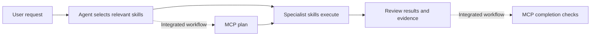
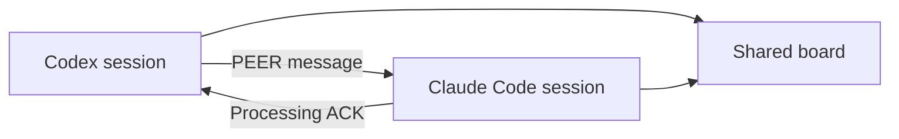

# Agent Governance Suite

[한국어](README.md) | English

Agent Governance Suite (AGS) is a local plugin that adds specialist skills and verification procedures to an AI agent's work. It helps select the checks a request needs and review execution results alongside their evidence.

Use it to track change scope and verification while building a feature, or to coordinate Codex and Claude Code sessions on the same computer.

| Situation | What to arrange without AGS | What AGS provides |
| --- | --- | --- |
| Starting work | A way to define goals, scope, and completion criteria | Instructions for defining task conditions and connecting the required specialists |
| Risky changes | Pre-execution checks and a separate audit process | Risk preflight, independent audits, and required-stage checks through MCP |
| Checking completion | Criteria for comparing results with evidence | Evidence checks for each acceptance criterion and workflow completion checks |
| Coordinating sessions | A way to see each session's work and contact it | A shared board and local PEER messages with processing acknowledgments |

<!-- release-version:start -->
The current public release is `v2.7.5` and includes sixteen governance specialist skills, one implementation-step skill (`ponytail`), two local infrastructure skills (task continuity and the session board), and one Korean prose workflow.
<!-- release-version:end -->

- [Installation](#installation)
- [Quick start](#quick-start)
- [Main features](#main-features)
- [Configuration](#configuration)
- [Troubleshooting](#troubleshooting)

## Installation

Node.js **24.0.0 or later** is required. Using the plugin does not require cloning this repository or running `pnpm install`.

### Claude Code

Run inside Claude Code:

```text
/plugin marketplace add jaeseongs95/agent-governance-suite
/plugin install agent-governance-suite@agent-governance-claude
```

Start a new session after installation.

### Codex

Run in a terminal:

<!-- release-install:start -->
```bash
codex plugin marketplace add jaeseongs95/agent-governance-suite --ref v2.7.5
codex plugin add agent-governance-suite@agent-governance
```
<!-- release-install:end -->

Start a new Codex session after installation. Review and trust the installed hooks in `/hooks` to enable context continuity, the session board, and execution observation. Review them again when their definitions change.

## Quick start

Describe the work and what you want checked in your usual language; you can start without memorizing skill names.

```text
Implement and verify this feature. Also check that changes from other tasks are not mixed in.
The same test keeps failing. Separate the possible causes and choose the next check.
Polish this Korean README while preserving facts, numbers, links, and the meaning of code.
```

The agent uses the installed skills' descriptions and applicability rules to decide which skills to use. When several specialists need to work in sequence, the `orchestrator` connects their order and results; a single check can use the relevant specialist directly.

Both hosts receive the shared intake rules in [`skills/orchestrator/SKILL.md`](skills/orchestrator/SKILL.md) through the MCP server initialization instructions (`instructions`). Claude Code also receives the same source text at SessionStart. To name a skill explicitly, use a request such as `$orchestrator` in Codex or `/agent-governance-suite:orchestrator` in Claude Code.


```mermaid
flowchart LR
    R["User request"] --> S["Agent selects relevant skills"]
    S --> E["Specialist skills execute"]
    E --> V["Review results and evidence"]
    S -. "Integrated workflow" .-> P["MCP plan"]
    P --> E
    V -. "Integrated workflow" .-> G["MCP completion checks"]
```

Specialists can be used directly. Integrated workflows that check plans, stage order, and completion conditions through MCP require the local MCP server.

## Main features

### Specialists for the task

Find the situation that fits your task below. This is not a list of skills to run all at once.

| Situation | Skill | Version | Responsibility |
| --- | --- | --- | --- |
| Preparing work | [`model-effort-advisor`](skills/model-effort-advisor/) | 0.1.0 | Checks material mismatches between observed model/effort and the request's difficulty and risk. |
| Preparing work | [`instruction-scope-resolver`](skills/instruction-scope-resolver/) | 1.0.0 | Resolves applicable instructions and their precedence. |
| Preparing work | [`workspace-convention-profiler`](skills/workspace-convention-profiler/) | 1.0.0 | Investigates repository structure, tools, conventions, and validation commands. |
| Preparing work | [`task-contract`](skills/task-contract/) | 1.1.0 | Defines scope, acceptance criteria, risk, and authority while separating source receipts from authority. |
| Implementation, changes, and decisions | [`coordinate-subagents`](skills/coordinate-subagents/) | 1.1.0 | Manages ownership and verification responsibilities for authorized, useful delegation. |
| Implementation, changes, and decisions | [`ponytail`](skills/ponytail/) | 4.10.0 | Guides the agent toward the simplest implementation that satisfies the request. |
| Implementation, changes, and decisions | [`change-scope-guardian`](skills/change-scope-guardian/) | 1.0.0 | Compares the baseline and current Git changes to find out-of-scope files. |
| Implementation, changes, and decisions | [`mutation-risk-preflight`](skills/mutation-risk-preflight/) | 1.0.1 | Checks the target, approval, impact, and recovery conditions of risky changes. |
| Implementation, changes, and decisions | [`independent-deliberation-panel`](skills/independent-deliberation-panel/) | 1.0.0 | Reviews evidence and counterarguments from independent perspectives. |
| Implementation, changes, and decisions | [`iteration-frame-auditor`](skills/iteration-frame-auditor/) | 1.0.0 | Independently compares iteration contracts and frame changes. |
| Checking completion | [`acceptance-evidence-validator`](skills/acceptance-evidence-validator/) | 1.0.0 | Checks every acceptance criterion against evidence for the current result. |
| Checking completion | [`independent-audit-gate`](skills/independent-audit-gate/) | 1.0.0 | Requires an auditor separate from the implementer for high-risk changes and their evidence. |
| Diagnosing failures and selecting recovery | [`blocker-diagnostician`](skills/blocker-diagnostician/) | 1.1.0 | Separates observations from hypotheses and selects the next discriminating check. |
| Diagnosing failures and selecting recovery | [`recovery-strategy-selector`](skills/recovery-strategy-selector/) | 0.2.0 | Compares strategies for a confirmed cause and creates a `RecoveryHandoff.v1` for a new task. |
| Specialist analysis and editing | [`korean-prose-editor`](skills/korean-prose-editor/) | 0.1.0 | Preserves facts, numbers, quotations, links, code, and claim strength through editing, separate verification, and finalization. |
| Specialist analysis and editing | [`codex-token-usage-analyzer`](skills/codex-token-usage-analyzer/) | 0.1.0 | Aggregates task and project token usage from local Codex logs. |
| Specialist analysis and editing | [`software-security-auditor`](skills/software-security-auditor/) | 0.1.0 | Audits web/API and CLI/MCP attack paths, controls, and coverage gaps. |
| Specialist analysis and editing | [`evaluation-validity-auditor`](skills/evaluation-validity-auditor/) | 1.0.0 | Independently audits a frozen evaluation's design, inputs, judgments, and aggregation. |

Versions and provenance are recorded in the [registry](skills/registry.json) and [source lock](skills/source-lock.json). The [`orchestrator`](skills/orchestrator/) is tracked by current Git history. The `ponytail` link points to the skill bundled in AGS. Pinned external source information remains in the source lock as historical provenance. `codex-token-usage-analyzer` reads Codex logs only and is omitted from the Claude Code distribution.

The Korean prose workflow is enabled. Its current editing policy has not yet been evaluated for quality, and the previous policy's quality pass does not apply to the current policy. See [evaluation status and plans](docs/roadmap.md) (Korean).

### MCP workflows that check evidence

Use `plan_workflow` to plan the work selected by the agent and `record_stage_result` to record actual specialist results. MCP checks stage order, result shapes, required evidence, and audit conditions. `finalize_workflow` produces a completion receipt only after the planned requirements pass.

Workflows requiring execution assurance also check the host-observed model, effort, and binding to the execution. See the [execution-observation contract](docs/host-execution-attestation.md) (Korean) for details.

### See who is working and send content between sessions

[`session-board`](skills/session-board/) shows who is working on which repository and task on the same computer. Each session records a one-line summary for others to read on the shared board.

Local PEER messages let sessions send work requests, review results, and blockers directly within an authorized collaboration scope, without asking the user to copy each message between sessions. Send, body delivery, and processing acknowledgment (ACK) can be checked separately.


```mermaid
flowchart LR
    C["Codex session"] --> B["Shared board"]
    L["Claude Code session"] --> B
    C -->|"PEER message"| L
    L -->|"Processing ACK"| C
```

Delivery timing depends on the host's hooks and wake support. Codex may defer delivery until the next supported tool boundary by default. ACK confirms message processing, not task completion or execution approval.

See [message lifecycle](docs/session-message-lifecycle.md) for call order and retries, and [input boundaries](docs/input-boundaries.md) and [peer waiting](docs/peer-wait-policy.md) (Korean) for host-specific delivery and wake behavior. Other local runtimes can use the same messaging protocol through the common CLI.

### Preserve context across long tasks

[`context-continuity`](skills/context-continuity/) stores the scope, decisions, open issues, and evidence references needed to resume a long direct task in a local checkpoint. Restoration first presents metadata and options; the body is returned only through an explicit `load_context` call. Orchestrated workflows resume from existing task contracts and execution records.

### Shared sources and host-specific connections

Shared skills, contracts, and MCP form the basis of the Codex and Claude Code distributions. Adapters and overlays connect host-specific installation, hooks, execution observation, and wake behavior. AGS's principle is to maintain common policy in one source and implement only actual host differences separately. See [architecture](docs/architecture.md) and [input boundaries](docs/input-boundaries.md) (Korean) for support details.

## Configuration

Most users can start with the defaults included in the distributions. Hosts coordinating on the same computer need access to the same shared-state location. If defaults differ, for example in sandboxes, set `AGENT_GOVERNANCE_SHARED_STATE_DIR` to the same absolute path for both hosts.

See [operations](docs/operations.md#상태-저장과-마이그레이션) for state locations and environment variables, the [configuration contract](docs/input-boundaries.md#codex-queue-wake-설정) for optional Codex queue wake, and [cleanup procedures](docs/state-cleanup.md) (Korean) for data retention and cleanup.

`check_for_updates` reports new public stable versions without installing them automatically. See [update checks](docs/operations.md#플러그인-업데이트-확인) (Korean).

## Troubleshooting

| Symptom | First checks |
| --- | --- |
| Skills or MCP are missing after installation | Start a new session after installation and check the host's plugin and MCP status. |
| The MCP server does not start | Check that the host runs Node.js 24.0.0 or later, and review MCP startup logs. |
| A message waits or has no acknowledgment | Query status with the same `messageId` and check the receiving session's hooks and delivery boundaries. See [delivery conditions](docs/input-boundaries.md) (Korean). |
| An update leaves old behavior running | Stop existing AGS MCP, relay, and broker processes, update, then reconnect to start new processes. See [updates and recovery](docs/session-message-lifecycle.md#업데이트와-복구) (Korean). |

See the [execution-observation contract](docs/host-execution-attestation.md) for observation errors and [operations](docs/operations.md) (Korean) for detailed operating conditions.

## Documentation and contributing

- [Architecture](docs/architecture.md), [Operations](docs/operations.md) (Korean)
- [Development and checks](CONTRIBUTING.md), [Development reference](docs/development.md) (Korean)
- [Release checklist](docs/release.md), [Release history and plans](docs/roadmap.md) (Korean)
- [Security policy](SECURITY.md)

## License

[MIT License](LICENSE)
