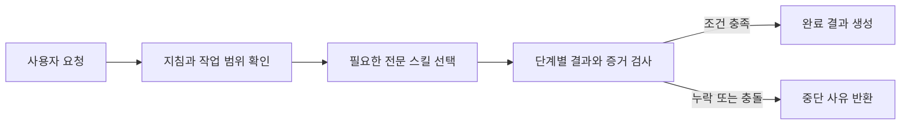

# Agent Governance Suite

한국어 | [English](README.en.md)

Agent Governance Suite는 Codex의 긴 작업에서 범위를 관리하고 위험한 변경을 사전에 점검하며, 증거 검증과 독립 감사를 하나의 워크플로로 연결하는 로컬 플러그인입니다.

에이전트가 작업을 완료했다고 보고해도 필요한 조건을 실제로 충족하지 않았다면 다음 단계로 넘어가지 않습니다. 테스트 근거가 없거나, 구현자가 자신의 결과를 감사했거나, 현재 변경과 맞지 않는 예전 감사 결과를 제출한 경우에는 워크플로 완료를 거절합니다.

<!-- release-version:start -->
현재 공개 릴리스는 `v1.16.0`이며 거버넌스 전문 스킬 15개, 로컬 task continuity 인프라 스킬 1개와 한국어 산문 워크플로 1개를 포함합니다. 이번 릴리스는 `korean-prose-editor`에 candidate-v2 정책을 적용합니다. selection은 결함을 두 단계로 찾고, editing은 위험한 첫 수정안 대신 안전한 대안을 검토하며, verification은 원문과 수정문을 양방향으로 대조합니다. 평가 도구는 실제 모델과 provider 버전이 확인되지 않은 실행을 새 평가 증거로 받지 않습니다. 품질 기준 통과 기록(`0.3.0-gate-1`)은 candidate-v2 이전 정책을 평가한 것이므로 이번 정책은 아직 품질 미평가 상태입니다.
<!-- release-version:end -->

## 이런 문제를 다룹니다

| 상황 | Agent Governance Suite의 처리 방식 |
| --- | --- |
| 여러 `AGENTS.md` 가운데 어떤 지침이 적용되는지 불분명하다 | 실제 작업 대상에 적용되는 지침 파일과 우선순위를 확인합니다. |
| 에이전트가 요청 범위를 벗어난 파일까지 수정한다 | 변경 전 기준선과 현재 변경 사항을 비교해 범위 밖의 파일을 찾습니다. |
| 삭제, 배포, 권한 변경처럼 되돌리기 어려운 작업을 곧바로 실행한다 | 실행 전에 대상, 권한, 영향 범위, 복구 가능성, 필요한 승인을 점검합니다. |
| 테스트 없이 작업을 완료했다고 보고한다 | 각 수용 기준을 뒷받침하는 증거가 있고, 그 증거가 현재 결과를 가리키는지 확인합니다. |
| 구현자가 자신의 작업을 감사하거나 이전 감사 결과를 재사용한다 | 구현자와 감사자가 분리됐는지, 감사 대상이 현재 결과와 일치하는지, 감사 결과가 아직 유효한지 검사합니다. |
| 같은 실패를 근거 없이 반복한다 | 실패 기록에서 관측 사실과 원인 가설을 분리하고, 새 정보를 얻을 다음 판별 검사를 정합니다. |

모든 요청에 전문 스킬을 전부 실행하지는 않습니다. 오케스트레이터는 작업에 필요한 역할만 선택하며, 간단한 요청에는 전문 스킬 하나를 직접 사용할 수 있습니다.

## 작동 방식



오케스트레이터는 요청에 필요한 검사를 선택하고 실행 순서를 정합니다. 로컬 MCP 서버는 이 계획을 고정한 뒤 단계 순서, 결과 형식, 증거, 감사 조건을 검사합니다. 모든 필수 조건을 통과하면 구조화된 완료 결과를 만듭니다.

오케스트레이션 workflow에서는 의미 판단 단계의 실행 능력도 계획에 포함합니다. bootstrap과 각 semantic stage는 역할·위험도에 따라 최소 model class와 reasoning effort가 정해지며, 실제 실행에서 관측한 값이 없거나 하한보다 낮으면 MCP가 `passed` 결과를 거절합니다. 따라서 같은 스킬이더라도 낮은 세션 설정이 높은 신뢰도의 stage로 조용히 통과하는 경로를 차단합니다. 특정 제품 모델은 고정하지 않습니다.

## 설치하고 사용하기

Node.js 22.13.0 이상이 필요합니다.

<!-- release-install:start -->
```bash
codex plugin marketplace add jaeseongs95/agent-governance-suite --ref v1.16.0
codex plugin add agent-governance-suite@agent-governance
```
<!-- release-install:end -->

설치를 마치면 새 Codex 세션을 시작합니다. 전체 워크플로를 사용하려면 다음과 같이 요청합니다.

Task continuity lifecycle Hook은 처음 설치하거나 정의가 바뀐 뒤 Codex의 `/hooks`에서 내용을 검토하고 신뢰해야 실행됩니다. 신뢰하지 않아 Hook이 생략되어도 기존 전문 스킬과 workflow MCP는 계속 동작합니다.

```text
$orchestrator를 사용해 이 작업의 범위와 성공 조건을 정하고, 필요한 검증과 완료 근거를 관리해 줘: <작업 내용>
```

특정 검사만 필요할 때는 전문 스킬을 직접 지정할 수 있습니다.

```text
$mutation-risk-preflight를 사용해 이 위험한 변경을 실행하기 전에 필요한 조건을 확인해 줘.
$acceptance-evidence-validator를 사용해 각 수용 기준에 현재 근거가 있는지 확인해 줘.
```

플러그인 루트에서 다음 명령을 실행하면 구성과 실행 환경을 확인할 수 있습니다.

```bash
node scripts/check-runtime.mjs
```

MCP 서버가 시작되지 않아도 개별 전문 스킬은 직접 호출할 수 있습니다. 단계 순서를 강제하고 완료 결과를 만드는 통합 작업에는 MCP 서버가 필요합니다.

### Claude Code에서 사용하기

Claude Code용 배포물은 저장소의 `claude-plugin/`에 따로 있습니다. Codex 플러그인과 파일·훅·MCP 설정·상태 DB를 공유하지 않습니다.

```text
/plugin marketplace add jaeseongs95/agent-governance-suite
/plugin install agent-governance-suite@agent-governance-claude
```

설치 후 새 세션에서 `/agent-governance-suite:orchestrator`나 `/agent-governance-suite:mutation-risk-preflight`처럼 스킬을 호출합니다. Codex와 다른 점은 다음과 같습니다.

- workflow·continuity 상태는 Claude Code가 플러그인마다 제공하는 데이터 디렉터리(`${CLAUDE_PLUGIN_DATA}`)에 저장합니다.
- `codex-token-usage-analyzer`는 Codex 세션 로그 전용이라 포함하지 않습니다.
- 독립 감사와 심의에는 부모 대화를 상속하지 않는 `independent-auditor`, `deliberation-reviewer` 서브에이전트를 사용합니다.
- `instruction-scope-resolver`는 `AGENTS.md` chain과 함께 `CLAUDE.md` 계층을 확인합니다.
- Anthropic API는 최상위 `oneOf`가 있는 도구 스키마를 받지 않으므로, Claude 배포물은 `AGENT_GOVERNANCE_TOOL_SCHEMA_PROFILE=anthropic`으로 `plan_workflow`의 공개 스키마만 평평하게 바꿉니다. 서버의 입력 검증은 같은 계약을 그대로 사용하고, 이 값이 없으면 기존 스키마를 그대로 내보냅니다.
- 실행 보증이 필요한 orchestrated workflow는 신뢰할 수 있는 실행 관측값이 없어 `BINDING_REQUIRED`로 시작되지 않습니다. Codex 배포 서버도 같은 조건에서 같은 결과를 냅니다.

`claude-plugin/`은 `pnpm claude:build`로 생성하며 직접 수정하지 않습니다. 공용 원본(`skills/`, `runtime/`, `contracts/`, MCP 서버 번들)은 그대로 복사하고, Claude 전용 파일은 `claude-overlay/`에, 스킬별 Claude 문구는 `claude-overlay/adaptations/<스킬명>.json`에 둡니다. 공용 원본을 고칠 때 Claude 생성물을 함께 맞출 필요는 없습니다. CI는 둘의 차이를 경고로만 알리고, 릴리스를 준비하거나 Claude 쪽을 작업할 때 다시 생성합니다.

## 포함된 스킬

스킬 이름을 누르면 표에 표시된 버전의 원본 저장소로 이동합니다.

`시점`은 각 스킬을 어떤 작업 상황에서 검토하거나 호출하는지 보여 주는 안내입니다. 위에서 아래로 모든 스킬을 실행하라는 고정 순서가 아니며, 요청의 위험도와 현재 상태에 맞는 스킬만 선택합니다. 각 시점의 정의는 [운영과 참고](docs/operations.md#스킬-시점-안내)에 있습니다.

| 시점 | 스킬 | 버전 | 역할 |
| --- | --- | --- | --- |
| 요청 직후 | [`model-effort-advisor`](skills/model-effort-advisor/) | 0.1.0 | 관측 가능한 현재 모델·추론 수준이 요청 난도와 위험에 비해 과한지 또는 부족한지 확인하고, 유의미한 차이만 안내합니다. |
| 명시 요청 시 | [`codex-token-usage-analyzer`](https://github.com/jaeseongs95/codex-token-usage-analyzer/tree/v0.1.0/skills/codex-token-usage-analyzer) | 0.1.0 | 로컬 Codex 로그에서 작업·하위 작업·프로젝트의 token 사용량을 집계하고 JSON과 선택적 Markdown으로 보고합니다. |
| 시작 전 | [`instruction-scope-resolver`](https://github.com/jaeseongs95/instruction-scope-resolver/tree/v1.0.0) | 1.0.0 | 작업 대상에 적용되는 지침의 범위와 우선순위를 확인합니다. |
| 시작 전 | [`workspace-convention-profiler`](https://github.com/jaeseongs95/workspace-convention-profiler/tree/v1.0.0) | 1.0.0 | 저장소의 구조, 도구, 관례, 검증 명령을 조사합니다. |
| 시작 전 | [`task-contract`](https://github.com/jaeseongs95/task-contract/tree/v1.0.0) | 1.0.0 | 요청의 목표, 범위, 수용 기준, 위험도, 권한을 구조화합니다. |
| 진행 중 | [`coordinate-subagents`](https://github.com/jaeseongs95/coordinate-subagents/tree/v1.0.0) | 1.0.0 | 독립 작업을 나누고 담당 영역과 검증 책임을 정합니다. |
| 진행 중 | [`independent-deliberation-panel`](https://github.com/jaeseongs95/independent-deliberation-panel/tree/v1.0.0) | 1.0.0 | 복잡한 결정의 근거와 반론을 여러 독립 관점에서 검토합니다. |
| 수렴 검토 | [`iteration-frame-auditor`](skills/iteration-frame-auditor/) | 1.0.0 | 반복 시도의 계약과 frame 변경을 독립적으로 비교해 새 epoch 허용 여부를 판정합니다. |
| 변경 전후 | [`change-scope-guardian`](https://github.com/jaeseongs95/change-scope-guardian/tree/v1.0.0) | 1.0.0 | 변경 전 기준선과 현재 Git 변경 사항을 비교해 요청 범위 밖의 파일을 찾습니다. |
| 변경 전 | [`mutation-risk-preflight`](https://github.com/jaeseongs95/mutation-risk-preflight/tree/v1.0.0) | 1.0.0 | 위험한 변경을 실행하기 전에 대상, 승인, 영향 범위, 복구 조건을 점검합니다. |
| 완료 전 | [`acceptance-evidence-validator`](https://github.com/jaeseongs95/acceptance-evidence-validator/tree/v1.0.0) | 1.0.0 | 수용 기준마다 현재 결과를 뒷받침하는 증거가 있는지 검사합니다. |
| 완료 전 | [`independent-audit-gate`](https://github.com/jaeseongs95/codex-independent-audit-gate/tree/v1.0.0) | 1.0.0 | 구현자와 분리된 감사자가 고위험 변경과 검증 근거를 확인합니다. |
| 문제 발생 시 | [`blocker-diagnostician`](https://github.com/jaeseongs95/blocker-diagnostician/tree/v1.0.0) | 1.0.0 | 반복 실패를 관측 사실과 원인 가설로 나누고 다음 판별 검사를 정합니다. |
| 복구 선택 시 | [`recovery-strategy-selector`](skills/recovery-strategy-selector/) | 0.1.0 | 확정된 원인에 맞는 복구 전략을 Objective Gate로 비교하고 새 작업용 `RecoveryHandoff.v1`을 만듭니다. |
| 평가 전후 | [`evaluation-validity-auditor`](https://github.com/jaeseongs95/evaluation-validity-auditor/tree/v1.0.0) | 1.0.0 | 동결된 평가의 설계·입력·판정·집계를 독립적으로 감사하며, `post-execution PASS`만 품질·릴리스 근거로 허용합니다. |

각 전문 스킬은 단독으로 호출할 수 있습니다. 둘 이상의 역할을 연결하려면 [`$orchestrator`](skills/orchestrator/)를 사용합니다. 외부에서 편입한 스킬의 원본과 이 저장소에서 만든 `model-effort-advisor`, `iteration-frame-auditor`, `recovery-strategy-selector`의 원본 경로·tag 또는 commit·원본/통합 `checksum`·업데이트 정책은 [`skills/source-lock.json`](skills/source-lock.json)에 고정되어 있으며, `orchestrator`는 현재 Git 이력으로 추적합니다.

## 개발과 검증

Node.js 22.13.0 이상과 Corepack이 필요합니다.

```bash
corepack enable
pnpm install --frozen-lockfile
pnpm bundle:check
pnpm claude:drift
pnpm lint
pnpm build
pnpm test
pnpm runtime:check
pnpm validate:all
pnpm validate:official
git diff --check
```

`claude:drift`는 `claude-plugin/`이 현재 원본으로 다시 생성한 결과와 다를 때 알려 주기만 하고 실패하지 않습니다. 릴리스를 준비하거나 Claude 쪽을 작업할 때는 `pnpm claude:build` 뒤 `pnpm claude:check`로 생성물이 최신인지 확인합니다. `bundle:check`는 stale 번들을 빌드가 덮어쓰기 전에 확인하므로 위 순서를 유지합니다. Codex 개발 환경의 `validate:official`은 시스템 `skill-creator`와 `plugin-creator` validator를 실행합니다. 시스템이 Python 3를 찾지 못하면 `PYTHON`에 실행 파일의 절대 경로를 지정합니다. 로컬 MCP 서버는 `pnpm dev`로 실행합니다.

## 문서와 기여

- [아키텍처](docs/architecture.md)
- [운영과 참고](docs/operations.md)
- [개발 참고](docs/development.md)
- [릴리스 점검](docs/release.md)
- [추가 스킬 구현 계획](docs/additional-skills-implementation-plan.md)
- [기여 안내](CONTRIBUTING.md)
- [보안 정책](SECURITY.md)

## 라이선스

[MIT License](LICENSE)
