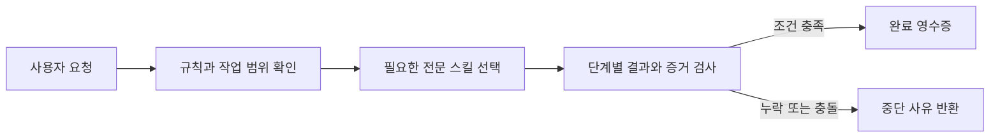

# Agent Governance Suite

한국어 | [English](README.en.md)

Agent Governance Suite는 Codex의 긴 작업에 필요한 범위 관리, 위험한 변경 점검, 증거 검증과 독립 감사를 하나의 흐름으로 연결하는 로컬 플러그인입니다.

쉽게 말해, 에이전트가 "끝났습니다"라고 보고했을 때 다음 단계로 넘어가거나 작업을 마치는 데 필요한 조건을 실제로 충족했는지 확인합니다. 테스트 근거가 없거나, 구현자가 자기 결과를 감사했거나, 변경 전에 만든 오래된 감사 결과를 다시 제출하면 워크플로를 완료할 수 없습니다.

현재 릴리스는 `v1.0.2`이며, 열 개의 전문 스킬과 하나의 오케스트레이터가 들어 있습니다.

## 작동 방식



오케스트레이터는 요청에 필요한 검사만 고르고 실행 순서를 정합니다. 로컬 MCP 서버는 그 계획을 고정한 뒤 단계 순서, 결과 형식, 증거와 감사 조건을 검사합니다. 모든 필수 조건을 통과해야 최종 영수증을 만듭니다.

### 예: 중요한 배포 작업

1. 작업을 시작하기 전에 적용할 지침과 저장소 관례를 확인하고, 허용 범위와 완료 조건을 정합니다.
2. 되돌리기 어려운 변경이라면 권한, 대상, 복구 방법을 먼저 확인합니다.
3. 여러 에이전트가 함께 작업한다면 담당 영역을 나누고 구현자와 감사자를 분리합니다.
4. 변경이 끝나면 처음 정한 범위와 실제 변경을 비교하고 테스트 결과를 확인합니다.
5. 감사자와 구현자가 같거나, 감사 대상이 현재 결과와 다르거나, 해결되지 않은 문제가 남아 있으면 완료를 거절합니다.

이 흐름은 문서상의 권고에 그치지 않습니다. MCP 실행 계층이 각 조건의 충족 여부를 검사합니다.

## 용어 설명

| 용어 | 이 프로젝트에서 하는 일 |
| --- | --- |
| 전문 스킬 | 작업 범위 확인, 위험 점검, 증거 검증 중 한 가지 역할을 맡습니다. |
| 오케스트레이터 | 요청에 필요한 전문 스킬을 고르고 실행 순서와 결과 전달을 관리합니다. |
| MCP 서버 | 계획과 각 단계의 결과가 정해진 계약에 맞는지 로컬에서 검사합니다. |
| 증거 | 테스트 결과나 파일 위치, `digest` 등 완료 판단에 사용하는 기록입니다. |
| 완료 영수증 | 모든 필수 단계와 게이트를 통과했음을 나타내는 구조화된 결과입니다. |

## 다루는 문제

| 흔히 생기는 상황 | 처리 방식 |
| --- | --- |
| 여러 `AGENTS.md` 중 어떤 지침이 적용되는지 헷갈린다 | 실제 작업 대상에 적용되는 지침 파일과 우선순위를 확인합니다. |
| 에이전트가 요청 범위를 벗어난 파일까지 수정한다 | 변경 전 기준선과 현재 변경 사항을 비교해 범위를 벗어난 파일을 찾습니다. |
| 삭제, 배포, 권한 변경처럼 되돌리기 어려운 작업을 바로 실행한다 | 실행 전에 대상과 권한, 복구 가능성, 필요한 승인을 점검합니다. |
| 테스트 없이 작업을 완료했다고 보고한다 | 각 수용 기준에 대한 증거가 있고 그 증거가 현재 결과를 가리키는지 확인합니다. |
| 구현자가 자기 작업을 감사하거나 이전 감사 결과를 재사용한다 | 구현자와 감사자가 분리됐는지, 감사 대상이 현재 결과와 일치하는지, 감사 결과가 아직 유효한지 검사합니다. |
| 같은 실패를 근거 없이 반복한다 | 실패 기록에서 관측 사실과 원인 가설을 나누고 다음 판별 검사를 정합니다. |

모든 요청에 열 개 스킬을 전부 실행하지는 않습니다. 오케스트레이터는 작업에 필요한 역할만 선택하며, 간단한 요청에는 전문 스킬 하나를 직접 사용할 수 있습니다.

## 설치와 첫 실행

Node.js 22 이상이 필요합니다.

```bash
codex plugin marketplace add jaeseongs95/agent-governance-suite --ref v1.0.2
codex plugin add agent-governance-suite@agent-governance
```

설치를 마친 다음 새 Codex 세션을 시작합니다. 새 세션에서는 다음과 같이 요청할 수 있습니다.

```text
$orchestrator를 사용해 이 작업의 범위와 성공 조건을 정하고, 필요한 검증과 완료 근거를 관리해 줘: <작업 내용>
```

특정 검사만 필요하면 전문 스킬을 직접 지정합니다.

```text
$mutation-risk-preflight를 사용해 이 위험한 변경을 실행하기 전에 필요한 조건을 확인해 줘.
$acceptance-evidence-validator를 사용해 각 수용 기준에 현재 근거가 있는지 확인해 줘.
```

플러그인 구성과 실행 환경은 플러그인 루트에서 확인할 수 있습니다.

```bash
node scripts/check-runtime.mjs
```

MCP 서버가 시작되지 않아도 개별 전문 스킬은 직접 호출할 수 있습니다. 단계 순서와 최종 영수증이 필요한 통합 작업에는 MCP 서버가 필요합니다.

## 포함된 스킬

스킬 이름을 누르면 표에 적힌 버전의 원본 저장소로 이동합니다.

| 시점 | 스킬 | 버전 | 역할 |
| --- | --- | --- | --- |
| 시작 전 | [`instruction-scope-resolver`](https://github.com/jaeseongs95/instruction-scope-resolver/tree/v0.1.0) | 0.1.0 | 작업 대상에 적용되는 지침의 범위와 우선순위를 확인합니다. |
| 시작 전 | [`workspace-convention-profiler`](https://github.com/jaeseongs95/workspace-convention-profiler/tree/v0.1.1) | 0.1.1 | 저장소의 구조와 도구, 관례, 검증 명령을 조사합니다. |
| 시작 전 | [`task-contract`](https://github.com/jaeseongs95/task-contract/tree/v0.1.0) | 0.1.0 | 요청의 목표, 범위, 수용 기준, 위험도와 권한을 구조화합니다. |
| 진행 중 | [`coordinate-subagents`](https://github.com/jaeseongs95/coordinate-subagents/tree/v0.1.2) | 0.1.2 | 독립 작업을 나누고 담당 영역과 검증 책임을 정합니다. |
| 진행 중 | [`independent-deliberation-panel`](https://github.com/jaeseongs95/independent-deliberation-panel/tree/v1.0.0) | 1.0.0 | 복잡한 결정의 근거와 반론을 여러 독립 관점에서 검토합니다. |
| 변경 전후 | [`change-scope-guardian`](https://github.com/jaeseongs95/change-scope-guardian/tree/v0.1.1) | 0.1.1 | 변경 전 기준선과 현재 Git 변경 사항을 비교해 요청 범위를 벗어난 파일을 찾습니다. |
| 변경 전 | [`mutation-risk-preflight`](https://github.com/jaeseongs95/mutation-risk-preflight/tree/v0.1.1) | 0.1.1 | 위험한 변경을 실행하기 전에 대상, 승인, 영향 범위와 복구 조건을 점검합니다. |
| 완료 전 | [`acceptance-evidence-validator`](https://github.com/jaeseongs95/acceptance-evidence-validator/tree/v0.1.0) | 0.1.0 | 수용 기준마다 현재 결과를 뒷받침하는 증거가 있는지 검사합니다. |
| 완료 전 | [`independent-audit-gate`](https://github.com/jaeseongs95/codex-independent-audit-gate/tree/v0.1.1) | 0.1.1 | 구현자와 분리된 감사자가 고위험 변경과 검증 근거를 확인합니다. |
| 문제 발생 시 | [`blocker-diagnostician`](https://github.com/jaeseongs95/blocker-diagnostician/tree/v0.1.0) | 0.1.0 | 반복 실패를 관측 사실과 원인 가설로 나누고 다음 판별 검사를 정합니다. |

각 전문 스킬은 단독으로 호출할 수 있습니다. 둘 이상의 역할을 연결하려면 [`$orchestrator`](skills/orchestrator/)를 사용합니다. 편입에 사용한 원본 태그·커밋·`checksum`은 [`skills/source-lock.json`](skills/source-lock.json)에 고정되어 있습니다.

## 검사 범위와 한계

MCP 서버는 `SkillDescriptor.v2`에서 `capability`, 실행 단계, `artifact` 의존성을 읽어 계획을 만듭니다. 계획에는 스키마 체크섬과 HMAC 서명이 들어가며, 서버는 다음 항목을 검사합니다.

- 계획이 시작된 뒤 바뀌지 않았는지
- 각 단계가 정해진 순서와 `revision`에 맞게 제출됐는지
- 각 provider의 결과가 선언된 스키마와 상태 매핑에 맞는지
- 다음 단계에 필요한 산출물과 검증 근거가 준비됐는지
- 독립 숙고와 필수 감사의 대상이 현재 결과와 일치하며 정해진 조건을 충족했는지
- 해결되지 않은 차단 사유가 남아 있지 않은지

이 서버는 적대적인 호출자를 인증하는 보안 경계가 아닙니다. MCP 서버는 전문 스킬과 호출자가 `verified` 값, 증거 위치와 작업자 식별자를 확인했다고 전제합니다. 서버는 이 값의 형식과 단계 간 일관성을 검사하지만, 실제 작업자의 신원이나 증거 원문의 진위는 인증하지 않습니다.

실행 상태는 MCP 서버 프로세스의 메모리에만 저장됩니다. 서버를 다시 시작한 뒤 기존 run에 `RUN_NOT_FOUND`가 반환되면 새 워크플로를 시작해야 합니다. 소스 코드와 전체 로그는 저장하지 않습니다. 신원 인증, 영구 감사 기록, 적대적 환경에서도 보장되는 증거 무결성이 필요하면 별도의 신원·증거 저장소를 연결해야 합니다.

## 프로젝트 구조

```text
.codex-plugin/plugin.json  플러그인 메타데이터
.mcp.json                  로컬 STDIO MCP 서버 설정
skills/                    오케스트레이터와 전문 스킬
mcp-server/                MCP 서버 구현
contracts/                 스킬 간 JSON Schema 계약
scripts/                   검증·빌드·스킬 편입 도구
tests/                     회귀·통합 테스트
```

`skills/orchestrator/`는 요청 분류, 실행 순서 결정, 입출력 전달과 결과 통합만 담당합니다. 전문 판단과 감사 결론은 해당 전문 스킬이 맡습니다. MCP 서버는 스킬 이름으로 분기하지 않고 `skills/registry.json`에 선언된 provider의 `capability`와 계약을 사용합니다.

## 개발과 검증

Node.js 22 이상과 Corepack이 필요합니다.

```bash
corepack enable
pnpm install --frozen-lockfile
pnpm lint
pnpm build
pnpm test
pnpm bundle:check
pnpm validate:all
```

Codex 개발 환경에서는 시스템 `skill-creator`와 `plugin-creator`의 공식 검증기도 실행할 수 있습니다. 시스템이 Python 3를 찾지 못하면 `PYTHON`에 실행 파일의 절대 경로를 지정합니다.

```bash
pnpm validate:official
```

문서를 수정한 뒤에는 `git diff --check`로 공백 오류를 확인합니다. 로컬 MCP 서버를 실행하려면 `pnpm dev`를 사용합니다.

## 스킬 추가와 편입

새 전문 스킬의 기본 구조와 정상·경계·실패 사례용 `fixture`를 만들려면 다음 명령을 사용합니다.

```bash
pnpm new:skill --name evidence-normalizer --phase validation --capability evidence-normalization
```

별도 저장소에서 개발한 스킬은 태그나 커밋으로 버전을 고정한 뒤 편입합니다. `integration/skill-descriptor.json`이 있으면 `provider` 선언을 그대로 사용하고, 기존 형식의 스킬은 `--phase`와 `--capability`로 단일 `provider`를 보완할 수 있습니다.

```bash
pnpm import:skill --source <path-or-url> --ref <tag-or-sha> --skill-path <path> --phase <phase> --capability <capability>
pnpm import:skill --source <path-or-url> --ref <new-tag-or-sha> --skill-path <path> --replace true
pnpm validate:skill --name <skill-name>
```

편입 명령은 임시 checkout에서 지정한 Git `ref`의 파일만 가져옵니다. `.git`, `__pycache__`, `evals/results`와 일반적인 빌드 산출물은 제외하고, 원본 `ref`, `commit`, `checksum`을 `skills/source-lock.json`에 기록합니다. 편입 PR에서는 자동 생성된 `fixture`를 실제 동작 사례로 교체해야 합니다.

공개 계약은 `contracts/`에 JSON Schema 2020-12로 정의되어 있습니다. 기존 버전과 호환되는 스킬 추가는 `minor`, 동작 수정은 `patch`, 계약·권한·식별자의 호환성을 깨는 변경은 `major` 버전으로 관리합니다.

## 문서와 기여

- [아키텍처](docs/architecture.md)
- [릴리스 점검](docs/release.md)
- [추가 스킬 구현 계획](docs/additional-skills-implementation-plan.md)
- [기여 안내](CONTRIBUTING.md)
- [보안 정책](SECURITY.md)

## 라이선스

[MIT License](LICENSE)
