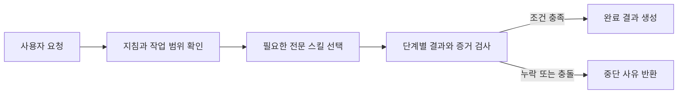

# Agent Governance Suite

한국어 | [English](README.en.md)

Agent Governance Suite는 여러 AI 호스트의 긴 작업에서 범위를 관리하고 위험한 변경을 사전에 점검하며, 증거 검증과 독립 감사를 하나의 워크플로로 연결하는 로컬 플러그인 모음입니다. 공용 스킬·계약·MCP는 호스트 중립이며 Codex, Claude Code와 다른 런타임의 차이는 adapter와 overlay에 둡니다.

에이전트가 작업을 완료했다고 보고해도 필요한 조건을 실제로 충족하지 않았다면 다음 단계로 넘어가지 않습니다. 테스트 근거가 없거나, 구현자가 자신의 결과를 감사했거나, 현재 변경과 맞지 않는 예전 감사 결과를 제출한 경우에는 워크플로 완료를 거절합니다. 이 판단을 지침으로만 두지 않는 것이 이 플러그인의 전제입니다. 로컬 MCP 서버가 계획을 고정한 뒤 단계 순서, 결과 형식, 증거와 감사 조건을 직접 검사하고, 조건을 채우지 못한 단계는 완료로 받지 않습니다.

같은 기준을 세션 하나 밖으로 넓힙니다. 한 대의 컴퓨터에서 여러 에이전트 세션이 같은 저장소나 설치를 동시에 다루면서 서로의 작업을 모르면, 각 세션이 자기 검사를 통과해도 결과는 어긋날 수 있습니다. 그래서 모든 호스트가 세션 현황판 하나를 함께 쓰고, 세션끼리 로컬 TLS 채널로 직접 메시지를 주고받습니다.

<!-- release-version:start -->
v2.2.1은 v2.2.0의 동작을 유지하는 patch 릴리스입니다. Claude 생성물에서 Codex 전용 스킬 메타데이터를 제외해 호스트 경계를 다시 맞추고, 한·영 README의 스킬 표를 현재 registry와 source lock에 맞춥니다. 인증서 serial의 DER 인코딩을 정규화해 간헐적인 세션 메시지 broker 시작 실패도 제거합니다.

v2.2.0은 세션 메시지의 본문을 주입하기 전에 출처 영수증을 기록하고, 이 영수증을 권한·승인·위임과 분리합니다. 영수증 저장소에는 원문 대신 digest와 제한된 메타데이터만 남고, peer 입력은 권한을 만들지 않습니다. 세션 현황에는 정확한 실행 instance에 결속된 presence가 함께 표시되며, 오래된 instance의 종료 신호가 새 instance를 종료하지 못합니다. Codex wake는 기본적으로 다음 사용자 turn까지 지연되고, 보이는 queue wake는 명시적으로 켜야 합니다. collaboration 판단은 현재 사용자 turn과 비권한 출처를 구분하며, blocker 진단의 확정 근본 조건은 recovery 전략과 새 작업 seed까지 digest로 이어집니다.

v2.1.0은 같은 컴퓨터에서 일하는 AI 호스트 세션들이 서로에게 직접 메시지를 보낼 수 있게 합니다. 로컬 TLS 1.3 broker가 본문을 보관하고 수신 측이 ACK할 때까지 전달을 추적하며, 호스트를 깨우는 wake bell은 target마다 소비되지 않은 것 하나만 예약해 같은 대기 구간에서 알림이 반복해 쌓이지 않습니다. 세션 현황판과 broker 상태는 모든 호스트가 함께 쓰는 `~/.agent-governance-suite` 아래에 둡니다. Codex의 새 사용자 요청은 `UserPromptSubmit` 훅으로 기록해, 같은 세션의 다음 변경 전에 현황판 한 줄을 다시 갱신하도록 요청 경계를 맞춥니다. v2.1.1은 세션 메시지 본문에 NUL 문자가 들어가면 보내는 단계에서 거부해, 플랫폼마다 `node:sqlite` 동작이 달라지는 경우를 없앱니다. 또 Windows에서 프로세스 시작 토큰을 더 가벼운 방법으로 읽어, 느린 환경에서 relay가 자기 호스트를 확인하지 못하던 문제를 고칩니다. v2.1.2는 실제 OS 토큰을 읽는 확인을 병렬 테스트에서 떼어 전용 단계로 옮겨 검증 결과가 기계 부하에 흔들리지 않게 하고, 느린 Windows 환경에서 broker가 준비될 때까지 더 기다립니다. 첫 메시지를 보낼 때 broker 기동이 늦어 실패하던 경우가 줄어듭니다.

- v2.0.0 — 세션 현황판을 두 호스트가 함께 쓰도록 바꾸면서 신뢰 경계를 확장한 major 릴리스
- v1.21.0 — 같은 컴퓨터에서 동시에 일하는 세션들이 서로의 작업을 알 수 있도록 세션 현황판(`session-board`)을 도입
- v1.20.0 — MIT 공개 스킬 `ponytail`을 구현 단계에 연결

지난 릴리스의 변경 내역은 [`docs/`](docs/)의 릴리스 노트에 있습니다. v1.16.0에서 `korean-prose-editor`에 적용한 candidate-v2 정책은 품질 기준 통과 기록(`0.3.0-gate-1`)의 평가 대상이 아니었으므로 아직 품질 미평가 상태입니다.

현재 공개 릴리스는 `v2.2.1`이며 거버넌스 전문 스킬 16개, 구현 단계 스킬 1개(`ponytail`), 로컬 인프라 스킬 2개(task continuity, 세션 현황판)와 한국어 산문 워크플로 1개를 포함합니다.
<!-- release-version:end -->

## 이런 문제를 다룹니다

| 상황 | Agent Governance Suite의 처리 방식 |
| --- | --- |
| 여러 `AGENTS.md` 가운데 어떤 지침이 적용되는지 불분명하다 | 실제 작업 대상에 적용되는 지침 파일과 우선순위를 확인합니다. |
| 에이전트가 요청 범위를 벗어난 파일까지 수정한다 | 변경 전 기준선과 현재 변경 사항을 비교해 범위 밖의 파일을 찾습니다. |
| 삭제, 배포, 권한 변경처럼 되돌리기 어려운 작업을 곧바로 실행한다 | 실행 전에 대상, 권한, 영향 범위, 복구 가능성, 필요한 승인을 점검합니다. |
| 테스트 없이 작업을 완료했다고 보고한다 | 각 수용 기준을 뒷받침하는 증거가 있고, 그 증거가 현재 결과를 가리키는지 확인합니다. |
| 구현자가 자신의 작업을 감사하거나 이전 감사 결과를 재사용한다 | 구현자와 감사자가 분리됐는지, 감사 대상이 현재 결과와 일치하는지, 감사 결과가 아직 유효한지 검사합니다. |
| 같은 실패를 근거 없이 반복한다 | 실패 기록에서 관측 사실과 원인 가설을 분리하고, 새 정보를 얻을 다음 판별 검사를 정합니다. |
| 여러 에이전트 세션이 같은 저장소나 설치를 동시에 건드린다 | 세션마다 지금 하는 일 한 줄을 공용 현황판에 적고, 병합·설치처럼 되돌리기 어려운 단계 전에 다른 세션의 작업을 확인합니다. |
| 세션 사이에 전할 내용을 사람이 직접 옮겨 붙인다 | 로컬 TLS 채널로 세션끼리 직접 메시지를 보내고, 수신 측이 ACK할 때까지 전달 상태를 추적합니다. |

모든 요청에 전문 스킬을 전부 실행하지는 않습니다. 오케스트레이터는 작업에 필요한 역할만 선택하며, 간단한 요청에는 전문 스킬 하나를 직접 사용할 수 있습니다.

## 작동 방식



오케스트레이터는 요청에 필요한 검사를 선택하고 실행 순서를 정합니다. 로컬 MCP 서버는 이 계획을 고정한 뒤 단계 순서, 결과 형식, 증거, 감사 조건을 검사합니다. 모든 필수 조건을 통과하면 구조화된 완료 결과를 만듭니다.

오케스트레이션 workflow에서는 의미 판단 단계의 실행 능력도 계획에 포함합니다. bootstrap과 각 semantic stage는 역할·위험도에 따라 최소 model class와 reasoning effort가 정해지며, 실제 실행에서 관측한 값이 없거나 하한보다 낮으면 MCP가 `passed` 결과를 거절합니다. 따라서 같은 스킬이더라도 낮은 세션 설정이 높은 신뢰도의 stage로 조용히 통과하는 경로를 차단합니다. 특정 제품 모델은 고정하지 않습니다.

검사는 세션 하나 안에서 끝나지 않습니다. 같은 컴퓨터의 다른 세션이 무엇을 하고 있는지는 공용 현황판에서 확인하고, 전해야 할 내용은 로컬 TLS 채널로 직접 보냅니다. [세션 사이 협업](#세션-사이-협업)을 참고하세요.

## 설치하고 사용하기

Node.js 22.13.0 이상이 필요합니다.

<!-- release-install:start -->
```bash
codex plugin marketplace add jaeseongs95/agent-governance-suite --ref v2.2.1
codex plugin add agent-governance-suite@agent-governance
```
<!-- release-install:end -->

설치를 마치면 새 Codex 세션을 시작합니다. 전체 워크플로를 사용하려면 다음과 같이 요청합니다.

```text
$orchestrator를 사용해 이 작업의 범위와 성공 조건을 정하고, 필요한 검증과 완료 근거를 관리해 줘: <작업 내용>
```

특정 검사만 필요할 때는 전문 스킬을 직접 지정할 수 있습니다.

```text
$mutation-risk-preflight를 사용해 이 위험한 변경을 실행하기 전에 필요한 조건을 확인해 줘.
$acceptance-evidence-validator를 사용해 각 수용 기준에 현재 근거가 있는지 확인해 줘.
```

플러그인 루트에서 다음 명령을 실행하면 구성과 실행 환경을 확인할 수 있습니다.

```bash
node scripts/check-runtime.mjs
```

MCP 서버가 시작되지 않아도 개별 전문 스킬은 직접 호출할 수 있습니다. 단계 순서를 강제하고 완료 결과를 만드는 통합 작업에는 MCP 서버가 필요합니다.

Hook은 처음 설치하거나 정의가 바뀐 뒤 Codex의 `/hooks`에서 내용을 검토하고 신뢰해야 실행됩니다. task continuity lifecycle Hook과 세션 현황판 Hook 모두 같습니다. 신뢰하지 않아 Hook이 생략되어도 기존 전문 스킬과 workflow MCP는 계속 동작합니다. 현황판 Hook은 Codex에서 세션 시작, 사용자 프롬프트 제출과 도구 호출 전 이벤트에 걸려 있고 Claude Code와 같은 공용 현황판 파일을 씁니다.

## 세션 사이 협업

한 사람이 같은 컴퓨터에서 여러 에이전트 세션을 동시에 돌리면, 각 세션의 검사만으로는 충분하지 않습니다. 다른 세션이 같은 파일을 고치고 있는지, 같은 설치를 바꾸려는지 알아야 합니다. 현황판은 그 상태를 보여 주고, 세션 메시지는 필요한 내용을 직접 전합니다. 둘 다 모든 로컬 호스트가 함께 쓰는 상태입니다.

세션 현황판은 세션마다 host, 세션 ID, 작업 디렉터리와 지금 하는 일 한 줄을 로컬 SQLite에 두고 `list_session_status`로 읽습니다. 사용자 요청마다 처음 파일을 고치거나 명령·서브에이전트를 실행하기 전에 `update_session_status`로 한 줄을 적어야 하며, 적지 않았으면 Hook이 그 호출을 한 번 거부하고 다음 시도는 허용합니다. 현황판은 다른 세션이 다음에 목록을 읽을 때 확인하는 방식이라, 그 자체로는 실행 중인 세션을 깨우거나 중단시키지 않습니다. 한 줄에 요청 원문이나 비밀, 개인정보를 적지 않습니다.

### 로컬 세션 메시지

현황판이 상태를 보여 준다면, 세션 메시지는 내용을 전합니다. `send_session_message`는 `targetHost`, `targetSessionId`와 최대 4096 UTF-8 byte의 본문을 받아 로컬 TLS 1.3 broker에 저장합니다. 수신 훅은 본문을 비신뢰 peer context로 claim하고, 처리한 모델이 `acknowledge_session_messages`를 호출해야 완료됩니다. ACK 전에는 claim lease가 끝난 뒤 지수 backoff로 다시 전달될 수 있으며, `get_session_message_status`는 `queued`, `delivered`, `acknowledged` 상태를 보여 줍니다. 기본 TTL은 1시간이고 30초부터 24시간까지 지정할 수 있으며, spool은 미ACK 메시지 1000개 또는 본문 합계 4 MiB로 제한됩니다. TLS spool과 ACK가 본문 전달의 내구성을 맡고, host를 깨우는 wake bell은 유실될 수 있는 알림입니다. broker는 target마다 소비되지 않은 bell을 하나만 예약해 같은 pending 구간에서 queue가 반복해서 쌓이지 않게 합니다. 실제 사용자 프롬프트 훅이 bell을 소비해야 다음 bell을 보낼 수 있으며, 전송 요청을 시작한 뒤 결과가 불명확하면 중복을 피하려고 다시 보내지 않습니다. wake가 유실돼도 다음 hook이나 turn이 같은 spool을 다시 확인합니다.

broker는 모든 호스트가 함께 쓰는 `~/.agent-governance-suite/session-messaging/`에서 필요할 때 시작하고 `127.0.0.1`에만 임의 포트로 바인딩합니다. 공용 루트는 절대 경로인 `AGENT_GOVERNANCE_SHARED_STATE_DIR`로 바꿀 수 있습니다. Node 내장 암호 모듈로 만든 P-256 자체서명 인증서의 SHA-256 fingerprint를 pin하고, 별도 256-bit token도 TLS 안에서 확인합니다. 본문은 Codex 명령행이나 Claude inbox에 넣지 않으며, 두 adapter는 target에 묶인 무작위 nonce가 든 작은 wake bell만 보냅니다. 지연·중복된 같은 bell도 TTL 안에서는 내부 wake로 인식하지만 본문 전달이나 권한을 부여하지 않습니다. 개인 키·broker token·Claude inbox token과 socket 경로는 메시지 DB에 저장하지 않습니다.

공통 프로토콜의 `host`는 임의 문자열입니다. Codex와 Claude Code에는 wake adapter를 제공하고, Grok·Spark 같은 다른 로컬 런타임은 `mcp-server/dist/session-message-cli.mjs`에 JSON을 stdin으로 넘겨 같은 `send`, `claim`, `acknowledge`, `status`, `pending` 작업을 사용할 수 있습니다. 새 wake adapter는 bell을 받을 수 있는 host 이벤트에서 반드시 `claim`도 호출해야 합니다. bell만 소비하고 claim하지 않으면 중복 억제 latch가 nonce TTL 동안 다음 자동 wake를 막으며, 본문은 spool에 남아 다음 자연 hook에서 전달됩니다. `claim` 호출자는 host 주입 한도에 맞춰 `maxMessages`와 UTF-16 code unit 기준 `maxBodyChars`를 줄일 수 있고, broker는 이 예산과 별개로 실제 JSON 응답을 32 KiB 이하로 유지합니다. 번들 hook은 가장 보수적인 공통값으로 한 번에 한 메시지만 주입합니다. 메시지 본문과 비밀값을 프로세스 인수로 넘기지 않습니다. 예:

```json
{"operation":"claim","payload":{"target":{"host":"spark","sessionId":"session-1"}}}
```

TLS는 loopback 구간의 평문 노출과 잘못된 broker 연결을 막지만, 같은 OS 사용자 권한으로 실행되는 악성 프로세스를 격리하지는 못합니다. 그런 프로세스는 사용자 상태의 키·token·DB를 읽거나 바꿀 수 있으므로, 이 기능을 사용자 간 보안 경계나 승인 위임 수단으로 사용하면 안 됩니다.

## Claude Code에서 사용하기

Claude Code용 배포물은 저장소의 `claude-plugin/`에 따로 있습니다. Codex 플러그인과 파일·훅·MCP 설정을 공유하지 않고, 상태 가운데 세션 현황판과 TLS 세션 메시지 broker만 모든 로컬 호스트가 함께 씁니다.

```text
/plugin marketplace add jaeseongs95/agent-governance-suite
/plugin install agent-governance-suite@agent-governance-claude
```

설치 후 새 세션에서 `/agent-governance-suite:orchestrator`나 `/agent-governance-suite:mutation-risk-preflight`처럼 스킬을 호출합니다. Codex와 다른 점은 다음과 같습니다.

- workflow·continuity 상태는 Claude Code가 플러그인마다 제공하는 데이터 디렉터리(`${CLAUDE_PLUGIN_DATA}`)에 저장합니다. 세션 현황판과 TLS broker는 OS·호스트에 관계없이 `~/.agent-governance-suite` 공용 루트에 두며, Claude Code 세션과 Codex 세션이 같은 상태를 봅니다. 샌드박스 호스트는 모든 adapter에 같은 절대 `AGENT_GOVERNANCE_SHARED_STATE_DIR`를 전달해야 합니다. 같은 OS 사용자로 실행되는 로컬 프로세스는 이 상태를 읽을 수 있습니다.
- 세션 현황판 Hook은 사용자 요청마다 처음 파일을 고치거나 명령·서브에이전트를 실행하기 전에 `update_session_status`로 지금 하는 일 한 줄을 적게 합니다. 적지 않았으면 그 호출을 한 번 거부하고 다음 시도는 허용합니다. 이 플러그인의 MCP 도구 호출은 거부하지 않습니다.
- `codex-token-usage-analyzer`는 Codex 세션 로그 전용이라 포함하지 않습니다.
- 독립 감사와 심의에는 부모 대화를 상속하지 않는 `independent-auditor`, `deliberation-reviewer` 서브에이전트를 사용합니다.
- `instruction-scope-resolver`는 `AGENTS.md` chain과 함께 `CLAUDE.md` 계층을 확인합니다.
- Anthropic API는 최상위 `oneOf`가 있는 도구 스키마를 받지 않으므로, Claude 배포물은 `AGENT_GOVERNANCE_TOOL_SCHEMA_PROFILE=anthropic`으로 `plan_workflow`의 공개 스키마만 평평하게 바꿉니다. 서버의 입력 검증은 같은 계약을 그대로 사용하고, 이 값이 없으면 기존 스키마를 그대로 내보냅니다.
- 같은 값으로 서버가 세션 `instructions`를 내보내고, Claude Code는 이를 세션 시작 때 시스템 프롬프트에 넣습니다. 내용은 "파일을 고치거나 명령을 실행하기 전에 요청의 실패 영향을 분류하고, 크면 orchestrator를 호출해 필요한 단계와 생략할 단계를 정한 뒤 정한 단계를 실제로 호출한다"는 접수 규칙입니다. 이 값이 없으면 `instructions`를 내보내지 않습니다.
- 실행 보증이 필요한 orchestrated workflow는 Claude 전용 host attestation 훅이 관측한 모델과 추론 수준으로 시작합니다. `plan_workflow`와 `record_stage_result`를 호출하기 직전에 Claude Code가 이 훅을 실행하고, 훅은 그 호출을 만든 assistant 메시지의 모델을 transcript에서, 추론 수준을 훅 입력과 transcript 중 낮은 값으로 정해 서명한 토큰을 도구 입력에 넣습니다. 서버는 Claude 배포물이 넘기는 `AGENT_GOVERNANCE_HOST_ATTESTATION=claude-code`가 있을 때만 이 토큰을 검증하므로, Codex 배포 서버는 이전처럼 `BINDING_REQUIRED`를 반환합니다. 토큰은 하네스가 관측했다는 근거일 뿐이며, 서명 키가 같은 사용자 권한의 상태 DB에 있으므로 OS 수준의 위조 방지는 아닙니다.

`claude-plugin/`은 `pnpm claude:build`로 생성하며 직접 수정하지 않습니다. 공용 원본(`skills/`, `runtime/`, `contracts/`, MCP 서버 번들)은 그대로 복사하고, Claude 전용 파일은 `claude-overlay/`에, 스킬별 Claude 문구는 `claude-overlay/adaptations/<스킬명>.json`에 둡니다. 공용 원본을 고칠 때 Claude 생성물을 함께 맞출 필요는 없습니다. CI는 둘의 차이를 경고로만 알리고, 릴리스를 준비하거나 Claude 쪽을 작업할 때 다시 생성합니다.

## 포함된 스킬

스킬 이름을 누르면 표에 표시된 버전의 원본 저장소로 이동합니다.

`시점`은 각 스킬을 어떤 작업 상황에서 검토하거나 호출하는지 보여 주는 안내입니다. 위에서 아래로 모든 스킬을 실행하라는 고정 순서가 아니며, 요청의 위험도와 현재 상태에 맞는 스킬만 선택합니다. 각 시점의 정의는 [운영과 참고](docs/operations.md#스킬-시점-안내)에 있습니다.

| 시점 | 스킬 | 버전 | 역할 |
| --- | --- | --- | --- |
| 요청 직후 | [`model-effort-advisor`](skills/model-effort-advisor/) | 0.1.0 | 관측 가능한 현재 모델·추론 수준이 요청 난도와 위험에 비해 과한지 또는 부족한지 확인하고, 유의미한 차이만 안내합니다. |
| 명시 요청 시 | [`codex-token-usage-analyzer`](https://github.com/jaeseongs95/codex-token-usage-analyzer/tree/v0.1.0/skills/codex-token-usage-analyzer) | 0.1.0 | 로컬 Codex 로그에서 작업·하위 작업·프로젝트의 token 사용량을 집계하고 JSON과 선택적 Markdown으로 보고합니다. |
| 한국어 산문 편집 시 | [`korean-prose-editor`](https://github.com/jaeseongs95/korean-prose-editor/tree/c5df63749e2edfc8aa424f9935ee3cd4697d3c49/skills/korean-prose-editor) | 0.1.0 | 한국어 README·안내문·보고서와 여러 문단의 산문을 사실·숫자·인용·링크·코드·주장 강도를 보존하며 자연스럽게 편집하고, 결과를 별도 검증해 결정적으로 최종화합니다. |
| 시작 전 | [`instruction-scope-resolver`](https://github.com/jaeseongs95/instruction-scope-resolver/tree/v1.0.0) | 1.0.0 | 작업 대상에 적용되는 지침의 범위와 우선순위를 확인합니다. |
| 시작 전 | [`workspace-convention-profiler`](https://github.com/jaeseongs95/workspace-convention-profiler/tree/v1.0.0) | 1.0.0 | 저장소의 구조, 도구, 관례, 검증 명령을 조사합니다. |
| 시작 전 | [`task-contract`](https://github.com/jaeseongs95/task-contract/tree/b14ffb36ed3be96cc4694d0b36054f21f69b577a) | 1.1.0 | 요청의 목표, 범위, 수용 기준, 위험도, 권한을 구조화하고 출처 영수증을 권한과 분리합니다. |
| 진행 중 | [`coordinate-subagents`](https://github.com/jaeseongs95/coordinate-subagents/tree/v1.1.0) | 1.1.0 | 독립 작업을 나누고 담당 영역과 검증 책임을 정합니다. |
| 진행 중 | [`independent-deliberation-panel`](https://github.com/jaeseongs95/independent-deliberation-panel/tree/v1.0.0) | 1.0.0 | 복잡한 결정의 근거와 반론을 여러 독립 관점에서 검토합니다. |
| 수렴 검토 | [`iteration-frame-auditor`](skills/iteration-frame-auditor/) | 1.0.0 | 반복 시도의 계약과 frame 변경을 독립적으로 비교해 새 epoch 허용 여부를 판정합니다. |
| 변경 전후 | [`change-scope-guardian`](https://github.com/jaeseongs95/change-scope-guardian/tree/v1.0.0) | 1.0.0 | 변경 전 기준선과 현재 Git 변경 사항을 비교해 요청 범위 밖의 파일을 찾습니다. |
| 변경 전 | [`mutation-risk-preflight`](https://github.com/jaeseongs95/mutation-risk-preflight/tree/v1.0.1) | 1.0.1 | 위험한 변경을 실행하기 전에 대상, 승인, 영향 범위, 복구 조건을 점검합니다. |
| 구현 | [`ponytail`](https://github.com/jaeseongs95/ponytail/tree/83b2cbc3bc50df3030c49d1dfe598ccefe850a85/skills/ponytail) | 4.10.0 | 코드를 작성·수정할 때와 거버넌스 흐름의 구현 단계에서 필요 없는 기능·추상화·의존성을 만들지 않는 가장 단순한 구현을 고르도록 안내합니다. |
| 보안 분석 요청 시 | [`software-security-auditor`](skills/software-security-auditor/) | 0.1.0 | 웹·API와 CLI·MCP의 공격 경로·방어 통제·취약점·검사 공백을 보고하며 완료 판정은 기존 게이트에 맡깁니다. |
| 완료 전 | [`acceptance-evidence-validator`](https://github.com/jaeseongs95/acceptance-evidence-validator/tree/v1.0.0) | 1.0.0 | 수용 기준마다 현재 결과를 뒷받침하는 증거가 있는지 검사합니다. |
| 완료 전 | [`independent-audit-gate`](https://github.com/jaeseongs95/codex-independent-audit-gate/tree/v1.0.0) | 1.0.0 | 구현자와 분리된 감사자가 고위험 변경과 검증 근거를 확인합니다. |
| 문제 발생 시 | [`blocker-diagnostician`](https://github.com/jaeseongs95/blocker-diagnostician/tree/14ae3288535b1d2061a0ee1c537fa6773077a533) | 1.1.0 | 실패를 관측 사실과 원인 가설로 나누고, 증상·메커니즘·근본 조건까지 evidence에 결속합니다. |
| 복구 선택 시 | [`recovery-strategy-selector`](skills/recovery-strategy-selector/) | 0.2.0 | 확정된 원인과 근본 조건에 결속된 복구 전략을 Objective Gate로 비교하고 새 작업용 `RecoveryHandoff.v1`을 만듭니다. |
| 평가 전후 | [`evaluation-validity-auditor`](https://github.com/jaeseongs95/evaluation-validity-auditor/tree/v1.0.0) | 1.0.0 | 동결된 평가의 설계·입력·판정·집계를 독립적으로 감사하며, `post-execution PASS`만 품질·릴리스 근거로 허용합니다. |

각 전문 스킬은 단독으로 호출할 수 있습니다. 둘 이상의 역할을 연결하려면 [`$orchestrator`](skills/orchestrator/)를 사용합니다. 외부에서 편입한 스킬의 원본과 이 저장소에서 만든 `model-effort-advisor`, `iteration-frame-auditor`, `recovery-strategy-selector`의 원본 경로·tag 또는 commit·원본/통합 `checksum`·업데이트 정책은 [`skills/source-lock.json`](skills/source-lock.json)에 고정되어 있으며, `orchestrator`는 현재 Git 이력으로 추적합니다.

## 개발과 검증

Node.js 22.13.0 이상과 Corepack이 필요합니다.

```bash
corepack enable
pnpm install --frozen-lockfile
pnpm bundle:check
pnpm claude:drift
pnpm lint
pnpm build
pnpm test
pnpm runtime:check
pnpm validate:all
pnpm validate:official
git diff --check
```

`claude:drift`는 `claude-plugin/`이 현재 원본으로 다시 생성한 결과와 다를 때 알려 주기만 하고 실패하지 않습니다. 릴리스를 준비하거나 Claude 쪽을 작업할 때는 `pnpm claude:build` 뒤 `pnpm claude:check`로 생성물이 최신인지 확인합니다. `bundle:check`는 stale 번들을 빌드가 덮어쓰기 전에 확인하므로 위 순서를 유지합니다. Codex 개발 환경의 `validate:official`은 시스템 `skill-creator`와 `plugin-creator` validator를 실행합니다. 시스템이 Python 3를 찾지 못하면 `PYTHON`에 실행 파일의 절대 경로를 지정합니다. 로컬 MCP 서버는 `pnpm dev`로 실행합니다.

## 문서와 기여

- [아키텍처](docs/architecture.md)
- [운영과 참고](docs/operations.md)
- [개발 참고](docs/development.md)
- [릴리스 점검](docs/release.md)
- [추가 스킬 구현 계획](docs/additional-skills-implementation-plan.md)
- [기여 안내](CONTRIBUTING.md)
- [보안 정책](SECURITY.md)

## 라이선스

[MIT License](LICENSE)
