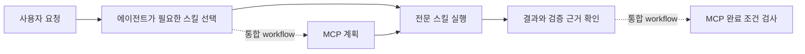
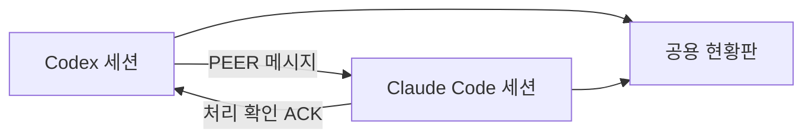

# Agent Governance Suite

한국어 | [English](README.en.md)

Agent Governance Suite(AGS)는 AI 에이전트의 작업에 전문 스킬과 검증 절차를 더하는 로컬 플러그인입니다. 요청에 필요한 점검을 고르고, 실행 결과를 근거와 함께 확인하도록 돕습니다.

새 기능을 만들면서 변경 범위와 검증 결과를 챙기거나, 같은 컴퓨터의 Codex·Claude Code 세션을 함께 쓸 때 활용할 수 있습니다.

| 상황 | AGS 없이 직접 마련할 것 | AGS가 제공하는 것 |
| --- | --- | --- |
| 작업 시작 | 목표·범위·완료 기준을 정리할 방식 | 작업 조건을 정리하고 필요한 전문 스킬을 연결하는 지침 |
| 위험한 변경 | 실행 전 점검과 별도 감사 절차 | 위험 사전 점검, 독립 감사와 MCP의 필수 단계 검사 |
| 완료 확인 | 결과와 검증 근거를 대조할 기준 | 수용 기준별 근거 확인과 workflow 완료 조건 검사 |
| 여러 세션의 협업 | 각 세션의 작업을 확인하고 연락할 경로 | 공용 현황판과 처리 여부를 확인할 수 있는 로컬 PEER 메시지 |

<!-- release-version:start -->
현재 공개 릴리스는 `v2.7.1`이며 거버넌스 전문 스킬 16개, 구현 단계 스킬 1개(`ponytail`), 로컬 인프라 스킬 2개(task continuity, 세션 현황판)와 한국어 산문 워크플로 1개를 포함합니다.
<!-- release-version:end -->

- [설치](#설치)
- [빠른 시작](#빠른-시작)
- [주요 기능](#주요-기능)
- [설정](#설정)
- [문제 해결](#문제-해결)

## 설치

Node.js **24.0.0 이상**이 필요합니다. 플러그인 사용을 위해 저장소를 clone하거나 `pnpm install`을 실행할 필요는 없습니다.

### Claude Code

Claude Code 안에서 실행합니다.

```text
/plugin marketplace add jaeseongs95/agent-governance-suite
/plugin install agent-governance-suite@agent-governance-claude
```

설치 후 새 세션을 시작합니다.

### Codex

터미널에서 실행합니다.

<!-- release-install:start -->
```bash
codex plugin marketplace add jaeseongs95/agent-governance-suite --ref v2.7.1
codex plugin add agent-governance-suite@agent-governance
```
<!-- release-install:end -->

설치 후 새 Codex 세션을 시작합니다. `/hooks`에서 설치된 훅을 검토하고 신뢰해야 문맥 보존, 세션 현황판과 실행 관측 훅이 동작합니다. 훅 정의가 바뀌면 다시 검토합니다.

## 빠른 시작

스킬 이름을 외우기보다 평소처럼 원하는 작업과 확인할 조건을 말해 보세요.

```text
이 기능을 구현하고 검증해 줘. 다른 작업의 변경이 섞이지 않았는지도 확인해 줘.
같은 테스트가 계속 실패해. 원인 후보를 나누고 다음에 할 검사를 정해 줘.
이 한국어 README를 다듬어 줘. 사실, 숫자, 링크와 코드의 의미는 유지해 줘.
```

에이전트는 설치된 스킬의 설명과 적용 조건을 보고 사용할 스킬을 판단합니다. 여러 전문 스킬을 이어 써야 할 때는 `orchestrator`가 순서와 결과를 연결하고, 한 가지 검사만 필요하면 해당 스킬을 직접 사용할 수 있습니다.

Claude Code는 일부 요청과 명령에 추가 스킬을 추천하는 안내를 제공합니다. Codex의 암시 선택은 모델의 판단에 의존합니다. 스킬을 직접 지정하려면 Codex에서는 `$orchestrator`, Claude Code에서는 `/agent-governance-suite:orchestrator`처럼 요청할 수 있습니다.


```mermaid
flowchart LR
    R["사용자 요청"] --> S["에이전트가 필요한 스킬 선택"]
    S --> E["전문 스킬 실행"]
    E --> V["결과와 검증 근거 확인"]
    S -. "통합 workflow" .-> P["MCP 계획"]
    P --> E
    V -. "통합 workflow" .-> G["MCP 완료 조건 검사"]
```

전문 스킬은 직접 사용할 수 있습니다. 계획·단계 순서·완료 조건을 MCP에서 검사하는 통합 workflow에는 로컬 MCP 서버가 필요합니다.

## 주요 기능

### 작업에 맞는 전문 스킬

아래 표에서 필요한 상황을 찾아보세요. 모든 스킬을 한꺼번에 실행하는 목록은 아닙니다.

| 상황 | 스킬 | 버전 | 역할 |
| --- | --- | --- | --- |
| 시작 조건 정리 | [`model-effort-advisor`](skills/model-effort-advisor/) | 0.1.0 | 관측된 모델·추론 수준과 요청의 난도·위험 사이에 유의미한 차이가 있는지 확인합니다. |
| 시작 조건 정리 | [`instruction-scope-resolver`](skills/instruction-scope-resolver/) | 1.0.0 | 대상에 적용되는 지침과 우선순위를 확인합니다. |
| 시작 조건 정리 | [`workspace-convention-profiler`](skills/workspace-convention-profiler/) | 1.0.0 | 저장소 구조, 도구, 관례와 검증 명령을 조사합니다. |
| 시작 조건 정리 | [`task-contract`](skills/task-contract/) | 1.1.0 | 목표·범위·수용 기준·위험·권한을 정리하고 출처 영수증과 권한을 구분합니다. |
| 구현·변경·의사결정 | [`coordinate-subagents`](skills/coordinate-subagents/) | 1.1.0 | 허용되고 필요한 위임의 담당 영역과 검증 책임을 관리합니다. |
| 구현·변경·의사결정 | [`ponytail`](skills/ponytail/) | 4.10.0 | 요청을 만족하는 가장 단순한 구현을 고르도록 안내합니다. |
| 구현·변경·의사결정 | [`change-scope-guardian`](skills/change-scope-guardian/) | 1.0.0 | 변경 전 기준선과 현재 Git 변경을 대조해 범위 밖 파일을 찾습니다. |
| 구현·변경·의사결정 | [`mutation-risk-preflight`](skills/mutation-risk-preflight/) | 1.0.1 | 위험한 변경의 대상·승인·영향·복구 조건을 점검합니다. |
| 구현·변경·의사결정 | [`independent-deliberation-panel`](skills/independent-deliberation-panel/) | 1.0.0 | 복잡한 결정의 근거와 반론을 독립 관점에서 검토합니다. |
| 구현·변경·의사결정 | [`iteration-frame-auditor`](skills/iteration-frame-auditor/) | 1.0.0 | 반복 작업의 계약과 frame 변경을 독립 비교합니다. |
| 완료 확인 | [`acceptance-evidence-validator`](skills/acceptance-evidence-validator/) | 1.0.0 | 각 수용 기준을 현재 결과의 증거와 대조합니다. |
| 완료 확인 | [`independent-audit-gate`](skills/independent-audit-gate/) | 1.0.0 | 구현자와 분리된 감사자가 고위험 변경과 근거를 확인합니다. |
| 실패 진단·복구 | [`blocker-diagnostician`](skills/blocker-diagnostician/) | 1.1.0 | 관측 사실과 원인 가설을 구분하고 다음 판별 검사를 정합니다. |
| 실패 진단·복구 | [`recovery-strategy-selector`](skills/recovery-strategy-selector/) | 0.2.0 | 확인된 원인에 맞는 전략을 비교해 새 작업용 `RecoveryHandoff.v1`을 만듭니다. |
| 전문 분석·편집 | [`korean-prose-editor`](skills/korean-prose-editor/) | 0.1.0 | 사실·숫자·인용·링크·코드·주장 강도를 보존하며 편집하고 별도 검증·최종화합니다. |
| 전문 분석·편집 | [`codex-token-usage-analyzer`](skills/codex-token-usage-analyzer/) | 0.1.0 | 로컬 Codex 로그의 작업·프로젝트 token 사용량을 집계합니다. |
| 전문 분석·편집 | [`software-security-auditor`](skills/software-security-auditor/) | 0.1.0 | 웹·API와 CLI·MCP의 공격 경로, 방어 통제와 검사 공백을 감사합니다. |
| 전문 분석·편집 | [`evaluation-validity-auditor`](skills/evaluation-validity-auditor/) | 1.0.0 | 동결 평가의 설계·입력·판정·집계를 독립 감사합니다. |

버전과 출처는 [registry](skills/registry.json)와 [source lock](skills/source-lock.json)에 기록됩니다. [`orchestrator`](skills/orchestrator/)는 현재 Git 이력으로 추적합니다. `ponytail` 링크는 AGS 내장 스킬을 가리킵니다. 과거 외부 원본의 고정 정보는 source lock에 provenance로 보존됩니다. `codex-token-usage-analyzer`는 Codex 로그 전용이라 Claude Code 배포물에는 포함되지 않습니다.

한국어 산문 워크플로는 활성화되어 있습니다. 현행 편집 정책의 품질은 아직 평가되지 않았으며, 이전 정책의 품질 통과 기록은 현재 정책에 적용되지 않습니다. [평가 상태와 계획](docs/roadmap.md)을 확인하세요.

### 근거를 확인하는 MCP workflow

에이전트가 선택한 작업을 `plan_workflow`로 계획하고, 실제 전문 스킬의 결과를 `record_stage_result`로 기록합니다. MCP는 단계 순서, 결과 형식, 필수 근거와 감사 조건을 검사합니다. 계획된 필수 조건을 충족해야 `finalize_workflow`가 완료 결과를 만듭니다.

실행 보증이 필요한 workflow에서는 호스트가 관측한 모델·추론 수준과 해당 실행의 연결도 확인합니다. 자세한 조건은 [실행 관측 계약](docs/host-execution-attestation.md)에 있습니다.

### 누가 무엇을 하는지 보고, 세션끼리 직접 전달

[`session-board`](skills/session-board/)로 같은 컴퓨터에서 누가, 어느 저장소에서, 무슨 작업을 하는지 확인할 수 있습니다. 각 세션이 현재 작업을 한 줄로 기록하면 다른 세션이 공용 현황판에서 읽을 수 있습니다.

로컬 PEER 메시지는 사용자에게 매번 내용을 복사해 옮기게 하지 않고, 허용된 협업 범위에서 작업 의뢰·검토 결과·차단 사유를 다른 세션에 직접 전달하는 수단입니다. 전송·본문 전달·처리 확인(ACK)을 구분해 확인할 수 있습니다.


```mermaid
flowchart LR
    C["Codex 세션"] --> B["공용 현황판"]
    L["Claude Code 세션"] --> B
    C -->|"PEER 메시지"| L
    L -->|"처리 확인 ACK"| C
```

메시지 전달 시점은 호스트의 훅과 깨우기 지원에 따라 달라집니다. Codex는 기본적으로 다음 지원 도구 경계까지 전달이 대기할 수 있습니다. ACK는 메시지 처리 확인이며 업무 완료나 실행 승인은 아닙니다.

호출 순서와 재시도는 [메시지 수명](docs/session-message-lifecycle.md), 호스트별 전달·깨우기는 [입력 경계](docs/input-boundaries.md)와 [peer 대기](docs/peer-wait-policy.md)를 참고하세요. 다른 로컬 런타임도 공통 CLI로 같은 메시지 프로토콜을 사용할 수 있습니다.

### 긴 작업을 이어가는 문맥 보존

[`context-continuity`](skills/context-continuity/)는 긴 direct task를 재개할 때 필요한 범위·결정·미해결 사항과 검증 참조를 로컬 checkpoint로 저장합니다. 먼저 저장 정보와 복원 선택지를 제시하고, 본문은 명시적으로 `load_context`를 호출할 때 반환합니다. Orchestrated workflow는 기존 작업 계약과 실행 기록을 기준으로 이어갑니다.

### 공통 원본과 호스트별 연결

공용 스킬·계약·MCP는 Codex와 Claude Code 배포물의 기반입니다. 호스트 고유의 설치·훅·실행 관측·깨우기 방식은 adapter와 overlay로 연결합니다. 공통 정책은 한 원본에서 관리하고 실제 호스트 차이만 별도로 구현하는 것이 AGS의 원칙입니다. 지원 범위는 [아키텍처](docs/architecture.md)와 [입력 경계](docs/input-boundaries.md)를 참고하세요.

## 설정

대부분은 배포물에 포함된 기본 설정으로 시작할 수 있습니다. 같은 컴퓨터의 두 호스트가 협업하려면 같은 공용 상태 경로에 접근해야 합니다. 샌드박스 등에서 기본 경로가 다르면 절대 경로 값이 같은 `AGENT_GOVERNANCE_SHARED_STATE_DIR`를 전달합니다.

상태 경로와 환경변수는 [운영 문서](docs/operations.md#상태-저장과-마이그레이션), Codex의 선택형 queue wake는 [설정 계약](docs/input-boundaries.md#codex-queue-wake-설정)에 있습니다. 데이터 보존과 정리는 [정리 절차](docs/state-cleanup.md)를 따릅니다.

`check_for_updates`는 새 공개 안정 버전을 안내하며 자동 설치하지 않습니다. [업데이트 확인](docs/operations.md#플러그인-업데이트-확인)을 참고하세요.

## 문제 해결

| 증상 | 먼저 확인할 내용 |
| --- | --- |
| 설치 후 스킬이나 MCP가 보이지 않는다 | 설치가 끝난 뒤 새 세션을 시작했는지, 호스트의 플러그인·MCP 상태를 확인합니다. |
| MCP 서버가 시작되지 않는다 | 호스트가 사용하는 Node.js가 24.0.0 이상인지와 MCP 시작 로그를 확인합니다. |
| 메시지가 대기하거나 처리 확인이 없다 | 같은 `messageId`로 상태를 확인하고 수신 세션의 훅·전달 경계를 확인합니다. [전달 조건](docs/input-boundaries.md)을 참고하세요. |
| 업데이트 뒤 이전 동작이 남는다 | 기존 AGS MCP·relay·broker를 종료하고 업데이트 후 재연결해 새 프로세스를 시작합니다. [업데이트와 복구](docs/session-message-lifecycle.md#업데이트와-복구)를 참고하세요. |

실행 관측 오류는 [실행 관측 계약](docs/host-execution-attestation.md), 자세한 운영 조건은 [운영 문서](docs/operations.md)를 확인하세요.

## 문서와 기여

- [아키텍처](docs/architecture.md), [운영과 참고](docs/operations.md)
- [개발·검증 절차](CONTRIBUTING.md), [개발 참고](docs/development.md)
- [릴리스 점검](docs/release.md), [릴리스 기록과 계획](docs/roadmap.md)
- [보안 정책](SECURITY.md)

## 라이선스

[MIT License](LICENSE)
