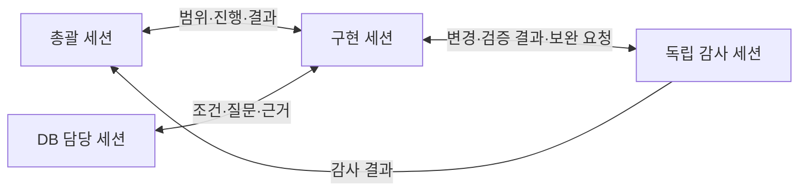

# Agent Governance Suite

한국어 | [English](README.en.md)

**AI 세션의 작업·협업·검증을 하나의 흐름으로.**

Agent Governance Suite(AGS)는 Codex와 Claude Code에서 AI 작업을 지속적으로 운영하기 위한 로컬 플러그인입니다. 목표와 담당 범위를 정하고, 각자의 맥락을 가진 세션들이 직접 협업하며, 결과를 검증한 근거를 남기도록 돕습니다.

한 세션에 맡긴 조사·구현·검토부터 여러 세션이 역할을 나누는 장기 작업까지 사용할 수 있습니다. 전문 스킬이 작업 방법과 판단 기준을 제공하고, 로컬 실행 계층이 세션 간 연락, 작업 기록, 필수 단계와 완료 조건의 검사를 담당합니다.

[작업 흐름](#작업이-이어지는-방식) · [설치](#설치) · [세션 협업 체험](#두-세션으로-직접-확인하기) · [주요 기능](#주요-기능) · [내부 구조](#내부-구조)

## 작업이 이어지는 방식

데이터베이스를 맡은 Claude Code 세션이 API 구현에 영향을 주는 조건을 발견했다고 해 보겠습니다. 구현 담당 Codex 세션에는 이미 작업 맥락이 있고, 별도의 세션이 감사를 맡고 있습니다.

DB 담당은 현황판에서 구현 담당을 찾아 조건과 근거를 직접 전달합니다. 구현 담당은 자신의 기존 맥락에서 내용을 검토하고, 허용된 범위에서 작업을 이어갑니다. 감사 담당은 변경 결과와 검증 근거를 직접 확인하고, 보완할 사항을 담당자에게 돌려보냅니다. 총괄은 그 결과를 모아 완료한 부분과 남은 문제를 확인합니다.


```mermaid
flowchart LR
    L["총괄 세션"] <-->|"범위·진행·결과"| I["구현 세션"]
    D["DB 담당 세션"] <-->|"조건·질문·근거"| I
    I <-->|"변경·검증 결과·보완 요청"| A["독립 감사 세션"]
    A -->|"감사 결과"| L
```

이것은 역할과 작업 범위를 정해 둔 팀의 사용 예입니다. 각 세션은 공용 현황판에서 담당 업무를 확인하고, **PEER 메시지**로 필요한 상대에게 직접 연락합니다. 자동 깨우기가 지원되고 활성화된 수신 환경에서는 메시지를 계기로 유휴 세션이 작업을 재개할 수 있습니다.

담당 세션에 축적된 조사와 결정은 후속 작업에 활용하고, 다른 세션에는 필요한 요약·산출물 위치·검증 근거를 전달합니다. 사용자는 세션 사이의 메시지를 매번 복사해 옮기는 대신, 작업의 목표·허용 범위와 중요한 결정을 다룹니다.

이 흐름을 받치는 것이 AGS의 작업 계약, 전문 스킬, 세션 현황판, 메시징, 문맥 보존과 검증 절차입니다. [협업 방식과 실행 구조](docs/architecture.md)를 더 자세히 볼 수 있습니다.

## 설치

Node.js **24.0.0 이상**과 사용할 호스트의 플러그인 기능이 필요합니다. 협업에 참여할 호스트마다 AGS를 설치합니다. 플러그인 사용을 위해 이 저장소를 clone하거나 `pnpm install`을 실행할 필요는 없습니다.

<!-- release-version:start -->
현재 공개 릴리스는 `v2.7.6`이며 거버넌스 전문 스킬 16개, 구현 단계 스킬 1개(`ponytail`), 로컬 인프라 스킬 2개(task continuity, 세션 현황판)와 한국어 산문 워크플로 1개를 포함합니다.
<!-- release-version:end -->

### Claude Code

Claude Code 안에서 실행합니다.

```text
/plugin marketplace add jaeseongs95/agent-governance-suite
/plugin install agent-governance-suite@agent-governance-claude
```

설치 후 새 세션을 시작합니다.

### Codex

터미널에서 실행합니다.

<!-- release-install:start -->
```bash
codex plugin marketplace add jaeseongs95/agent-governance-suite --ref v2.7.6
codex plugin add agent-governance-suite@agent-governance
```
<!-- release-install:end -->

설치 후 새 Codex 세션을 시작합니다. `/hooks`에서 설치된 훅을 검토하고 신뢰해야 문맥 보존, 세션 현황판과 실행 관측 훅이 동작합니다. 훅 정의가 바뀌면 다시 검토합니다.

## 빠른 시작

평소처럼 작업과 확인할 조건을 요청하면 됩니다. 에이전트가 설치된 스킬의 설명과 적용 조건을 읽고 필요한 스킬을 선택합니다.

```text
이 기능을 구현하고 검증해 줘. 수정 범위와 완료 기준을 먼저 정리하고,
최종 결과에는 실제로 실행한 검사와 아직 해결하지 못한 문제를 함께 적어 줘.
```

여러 전문 결과의 순서와 입출력을 연결할 때는 `orchestrator`가 흐름을 구성합니다. 필요한 전문 스킬 하나를 직접 사용하는 것도 가능합니다. 스킬을 명시하려면 Codex에서는 `$orchestrator`, Claude Code에서는 `/agent-governance-suite:orchestrator`처럼 요청합니다.

### 두 세션으로 직접 확인하기

같은 컴퓨터에서 같은 프로젝트를 연 세션 두 개를 준비합니다. 두 세션 모두 AGS의 MCP와 훅이 동작하고, 같은 공용 상태 경로에 접근할 수 있어야 합니다. Codex와 Claude Code를 하나씩 사용해도 됩니다.

아래 예제는 **프로젝트의 테스트 실행 방법을 조사하고, 다른 세션이 근거를 확인해 회신하는 작업**입니다. 코드 수정 없이 현황판, 세션 간 전달, 검토와 회신을 확인합니다.

**먼저 검토 담당 세션에 입력합니다.**

```text
이번 체험에서 너는 검토 담당이야.
AGS 현황판의 현재 작업을 "AGS-DEMO-REVIEW · 테스트 실행 방법 검토"로 기록해 줘.

조사 담당 세션이 PEER 메시지로 검토를 요청하면,
전달받은 파일 위치를 직접 읽고 설명이 맞는지 확인해 줘.
메시지 처리 확인(ACK)을 남기고, 검토 결과와 근거는 별도 PEER 메시지로
요청한 세션에 회신해 줘. 파일 수정이나 테스트 실행은 하지 마.
```

**이어서 조사 담당 세션에 입력합니다.**

```text
AGS 현황판의 현재 작업을 "AGS-DEMO-RESEARCH · 테스트 실행 방법 조사"로 기록해 줘.
이 프로젝트의 문서와 설정에서 테스트 실행 방법을 찾아,
명령과 근거 파일 위치를 짧게 정리해 줘. 파일 수정이나 테스트 실행은 하지 마.

현황판에서 "AGS-DEMO-REVIEW"를 맡은 세션을 찾고,
조회된 host와 session ID를 사용해 조사 내용을 PEER 메시지로 보내 검토를 요청해 줘.
응답에서는 메시지 처리 확인(ACK)과 실제 검토 결과를 구분해 줘.
상대의 회신을 받으면 조사 내용과 대조해 최종 결론을 알려 줘.
```

확인할 것은 **조사 담당의 전송 기록 → 검토 담당의 본문 수신과 근거 확인 → 조사 담당으로 돌아온 검토 결과**입니다. 메시지가 전송됐다는 상태와 검토 작업이 끝났다는 결과를 각각 확인합니다.

회신 뒤에는 조사 담당에게 다음처럼 이어서 요청할 수 있습니다.

```text
방금 검토받은 내용을 기준으로, 새 개발자가 테스트를 실행할 때 필요한
준비 사항을 정리해 줘. 추가로 확인할 내용이 생기면 같은 검토 담당에게 물어봐 줘.
```

같은 담당 세션과 대화를 이어가면서, 필요한 확인만 다른 세션에 요청하는 흐름입니다.

> **메시지가 아직 도착하지 않았다면:** 전달 시점은 수신 호스트의 훅과 깨우기 설정에 따라 달라집니다. Codex는 기본적으로 다음 지원 도구 경계까지 전달이 대기할 수 있습니다. 자동 깨우기를 체험하려면 [Codex queue wake 설정](docs/input-boundaries.md#codex-queue-wake-설정)을 적용하고 수신 세션을 새로 시작하거나 재개합니다. 같은 `messageId`로 상태를 확인하고, 전송 결과가 불명확한 메시지를 새 ID로 반복해서 보내지 않습니다. 상세 절차는 [메시지 수명](docs/session-message-lifecycle.md)에 있습니다.

## 주요 기능

### 목표와 완료 기준을 작업의 기준으로 유지

작업을 시작할 때 적용 지침, 저장소 관례, 수정 범위, 완료 기준과 권한을 정리합니다. 작업 중에는 변경 전 기준선과 현재 변경을 대조하고, 반복 시도에서 목표나 범위가 달라졌는지도 검토합니다.

배포, 권한 변경, 데이터 삭제처럼 영향이 큰 작업에는 대상·승인·영향·복구 조건을 살피는 사전 점검과 독립 감사를 적용합니다. 필요한 판단과 확인 사항은 작업 조건에 맞춰 선택합니다.

관련 스킬: [작업 계약](skills/task-contract/), [변경 범위 점검](skills/change-scope-guardian/), [위험 사전 점검](skills/mutation-risk-preflight/), [반복 작업 감사](skills/iteration-frame-auditor/).

### 담당 세션을 찾고 직접 협업

공용 현황판에는 호스트, 세션, 작업 디렉터리와 현재 업무가 표시됩니다. 세션은 이 정보를 읽고 협업할 상대를 찾습니다. 실제 요청·검토 결과·차단 사유는 PEER 메시지로 전달합니다.

메시지는 시스템이 발급한 ID로 추적하며 전송, 본문 전달, 처리 확인(ACK)을 구분합니다. 자동 깨우기는 지원되는 호스트 연결 방식으로 제공하고, 메시지 본문과 전달 상태는 로컬 큐에서 별도로 관리합니다. **ACK는 메시지 처리 확인이고, 업무 완료와 실행 승인은 별도로 확인합니다.**

관련 문서: [세션 현황판](skills/session-board/), [메시지 수명과 재시도](docs/session-message-lifecycle.md), [입력·전달 경계](docs/input-boundaries.md), [대기와 작업 재개](docs/peer-wait-policy.md).

### 긴 작업을 기록과 맥락에 연결

담당 세션은 자신이 진행한 조사와 결정의 맥락에서 다음 작업을 이어갑니다. 다른 세션과 공유할 때는 필요한 결론과 근거를 전달하고, 역할과 수정 책임을 명확히 나눕니다.

긴 개별 작업에는 `context-continuity`로 범위·결정·미해결 사항·검증 참조를 로컬 checkpoint에 저장할 수 있습니다. 재개 시 저장 정보와 복원 선택지를 먼저 제시하고, 본문은 명시적인 `load_context` 호출로 불러옵니다. MCP로 관리하는 통합 작업은 기존 작업 계약과 실행 기록을 기준으로 이어갑니다.

관련 문서: [문맥 보존](skills/context-continuity/), [위임과 책임 관리](skills/coordinate-subagents/).

### 현재 결과의 근거로 완료를 판단

전문 스킬은 완료 기준을 실제 산출물과 검증 결과에 대조합니다. 고위험 변경은 구현에 참여하지 않은 감사자가 요구사항, 최종 변경과 실패 가능성을 따로 검토합니다. 감사 대상이 이후에 바뀌면 영향을 받은 부분을 다시 확인합니다.

MCP workflow는 계획된 단계의 순서, 결과 형식, 필수 근거와 감사 조건을 검사합니다. 모든 필수 조건을 충족하고 미해결 항목이 없어야 완료 결과를 발급합니다. **산출물의 내용을 판단하는 전문 스킬과, 절차·기록·완료 조건을 검사하는 실행 계층이 함께 작동합니다.**

관련 스킬: [완료 근거 검증](skills/acceptance-evidence-validator/), [독립 감사](skills/independent-audit-gate/).

### 실패 원인을 가르고 다음 시도를 설계

같은 문제가 반복되면 관측한 사실과 원인 가설을 나누고, 후보를 구별할 다음 검사를 정합니다. 원인이 확인되면 복구 전략을 비교하고, 다음 작업이 사용할 인계 자료를 만듭니다.

통합 workflow의 복구에서는 이전 실행 기록을 보존하고, 복구 인계에 연결된 새 작업 계약과 실행을 구성합니다. 무엇이 실패했고 왜 접근을 바꿨는지 추적할 수 있습니다.

관련 스킬: [실패 진단](skills/blocker-diagnostician/), [복구 전략 선택](skills/recovery-strategy-selector/).

### 필요한 전문 역량을 작업에 연결

보안 감사, 독립적인 의사결정 검토, 한국어 문서 편집, Codex 토큰 사용량 분석도 같은 플러그인에서 사용할 수 있습니다. 각 전문 스킬은 담당하는 판단과 결과 형식이 있으며, `orchestrator`가 필요한 결과의 순서와 연결을 맡습니다.

<details>
<summary>전문 스킬 전체 보기</summary>

| 스킬 | 담당하는 일 |
| --- | --- |
| [`model-effort-advisor`](skills/model-effort-advisor/) | 관측한 모델·추론 수준이 작업의 난도와 위험에 맞는지 점검합니다. |
| [`instruction-scope-resolver`](skills/instruction-scope-resolver/) | 적용할 지침과 우선순위를 확인합니다. |
| [`workspace-convention-profiler`](skills/workspace-convention-profiler/) | 저장소 구조, 관례, 도구와 검증 명령을 조사합니다. |
| [`task-contract`](skills/task-contract/) | 목표·범위·완료 기준·위험·권한을 정리합니다. |
| [`coordinate-subagents`](skills/coordinate-subagents/) | 위임의 필요성, 담당 영역, 전달할 맥락과 검증 책임을 관리합니다. |
| [`ponytail`](skills/ponytail/) | 요청을 만족하는 가장 단순한 구현을 고르도록 안내합니다. |
| [`change-scope-guardian`](skills/change-scope-guardian/) | 기준선과 현재 변경을 대조해 범위를 벗어난 파일을 찾습니다. |
| [`mutation-risk-preflight`](skills/mutation-risk-preflight/) | 위험한 변경의 대상·승인·영향·복구 조건을 점검합니다. |
| [`independent-deliberation-panel`](skills/independent-deliberation-panel/) | 복잡한 결정의 근거와 반론을 독립된 관점에서 검토합니다. |
| [`iteration-frame-auditor`](skills/iteration-frame-auditor/) | 반복 작업에서 계약과 판단 전제가 달라졌는지 감사합니다. |
| [`acceptance-evidence-validator`](skills/acceptance-evidence-validator/) | 완료 기준을 현재 결과의 근거와 대조합니다. |
| [`independent-audit-gate`](skills/independent-audit-gate/) | 구현자와 분리된 감사자가 고위험 변경과 근거를 확인합니다. |
| [`blocker-diagnostician`](skills/blocker-diagnostician/) | 사실과 원인 가설을 구분하고 다음 판별 검사를 정합니다. |
| [`recovery-strategy-selector`](skills/recovery-strategy-selector/) | 확인된 원인에 맞는 복구 전략과 다음 작업의 인계를 준비합니다. |
| [`korean-prose-editor`](skills/korean-prose-editor/) | 사실·수치·링크·코드·주장 강도를 보존하며 한국어 산문을 편집·검증합니다. |
| [`codex-token-usage-analyzer`](skills/codex-token-usage-analyzer/) | 로컬 Codex 로그의 작업·프로젝트 토큰 사용량을 집계합니다. |
| [`software-security-auditor`](skills/software-security-auditor/) | 웹·API와 CLI·MCP의 공격 경로, 방어 수단과 검사 공백을 감사합니다. |
| [`evaluation-validity-auditor`](skills/evaluation-validity-auditor/) | 고정된 평가의 설계·입력·판정·집계를 독립 감사합니다. |

스킬 버전과 출처는 [registry](skills/registry.json)와 [source lock](skills/source-lock.json)에 기록합니다. [`orchestrator`](skills/orchestrator/)는 현재 Git 이력으로 추적합니다. `ponytail`은 AGS에 내장되어 있으며 외부 원본의 고정 정보는 source lock에 출처 이력으로 남아 있습니다.

`codex-token-usage-analyzer`는 Codex 로그 전용이며 Claude Code 배포물에는 포함되지 않습니다. 한국어 산문 workflow는 활성화되어 있지만 현행 편집 정책의 품질 평가는 아직 완료되지 않았습니다. 이전 정책의 품질 통과 기록은 현행 정책에 적용하지 않습니다. [평가 상태와 계획](docs/roadmap.md)을 확인하세요.

</details>

## 내부 구조

AGS는 전문 판단, 흐름 연결, 실행 시 검사를 분리합니다.

| 구성 | 책임 |
| --- | --- |
| 전문 스킬 | 작업 조건을 해석하고, 조사·구현·검토를 수행하며 결과와 근거를 만듭니다. |
| `orchestrator` | 필요한 전문 역량을 선택하고 실행 순서, 입출력과 결과 통합을 연결합니다. |
| 로컬 MCP·계약·SQLite | 계획과 실행 상태를 기록하고, 단계·결과 형식·필수 근거·완료 조건을 검사합니다. |
| 호스트 adapter·훅 | Codex와 Claude Code의 세션 정보, 실행 관측, 메시지 전달·깨우기를 공통 계약에 연결합니다. |

통합 workflow는 `plan_workflow`에서 계획을 만들고, 실행 단계의 결과를 `record_stage_result`로 기록하며, `finalize_workflow`에서 완료 조건을 검사합니다. 실행 보증이 필요한 단계에서는 호스트가 관측한 모델·추론 수준과 해당 호출의 연결도 확인합니다. 전문 스킬을 단독으로 사용할 수 있으며, MCP가 검사하는 통합 workflow에는 로컬 MCP 서버가 필요합니다.

공용 스킬·계약·런타임은 한 원본에서 관리합니다. 호스트마다 다른 설치·훅·실행 관측·깨우기 방식은 adapter와 overlay로 연결합니다. 다른 로컬 런타임은 공통 CLI로 메시징 프로토콜을 사용하거나 adapter를 추가해 연결할 수 있습니다.

상세 설계: [아키텍처](docs/architecture.md), [실행 관측 계약](docs/host-execution-attestation.md), [공통 입력 경계](docs/input-boundaries.md).

## 설정

### 같은 컴퓨터의 세션 연결

공개 배포물은 Codex와 Claude Code를 지원하며, 기본 협업 범위는 **같은 컴퓨터의 동일 OS 사용자 환경**입니다. 세션 현황판과 메시징 상태는 공용 로컬 경로를 사용합니다.

샌드박스 등으로 기본 경로가 달라지는 환경에서는 참여하는 호스트 모두에 같은 절대 경로의 `AGENT_GOVERNANCE_SHARED_STATE_DIR`를 전달합니다. 같은 경로를 지정한 뒤에는 각 호스트가 실제로 그 경로를 읽고 쓸 수 있는지도 확인합니다.

### 메시지 전달과 자동 깨우기

자동 깨우기의 사용 가능 여부는 수신 세션의 호스트 지원, 설정과 실행 상태에 따라 결정됩니다. Codex의 기본 전달 방식은 지연 전달이며, queue wake는 별도로 설정합니다. 세션이나 호스트가 종료된 상태를 유휴 상태와 같게 취급하지 않습니다.

설정 방법은 [Codex queue wake](docs/input-boundaries.md#codex-queue-wake-설정), 상태 해석은 [메시지와 wake의 수명](docs/session-message-lifecycle.md), 대기 방식은 [peer 대기 정책](docs/peer-wait-policy.md)에 있습니다.

### 권한과 저장 데이터

협업 요청은 각 세션에 허용된 작업 범위와 권한 안에서 처리합니다. PEER 메시지와 ACK는 출처·처리 상태를 전달하며, 새 사용자 승인으로 취급하지 않습니다. MCP 검사는 AGS의 도구와 workflow 경계에 적용됩니다. 같은 OS 사용자 권한의 임의 프로세스를 격리하는 보안 장치는 아닙니다.

작업 기록과 checkpoint에는 제출한 내용이 로컬에 남을 수 있습니다. 비밀값과 민감한 원문을 넣지 않고, 상태 디렉터리의 접근 권한과 보존 기간을 관리합니다. AI 호스트의 모델 호출과 데이터 처리 정책은 별도로 적용됩니다.

[운영·저장 경로](docs/operations.md#상태-저장과-마이그레이션) · [보존과 정리](docs/state-cleanup.md) · [보안 정책](SECURITY.md)

### 업데이트

`check_for_updates`는 새 공개 안정 버전을 안내하며 자동으로 설치하지 않습니다. 업데이트할 때는 기존 AGS MCP·relay·broker를 종료하고 플러그인을 갱신한 뒤 재연결해 새 프로세스를 시작합니다.

[업데이트 확인](docs/operations.md#플러그인-업데이트-확인) · [업데이트와 복구 절차](docs/session-message-lifecycle.md#업데이트와-복구)

## 문제 해결

| 증상 | 확인할 내용 |
| --- | --- |
| 설치했는데 스킬이나 MCP가 보이지 않는다 | 설치 후 새 세션을 시작했는지, 해당 호스트에서 플러그인과 MCP가 활성화되어 있는지 확인합니다. |
| MCP 서버가 시작되지 않는다 | 호스트가 실행하는 Node.js가 24.0.0 이상인지와 MCP 시작 로그를 확인합니다. |
| 다른 세션이 현황판에 보이지 않는다 | 상대가 현재 작업을 기록했는지, 훅이 동작하는지, 두 호스트가 같은 공용 상태 경로에 접근하는지 확인합니다. |
| 전송했는데 상대가 반응하지 않는다 | 같은 `messageId`로 상태를 조회하고, 수신 세션의 실행 상태·훅·전달 방식·깨우기 설정을 확인합니다. |
| ACK는 왔는데 검토 결과가 없다 | ACK는 처리 확인입니다. 담당 세션에 작업 결과나 차단 사유를 별도로 요청합니다. |
| 실행 관측 오류로 workflow가 진행되지 않는다 | [실행 관측 계약](docs/host-execution-attestation.md)에서 호스트 설정과 오류 원인을 확인합니다. |
| 업데이트했는데 예전 동작이 남는다 | 이전 AGS MCP·relay·broker가 계속 실행 중인지 확인하고 [업데이트 절차](docs/session-message-lifecycle.md#업데이트와-복구)에 따라 재연결합니다. |

## 문서와 기여

| 목적 | 문서 |
| --- | --- |
| 구조와 운영 방식 이해 | [아키텍처](docs/architecture.md), [운영](docs/operations.md) |
| 세션 협업과 전달 조건 확인 | [메시지 수명](docs/session-message-lifecycle.md), [입력 경계](docs/input-boundaries.md), [대기 정책](docs/peer-wait-policy.md) |
| 개발과 검증 참여 | [기여 안내](CONTRIBUTING.md), [개발 참고](docs/development.md) |
| 릴리스와 진행 상태 확인 | [릴리스 점검](docs/release.md), [릴리스 기록과 계획](docs/roadmap.md) |

## 라이선스

[MIT License](LICENSE)
