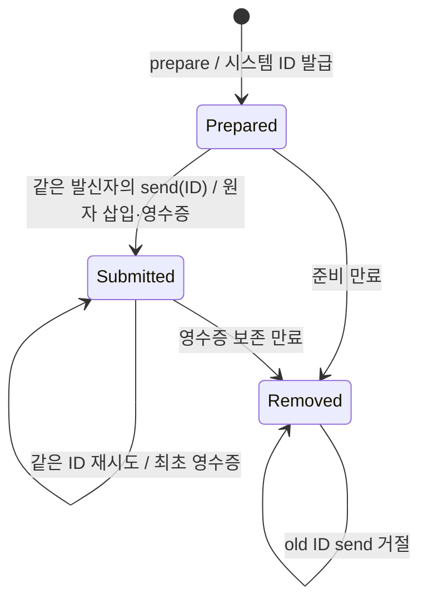

# 시스템 발급 메시지 ID와 재시도

릴레이의 기존 5초 주기는 `relay-tick` 한 요청으로 현재 세션 세대와 relay lease를 확인하고 두 heartbeat를 함께 갱신한다. pending 조회는 해당 transport가 필요한 경우만 포함한다. 오래된 세대·종료된 presence·만료된 lease는 갱신하지 않으며, heartbeat 자체는 실제 wake 관측이 아니다.

2.6.0의 새 메시지는 `prepare_session_message`로 준비하고 반환된 `messageId`만 `send_session_message`에 전달한다. 준비는 발신자·대상·본문·TTL을 고정하며 수신 큐·peer 관계·wake에 영향을 주지 않는다. ID는 공통 broker가 발급하고 기존 메시징 SQLite에 보존한다. caller가 ID를 만들거나 전송 때 내용을 바꿀 수 없다.

3.x의 signed model handoff에서도 이 전송 계약을 사용한다. 내용 digest인 `packetId`와 broker 발급 `messageId`는 별개다. 기존 로컬 handoff journal의 추가 bounded binding 테이블(최대 512개)에 발급 ID를 send 전에 보존한다. 응답 유실·재개·동일 signed packet 재시도는 같은 전송 ID를 사용하며, packet signature·대상 instance·task admission과 ACK/실행의 구분은 유지한다. signature와 발급 ID가 만료되면 새 prepare로 불명 전송을 대체하지 않는다.



`schemaVersion: "1.0.0"`, `targetHost`, `targetSessionId`, `body`, 선택 `ttlSeconds`로 prepare를 호출한다. 이어 `schemaVersion`과 반환된 `messageId`로 send를 호출한다. 두 호출의 `_sessionBinding`은 기존 host hook이 결속하며 별도 사용자의 승인·principal을 만들지 않는다. 발급되지 않은 ID, 다른 sender, send의 추가 body/target/TTL은 큐 삽입 없이 거절한다.

prepare 응답이 유실되어 다시 준비하면 사용하지 않는 draft가 남을 수 있지만 전달은 일어나지 않는다. send 응답이 유실되면 이미 알고 있는 같은 발급 ID로 `get_session_message_status`를 조회하거나 send를 재시도한다. 최초 큐 삽입과 제출 상태·영수증 저장은 같은 `BEGIN IMMEDIATE` transaction으로 확정한다. broker 재시작이나 다른 연결의 동시 send에도 같은 ID로 다시 삽입하거나 expiry를 늘리지 않는다.

**unknown ID는 전송이 없었다는 증거가 아니다.** 이미 전송한 기록이 정리됐을 수 있으므로 보관한 영수증과 대조한다. 불명확한 전송을 무조건 새 prepare로 다시 보내지 않는다. 새 prepare는 새 전송 의도에 사용한다. 수신 모델의 업무를 exactly-once로 실행한다는 보장은 없다.

| 저장 대상 | 경계 |
| --- | --- |
| 미전송 draft | prepare부터 10분; sender별 100개, 전역 1000개 |
| 제출 영수증 | 최대 1000개; 최초 메시지 expiry 이후 1시간까지 보존 |
| draft·영수증 전체 | record JSON의 UTF-8 byte 합 최대 4 MiB; 전송 뒤 본문 중복 저장 제거 |
| 실제 수신 큐 | 기존 미ACK 메시지 최대 1000개·본문 합 4 MiB |
| 메시지 TTL | 첫 send부터 30~86400초, 기본 3600초 |

상한에서는 명시적으로 거절하며 미만료 기록을 강제로 지우지 않는다. 영수증이 정리된 ID도 unknown으로 거절해 새 메시지가 생기지 않는다. 영구 tombstone이나 별도 DB·daemon은 없다. status는 준비 상태, 기존 queued/delivered/acknowledged 상태 또는 큐 행이 정리된 뒤 제출 영수증과 `deliveryState: "unknown"`을 구별한다.

ACK 전 lease 재전달은 정상이며 같은 ID·본문을 유지한다. 중복 ACK는 최초 ACK 시각을 늘리지 않는다. ACK는 처리 확인으로, 업무 완료나 승인이 아니다. wake의 전달 결과가 불명확하면 기존 예약을 유지하고 새 wake 효과로 바꾸지 않는다. [peer 대기 판정](peer-wait-policy.md)의 nonce·generation·복귀 증거 만료 계약은 유지한다.

## hook 없는 CLI

`node mcp-server/dist/session-message-cli.mjs`의 stdin으로 아래 준비 요청을 보낸다.

```json
{"operation":"prepare","payload":{"sender":{"host":"spark","sessionId":"owner"},"target":{"host":"grok","sessionId":"worker"},"body":"검증 결과를 전달합니다.","ttlSeconds":600}}
```

성공 출력의 `data.messageId`를 보관하고 다음 전송 요청에 그대로 사용한다. 아래 ID 자리는 시스템이 반환한 실제 값으로 채운다.

```json
{"operation":"send","payload":{"sender":{"host":"spark","sessionId":"owner"},"messageId":"<returned-messageId>"}}
```

옛 send의 body/target/TTL이나 임의 ID 입력은 오류와 함께 종료하며 전달 효과가 없다. CLI도 broker와 같은 발급·보존·전이 계약을 사용한다. 본문과 비밀은 프로세스 인수에 넣지 않는다.

## 업데이트와 복구

기존 AGS MCP·relay·broker를 종료한 뒤 업데이트하고 재연결한다. 추가 `prepared_messages` 테이블은 기존 messages·키·nonce·presence 데이터를 보존한다. 기존 메시지는 계속 claim/status/ACK할 수 있지만 발급 이력이 없는 기존 ID로 새 send를 할 수 없다. 이전 broker와 섞이는 호환 경로는 이번 사용자 범위에서 제외했다.

문제가 생기면 운영 DB와 키를 지우지 않고 데이터를 보존해 조사한다. 구버전 재설치는 새 발급 ID·재시도 계약을 지킨다는 증거가 아니다. 새 테이블을 삭제하거나 DB를 덮어써서 복구하지 않는다. 실제 설치·실행 process의 후보 확인은 소스 검증과 별도로 수행한다.
