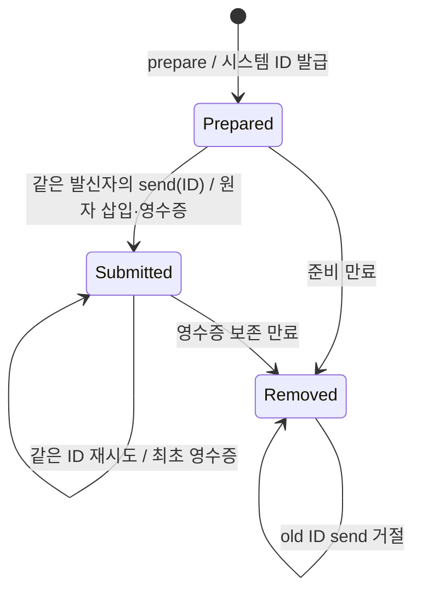
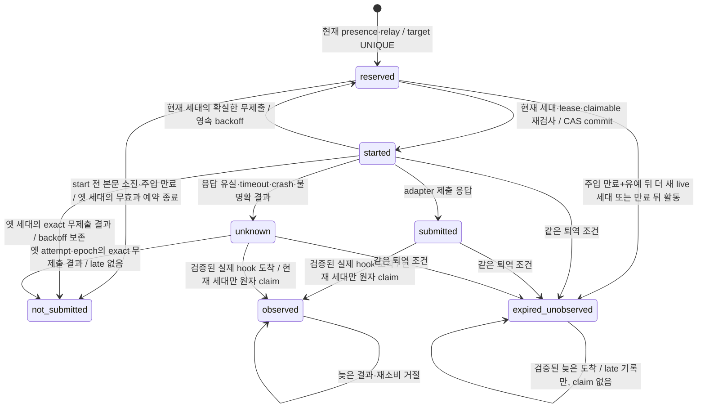

# 시스템 발급 메시지 ID와 재시도

릴레이의 기존 5초 주기는 `relay-tick` 한 요청으로 현재 세션 세대와 relay lease를 확인하고 두 heartbeat를 함께 갱신한다. pending 조회는 해당 transport가 필요한 경우만 포함한다. 오래된 세대·종료된 presence·만료된 lease는 갱신하지 않으며, heartbeat 자체는 실제 wake 관측이 아니다.

2.6.0의 새 메시지는 `prepare_session_message`로 준비하고 반환된 `messageId`만 `send_session_message`에 전달한다. 준비는 발신자·대상·본문·TTL을 고정하며 수신 큐·peer 관계·wake에 영향을 주지 않는다. ID는 공통 broker가 발급하고 기존 메시징 SQLite에 보존한다. caller가 ID를 만들거나 전송 때 내용을 바꿀 수 없다.



`schemaVersion: "1.0.0"`, `targetHost`, `targetSessionId`, `body`, 선택 `ttlSeconds`로 prepare를 호출한다. 이어 `schemaVersion`과 반환된 `messageId`로 send를 호출한다. 두 호출의 `_sessionBinding`은 기존 host hook이 결속하며 별도 사용자의 승인·principal을 만들지 않는다. 발급되지 않은 ID, 다른 sender, send의 추가 body/target/TTL은 큐 삽입 없이 거절한다.

prepare 응답이 유실되어 다시 준비하면 사용하지 않는 draft가 남을 수 있지만 전달은 일어나지 않는다. send 응답이 유실되면 이미 알고 있는 같은 발급 ID로 `get_session_message_status`를 조회하거나 send를 재시도한다. 최초 큐 삽입과 제출 상태·영수증 저장은 같은 `BEGIN IMMEDIATE` transaction으로 확정한다. broker 재시작이나 다른 연결의 동시 send에도 같은 ID로 다시 삽입하거나 expiry를 늘리지 않는다.

**unknown ID는 전송이 없었다는 증거가 아니다.** 이미 전송한 기록이 정리됐을 수 있으므로 보관한 영수증과 대조한다. 불명확한 전송을 무조건 새 prepare로 다시 보내지 않는다. 새 prepare는 새 전송 의도에 사용한다. 수신 모델의 업무를 exactly-once로 실행한다는 보장은 없다.

| 저장 대상 | 경계 |
| --- | --- |
| 미전송 draft | prepare부터 10분; sender별 100개, 전역 1000개 |
| 제출 영수증 | 전역 1000개, sender별 250개; 미ACK 메시지는 최초 메시지 expiry 이후 1시간, ACK된 메시지는 `min(메시지 expiry+1시간, 최초 ACK+1시간)`까지 보존 |
| draft·영수증 전체 | record JSON의 UTF-8 byte 합 최대 4 MiB; 전송 뒤 본문 중복 저장 제거 |
| 실제 수신 큐 | 기존 미ACK 메시지 최대 1000개·본문 합 4 MiB |
| 메시지 TTL | 첫 send부터 30~86400초, 기본 3600초 |

상한에서는 명시적으로 거절하며 미만료 기록을 강제로 지우지 않는다. 영수증이 정리된 ID도 unknown으로 거절해 새 메시지가 생기지 않는다.

sender별 영수증 상한은 협력하는 세션 사이의 공정성 장치다. sender는 host hook이 결속한 세션 식별자일 뿐 인증된 principal이 아니므로, 같은 OS 사용자의 의도적 우회를 막는 할당량으로 보지 않는다. send는 같은 transaction에서 정리 뒤 sender 상한, 전역 상한 순으로 검사하는 권위 검사다. prepare도 같은 방식으로 영수증 용량을 먼저 확인해 이미 상한에 닿았으면 draft를 만들지 않고 `no draft was created`로 거절한다. 이 prepare 검사는 입장 확인일 뿐이며, prepare와 send 사이에 용량이 차면 send가 거절하고 해당 draft는 준비 만료까지 남는다.

영수증 용량 거절은 효과가 없었음이 확정된 거절이다. 메시지는 큐에 들어가지 않았고 영수증도 발급되지 않았다. 도구 응답의 `error.code`는 기존 `MCP_UNAVAILABLE`이고, `error.details`에 `scope`(`sender` 또는 `global`)와 해당 범위에서 가장 먼저 만료되는 기록의 시각 `earliestReleaseAt`을 담는다. 그 시각 뒤에는 새 prepare가 성공할 수 있지만 다른 sender가 먼저 용량을 쓸 수 있으므로 보장은 아니다. send에서 거절된 `messageId`는 prepare 응답의 `expiresAt`(준비 만료)까지 `prepared`로 남는다. `earliestReleaseAt`이 그 `expiresAt`보다 이르면 그 시각 뒤 같은 `messageId`로 재시도할 수 있다. 그렇지 않으면 draft가 먼저 만료되므로 새로 prepare한다. 둘 다 하지 않는다. 둘 다 하면 한 의도가 두 메시지로 전달될 수 있다. 용량 거절을 받은 뒤 그 ID로 다시 send하지 않았는데 draft가 만료돼 같은 ID의 send가 unknown(`Issued message ID is unavailable`)으로 거절될 수 있다. 이 경우 그 ID는 앞선 확정 거절로 전달되지 않았음이 이미 확인됐으므로, 저장한 거절 응답과 대조한 뒤 새로 prepare해도 된다. 확정 거절 기록이 없는 unknown ID는 기존처럼 저장한 영수증과 대조하고 무조건 다시 준비하지 않는다. 응답을 받지 못한 불확실한 send는 이 경우가 아니며, 기존처럼 같은 ID로 status를 조회하거나 send를 재시도한다. 이전 broker에서 온 거절에는 `details`가 없으므로 기존 안내를 그대로 따른다.

ACK는 처음 성공한 ACK에서만 영수증 만료를 줄인다. 두 번째 ACK, 대상이 아닌 세션의 ACK, 모르는 ID의 ACK는 만료를 바꾸지 않으며, 줄인 만료는 다시 늘지 않는다. 따라서 ACK 후 1시간이 지난 ID는 status가 unknown(`null`)이고 같은 ID의 send도 발급 ID 없음으로 거절한다. 이 규칙은 새로 기록되는 ACK에만 적용하며, 이전 버전이 ACK한 기존 영수증의 만료를 소급해 바꾸지 않는다. 영구 tombstone이나 별도 DB·daemon은 없다. status는 준비 상태, 기존 queued/delivered/acknowledged 상태 또는 큐 행이 정리된 뒤 제출 영수증과 `deliveryState: "unknown"`을 구별한다.

ACK 전 lease 재전달은 정상이며 같은 ID·본문을 유지한다. 중복 ACK는 최초 ACK 시각을 늘리지 않는다. ACK는 처리 확인으로, 업무 완료나 승인이 아니다. wake의 전달 결과가 불명확하면 기존 예약을 유지하고 새 wake 효과로 바꾸지 않는다. [peer 대기 판정](peer-wait-policy.md)의 nonce·generation·복귀 증거 만료 계약은 유지한다.

## hook 없는 CLI

`node mcp-server/dist/session-message-cli.mjs`의 stdin으로 아래 준비 요청을 보낸다.

```json
{"operation":"prepare","payload":{"sender":{"host":"spark","sessionId":"owner"},"target":{"host":"grok","sessionId":"worker"},"body":"검증 결과를 전달합니다.","ttlSeconds":600}}
```

성공 출력의 `data.messageId`를 보관하고 다음 전송 요청에 그대로 사용한다. 아래 ID 자리는 시스템이 반환한 실제 값으로 채운다.

```json
{"operation":"send","payload":{"sender":{"host":"spark","sessionId":"owner"},"messageId":"<returned-messageId>"}}
```

옛 send의 body/target/TTL이나 임의 ID 입력은 오류와 함께 종료하며 전달 효과가 없다. CLI도 broker와 같은 발급·보존·전이 계약을 사용한다. 본문과 비밀은 프로세스 인수에 넣지 않는다.

## 업데이트와 복구

기존 AGS MCP·relay·broker를 종료한 뒤 업데이트하고 재연결한다. 추가 `prepared_messages` 테이블은 기존 messages·키·nonce·presence 데이터를 보존한다. 기존 메시지는 계속 claim/status/ACK할 수 있지만 발급 이력이 없는 기존 ID로 새 send를 할 수 없다. 이전 broker와 섞이는 호환 경로는 이번 사용자 범위에서 제외했다.

문제가 생기면 운영 DB와 키를 지우지 않고 데이터를 보존해 조사한다. 구버전 재설치는 새 발급 ID·재시도 계약을 지킨다는 증거가 아니다. 새 테이블을 삭제하거나 DB를 덮어써서 복구하지 않는다. 실제 설치·실행 process의 후보 확인은 소스 검증과 별도로 수행한다.


## wake 알림 수명과 누적 억제

새 relay는 메시지 본문과 별도로 기존 `wake_nonces`에 managed 알림을 저장한다. 대상당 미관측 알림은 하나이며 뒤따르는 본문은 기존 `messages`에 남는다. 본문 claim, ACK, tool-boundary, turn-end는 managed 알림을 관측하거나 직접 해제하지 않는다. 주입 만료 뒤의 이 활동은 아래 퇴역 규칙의 근거로만 쓴다. board의 `consume-wake`는 nonce 소유 여부만 확인한다.



`not_submitted`는 저장값 `not-submitted`다. 시작 전 본문 소진·주입 만료 또는 확실한 무제출을 기록하는 종료 상태이며 host 관측으로 계산하지 않는다. reserved에서만 현재 lease 소유자가 기존 nonce와 attempt를 회수할 수 있다. 같은 세대의 relay 교체는 기존 resume과 backoff를 유지하고 옛 소유자의 start를 거절한다. 현재 세대의 definite failure 재시도는 같은 attempt와 영속 backoff를 사용하며 새 dispatch epoch가 늦은 결과를 차단한다. started를 먼저 commit한 뒤에만 adapter를 호출한다. 시작 응답이 유실되었어도 재호출은 새 발송 권한을 만들지 않는다.

실제 presence의 instance·birth·transport가 교체되면, 시작하지 않은 epoch 0 예약 또는 같은 attempt·epoch의 definite failure로 무효과가 확인된 reserved 행만 종료할 수 있다. 현재 세대의 유효 presence·relay·pending을 확인하는 reserve transaction에서 옛 행을 `not-submitted`로 보존하고 새 nonce·attempt를 따로 만든다. 교체 뒤 들어온 exact definite failure도 옛 binding을 재개방하지 않고 `not-submitted`로 종료한다. 옛 nonce·binding·epoch·started·late·observed·consumed는 바꾸지 않는다. H1에는 retry를 만들지 않으며, H2·H3의 기존 `retry_not_before`는 새 reserve가 deadline 전까지 거절하도록 연결한다. terminal 보관 개수·시간에 따른 prune도 아직 유효한 backoff 행을 제거하지 않는다. deadline 뒤에는 기존 terminal 보관 규칙을 따른다.

Codex의 definite failure는 process spawn 전 오류, Claude의 definite failure는 연결·쓰기 전 실패에 한정한다. spawn·연결·쓰기 뒤 오류나 timeout, adapter 예외는 무효과 근거가 아니다. 단순 lease 소실·TTL·ACK는 세대 교체나 무효과 증명을 대신하지 않으며, submitted·근거 없는 unknown·late·종료 행을 재개방하지 않는다.

submitted는 host의 처리 ACK가 아니다. started 이후 불확실한 효과는 unknown으로 보존하고, relay나 broker 재시작, 본문 ACK, 메시지 만료, nonce 만료 하나만으로 새 발송을 허용하지 않는다. 아래 [퇴역 규칙](#미관측-알림-퇴역과-자동-깨우기-신호)의 만료·유예·근거가 모두 갖춰질 때만 새 attempt를 예약한다. nonce에는 대상, instance, presence의 birth generation, relay, attempt, dispatch epoch를 저장한다. 메모리 Map은 이 알림 수명의 원장이 아니다.

### hook 관측 경계

관측은 실제 `UserPromptSubmit` hook에서 adapter가 해석한 marker-only 입력과 기존 TrustStore의 비권위 source receipt를 함께 보낸다. broker는 저장된 서명·대상·정규화한 관측 digest·receipt TTL을 검증한 뒤 `BEGIN IMMEDIATE` 안에서 nonce, 현재 presence instance/birth generation과 claim 가능 본문을 확인한다. 일반 caller의 `approved`, normalized 입력 자칭, nonce 문자열만으로 managed observed를 만들 수 없다. 일반 peer 본문 receipt도 wake hook receipt로 사용할 수 없다. receipt 발급은 hook 코드에 있으며 공개 MCP 발급 도구는 없다.

receipt는 `authorityEffect: none`이다. 이 검사는 협력하는 로컬 hook 경로의 liveness provenance를 결속한다. 같은 OS 사용자가 코드를 실행하거나 source key를 변조할 수 없다는 보장, 사용자 승인·신원·업무 완료·W06 권위 채널 자격을 만들지 않는다. host payload에 instanceId가 없다는 한계를 숨기지 않고 nonce의 영속 결속과 현재 presence를 대조한다.

현재 세대의 관측과 본문 claim은 하나의 transaction이며 batch/response budget 오류가 나면 둘 다 rollback한다. nonce는 한 번만 관측되고, 현재 세대의 알림이 해당 시점의 claimable batch를 전달한다. 빈 wake prompt를 막을 수 있는 host(delivery profile의 `blocksEmptyWakePrompt`, 현재 Codex)에서 현재 세대 managed wake가 검증되어 `recognized: true`이고 원자 claim 결과가 비어 있으면, hook은 `UserPromptSubmit`의 `decision: block`으로 해당 marker prompt를 모델 요청 전에 중단한다. 내부 응답의 `managed` 값은 검증된 `WakeAttempt` binding의 존재만 나타내며 새 권한이나 host queue 제거 영수증이 아니다. 본문이 있으면 기존 peer envelope를 전달한다. legacy, 이미 관측한 중복, 옛 세대·만료 marker, 미등록 nonce, 잘못된 receipt, 일반 입력과 marker가 섞인 prompt, broker 오류는 이 차단 조건에 들어가지 않는다. 차단하지 않은 입력은 기존 fail-open 처리를 따르며, 검증된 옛 도착의 종료는 다음 문단의 별도 규칙을 적용한다. 지원 의미는 [공식 Codex Hooks 문서](https://learn.chatgpt.com/docs/hooks#userpromptsubmit)를 따른다. `Stop`의 같은 decision은 continuation을 뜻하므로 이 처리에 사용하지 않는다. batch 밖 본문과 ACK가 유실된 본문은 기존 claim lease 규칙에 따라 안전한 boundary에서 전달할 수 있다. 메시지 전달 자체를 exactly-once 업무 실행으로 확대하지 않는다.

만료 또는 옛 generation marker도 서명·대상·관측 digest·receipt TTL과 전체 nonce 검증을 통과한 실제 hook 도착이면 해당 managed attempt를 `observed`로 종료한다. `observedAt`, `consumed_at`과 `lateObservedAt`을 저장하지만 `recognized: false`, 빈 messages와 binding을 반환하므로 새 본문 claim, 현재 세대의 resume 관측이나 Codex prompt 차단을 허용하지 않는다. 이후 새 pending의 wake는 현재 presence·relay·claimable 검사를 거쳐 별도로 reserve/start한다. 옛 marker의 재소비나 늦은 outcome은 새 attempt를 바꾸지 못한다. 미등록 nonce가 섞인 batch, 잘못된 receipt·대상, 일반 입력이 섞인 prompt는 종료 근거가 아니며, 실제 도착이 없는 unknown은 ACK·세대 교체·lease·TTL 가운데 하나만으로 해제하지 않는다. 해제는 아래 퇴역 규칙으로만 하며 `observed`로 바꾸지 않는다. 관측 기한이 지난 미확정 상태는 `observation-overdue`로 표시한다. `wake-status`와 메시지 status의 `wake` diagnostic에 상태·generation·attempt·주입 만료·재시도 시각·관측 시각을 표시하며 본문이나 nonce는 포함하지 않는다.

### capability와 이관

| adapter | 주입과 idle 깨우기 | 제출 후 의미 |
| --- | --- | --- |
| claude-inbox | peer-wake·tool-boundary·turn-end, silent next | 실제 peer-wake hook 관측 필요 |
| codex-queue | peer-wake·tool-boundary, user-message | 실제 peer-wake hook 관측 필요 |
| codex-deferred | tool-boundary만, idle wake 없음 | idle 알림 발송 0 |

공통 relay는 outcome/capability/dispatch port만 사용한다. transport 등록과 vendor SDK·protocol은 adapter 모듈에 둔다. 다른 vendor도 같은 port를 주입할 수 있으며 공통 알림 상태에 vendor 분기를 추가하지 않는다. 이 경로는 host queue 목록·취소·삭제를 호출하지 않는다.

이관은 기존 DB에 컬럼과 active target UNIQUE를 transaction으로 추가한다. 기존 nonce는 `legacy`이며 옛 consumed_at을 observed로 가져오지 않는다. 기존 queued marker는 자연 소진한다. legacy 종료에는 새 누적 억제 보장을 소급하지 않는다. 활성 managed 행과 아직 backoff가 끝나지 않은 무제출 종료 행은 함께 기존 1000개 budget을 사용하며 초과는 명시적으로 거절한다. 미확정 행과 유효한 backoff 행은 TTL prune에서 제외한다. 나머지 종료 기록은 최대 1000개, 종료 후 1시간까지 보관한다. 관측 종료 기록의 보관 기산점은 `consumed_at`이며 과거 도착 시각과 복구 적용 시각을 혼동하지 않는다. 이관 실패는 추가 컬럼과 index를 rollback하며 기존 본문·nonce를 보존한다. 운영 DB 삭제·덮어쓰기나 구버전과 혼용한 자동 rollback은 제공하지 않는다.

### 과거 late 관측의 수동 복구

구버전이 실제 hook 도착을 `late_observed_at`에 기록하고도 `unknown`으로 남긴 이전 generation은 기존 CLI의 `reconcile-wake-observation`으로 종료할 수 있다. stdin payload는 `target: {host, sessionId}`, `attemptId`, 원본 `sourceReceiptId` 세 필드만 받는다. 시각·nonce·관측 객체·raw receipt·승인 boolean은 받지 않는다. CLI는 같은 인증된 broker에 요청만 전달하고, 공통 store와 provenance 검증이 판단한다. 자동 startup 복구, 벤더 분기와 MCP 복구 도구는 없다.

서버가 저장한 원본 binding·nonce·epoch·`unknown` 상태·late 기록을 읽는다. 기존 trust DB를 `readOnly`와 `query_only`로 열어 한 read transaction의 기존 키·영수증을 같은 서명 검증으로 확인한다. DB·키·영수증이 없거나 검증되지 않으면 종료하지 않으며 schema·키·영수증을 생성하거나 재발급하지 않는다. 이 불변 조건은 권위 데이터에 적용한다. SQLite가 read-only WAL 연결에도 생성할 수 있는 WAL/SHM 조정 파일은 별도로 관측하며, 그것을 새 receipt·key·schema 쓰기로 계산하거나 모든 WAL 변화를 무시하지 않는다. checkpoint·journal mode 변경·live DB의 immutable 우회는 사용하지 않는다. 별도 trust snapshot과 메시지 DB transaction을 두 DB의 원자적 변경이라고 설명하지 않는다.

`started ≤ 원본 observed ≤ 서버 late < receipt expiry ≤ 복구 적용 시각`과 exact target·adapter·authority `none`을 요구한다. 원본 nonce 하나로 기존 정규화를 재구성하고, 서명된 digest와 정확히 일치하는 actor 후보가 하나일 때만 인정한다. actor 기본값이나 nonce 부분집합을 추정하지 않으며 복원할 수 없는 다중 nonce 관측은 거절한다. 현재 hook의 receipt TTL 검사는 그대로 유지한다. 이 검사는 현재 키 snapshot으로 과거의 비권한 관측을 확인하며 승인·신원 증거를 만들지 않는다.

메시지 DB transaction 안에서 대상이 여전히 이전 instance/birth generation인지와 원본 binding·epoch·상태·late 값을 다시 검사해 해당 행만 `observed`로 CAS한다. `observed_at`은 원본 관측 시각, `consumed_at`은 복구 적용 시각이며 기존 late·outcome은 보존한다. 결과의 `evidence`에는 원본 source ID·digest·old binding과 세 시각이 남고 nonce·서명 키는 없다. 중복 호출은 `reconciled: false`를 반환한다. 복구는 본문 claim·현재 binding 관측·peer-wait resume·enqueue를 수행하지 않는다. 다음 pending은 현재 presence·relay·claimable 검사를 통과하는 기존 reserve/start로만 처리하며, 옛 attempt의 늦은 outcome은 재개방 근거가 아니다.

### 보장과 남은 조건

start 이후 본문 claim과 외부 enqueue 사이 경합에서는 알림 하나마다 host queue에 잔여 marker 최대 1개가 남을 수 있다. 아래 퇴역 규칙이 적용되므로 세션이 활동하는 동안에는 (주입 TTL + 유예)마다 marker가 최대 1개 더 쌓일 수 있다. 현재 세대의 검증된 managed marker가 hook에 도착했을 때 전달할 본문이 없으면 앞의 prompt 차단으로 불필요한 모델 턴을 막는다. 이 처리는 제출된 queue 항목을 삭제·취소하지 않으며, receipt나 generation 검증이 거절된 입력까지 차단하지 않는다. 실행 중 여부를 추정하는 새 boolean·turn tracker·TTL은 추가하지 않는다. 제출 전에는 기존 reserve/start의 claimable 재검사로 본문이 이미 처리된 알림을 억제하고, idle의 미처리 본문은 기존 wake 경로를 유지한다. host가 submitted 또는 unknown marker를 끝내 처리하지 않으면 queue 관측·멱등 지원 없이 추가 누적 억제와 idle 자동 재깨움을 동시에 보장할 수 없다. 주입 만료와 유예 전에는 누적 억제를 택하고, 그 뒤에는 퇴역 근거가 있을 때만 새 알림 하나를 허용한다. nonce TTL은 주입 유효기간이고 메시지 TTL은 본문 전송 제외 기준이며 어느 TTL도 host queued marker 제거 증거가 아니다. 세대 교체 뒤 실제 옛 도착이 검증되면 이전 알림은 종료되지만 새 본문은 현재 세대의 별도 wake 관측에 조건부로 전달된다. 실제 도착 근거가 없는 unknown은 남은 한계로 드러낸다.

### 미관측 알림 퇴역과 자동 깨우기 신호

2.7.2는 도착 증거가 없는 submitted·unknown을 자동 해제하지 않았다. 그래서 Codex queue의 follow-up이 한 번 사라지면(재부팅, 앱 재시작, 사용자의 대기 항목 삭제) 대상당 하나인 활성 알림 자리가 영구히 찼다. 새 presence 세대가 떠도, 세션이 도구를 쓰고 ACK를 보내도 새 wake가 예약되지 않았다. 실제 PC에서 13개 세션이 이 상태였다. 다음 개발 후보는 이 계약을 아래 조건으로 개정한다.

퇴역 조건은 두 가지를 모두 요구한다.

1. 알림의 주입 만료(`expires_at`, 예약 뒤 1시간)에 유예 10분을 더한 시각이 지났다. 유예는 hook 8초 timeout, broker 재시작, hook receipt 30초 TTL을 덮고, 가장 긴 재시도 backoff와 같다.
2. 다음 근거 가운데 하나가 저장되어 있다.
   - 같은 대상의 최신 presence 행(birth 기준)이 더 이상 알림을 받은 birth의 살아 있는 행이 아니다. 새 birth가 최신이거나, 알림의 birth가 끝났거나(`ended_at`) lease가 끊겼거나, 행이 모두 지워진 경우다. 판정은 instance와 birth generation으로 하고 transport는 보지 않는다. 살아 있는 birth는 같은 세대로 transport를 바꿨다가 되돌릴 수 있기 때문이다.
   - 만료 뒤 같은 세션의 활동이 있었다: 본문 claim, 도구 경계 claim, turn-end claim과 정리, SessionEnd 정리, hook 없는 CLI의 claim·ACK 호출, ACK, 일반 사용자 입력 관측, 검증된 wake hook 도착.

활동 근거는 권위가 아니며 신뢰 수준은 같은 OS 사용자다. 같은 OS 사용자의 프로세스는 CLI로 다른 세션의 활동 근거도 만들 수 있다.

끝났거나 lease가 끊긴 birth는 다시 살아나지 않는다. heartbeat는 살아 있는 행만 갱신하고, 같은 instance의 재등록은 더 늦은 새 birth를 받는다. presence 조회, relay tick, 현재 세대 claim과 `autoWake`는 모두 최신 행을 읽으므로, 최신 행이 알림의 살아 있는 birth가 아니면 그 알림은 현재 세대로 claim될 수 없고 새 wake도 예약되지 않는다. 그래서 이 근거로 퇴역해도 누적 억제 범위는 줄지 않는다. 2.7.4까지는 이 경우 가운데 새 birth가 살아 있는 경우만 퇴역했으므로, 끝나거나 lease가 끊긴 뒤 활동도 재등록도 없는 세션의 알림이 영구히 활성으로 남았다. 활성으로 남는 것은 만료와 유예 전의 행, 그리고 알림의 birth가 최신 행으로 살아 있고 만료 뒤 활동이 없는 행(살아 있지만 조용한 세션)뿐이다. 퇴역은 `prune`의 UPDATE 한 문장으로 원자 commit하며, reserve·send·status 같은 기존 prune 지점에서 일어난다. 조회 도구인 `list_session_status`와 `get_session_message_status`도 prune을 부르므로 만료 기록 삭제와 퇴역을 일으킬 수 있다. 이 정리는 멱등이며 조회 결과의 의미를 바꾸지 않는다.

누적 상한: 대상당 활성 알림은 하나이고 퇴역은 주입 만료와 유예 뒤에만 일어난다. 따라서 세션이 활동하는 동안 host queue에는 (주입 TTL + 유예), 곧 약 70분마다 marker가 최대 1개 쌓일 수 있다. 한 turn이 오래 바쁘고 그동안 도구 경계 claim이나 ACK가 이어지면 이 상한까지 쌓일 수 있다. 살아 있지만 조용한 세션에는 쌓이지 않고, 끝난 세션에는 live relay가 없어 새 알림을 보내지 않는다.

퇴역한 행은 새 terminal 상태 `expired-unobserved`가 된다. `observed`나 성공으로 바꾸지 않고, status의 `deliveryState`는 계속 `unknown`이다. nonce, instance, birth generation, transport, relay, attempt, dispatch epoch, started·outcome·late 시각은 그대로 두고 `retired_at`만 더한다. 옛 attempt의 늦은 outcome이나 start는 이 행을 다시 열지 못한다. terminal 보관 규칙(최대 1000개, 퇴역 후 1시간)을 따르며, 보관 기산점은 `retired_at`이다. 이미 `late_observed_at`이 있는 v2.7.1 모양의 unknown도 같은 규칙으로 퇴역하며, 그 뒤 `reconcile-wake-observation`은 `reconciled: false`를 돌려준다. late 기록은 행에 그대로 남는다.

퇴역한 nonce가 늦게 도착하면 hook receipt·대상·digest·nonce 검증을 모두 통과한 경우에만 `late_observed_at`을 한 번 기록한다. 상태는 `expired-unobserved`로 두고, prompt의 marker가 모두 퇴역한 경우 응답은 `recognized: false`, 빈 messages, binding 없음과 `retired: true`다. 퇴역 marker와 현재 marker가 한 prompt에 섞이면 퇴역 행은 late만 기록하고 판정에서 빠지며, 나머지 marker가 현재 세대로 유효하면 평소처럼 관측과 본문 claim을 한다. 나머지가 유효하지 않으면 옛 세대·만료 marker의 늦은 도착 규칙을 따르고 `retired`를 붙이지 않는다. 이 도착은 현재 세대 본문을 대신 claim하거나 현재 세대의 도착을 증명하는 근거가 아니다. 모든 marker가 퇴역한 경우에만, 빈 wake prompt를 막을 수 있는 host(delivery profile의 `blocksEmptyWakePrompt`, 현재 Codex)의 hook이 이 검증된 marker-only 입력을 2.7.2의 빈 wake와 같은 `decision: block`으로 모델 요청 전에 막는다. host 화면에 marker가 한 번 보이는 것은 막지 않는다. 따라서 중복 wake의 비용은 보이는 알림 한 번이다. 현재 본문은 퇴역과 함께 예약된 현재 세대 wake나 다음 안전한 boundary에서 전달된다. Claude는 차단하지 않고 기존 fail-open 처리를 따른다. 퇴역 행이 보관 기간 뒤 삭제된 다음에 도착한 marker는 미등록 nonce로 거절되어 2.7.2처럼 차단하지 않는다.

거절한 대안은 다음과 같다.

- 만료만으로 해제: 세션이 살아 있다는 근거 없이 주입 만료마다 새 알림을 쌓는다. 선택한 규칙도 활동하는 세션에는 (주입 TTL + 유예)마다 최대 1개를 쌓을 수 있지만, 살아 있지만 조용한 세션에는 쌓지 않는다.
- `observed`나 `not-submitted`로 해제: 도착이나 무효과의 증거가 없는데 그렇게 기록하게 된다.
- broker가 relay 없이 직접 깨우기: host 생존과 알림 발송을 묶은 설계를 깨므로 만들지 않는다.
- 같은 세대에서 활동 없이 relay만 살아 있어도 해제: idle host의 queue에 marker가 남아 있을 가능성을 배제하지 못한다.
- 알림을 받은 instance의 행만 보고 판정: 그 행이 살아 있어도 더 늦은 birth가 최신이면 relay tick과 claim이 모두 거절되므로, 그 birth가 끝날 때까지 풀리지 않는 활성 행이 남는다. 최신 행 하나로 판정하면 presence·claim과 같은 행을 보고, 따로 규칙을 둘 필요도 없다.

퇴역은 broker가 하는 prune에서만 일어난다. 2.7.4 이하 broker는 끝나거나 lease가 끊긴 birth의 알림을 퇴역하지 않으므로, 같은 DB를 이전 broker가 쓰는 동안 그 알림은 활성으로 남고 새 broker의 첫 prune에서 퇴역한다. 새 broker가 퇴역한 행은 2.7.3 이상 broker에서 terminal로 보인다.

`send_session_message`의 결과와 `get_session_message_status`의 미ACK 큐 행, 세션 현황판의 presence에는 조언용 `autoWake`가 붙는다. 계약은 `contracts/session-auto-wake-outlook.v1.schema.json`이며 `authorityEffect: "none"`이다. 발신 성공은 broker가 큐에 넣었다는 뜻이고, `autoWake`는 수신자가 지금 idle 상태에서 자동으로 깨워질 수 있는지에 대한 조언일 뿐이다. 전달, 처리, 완료, 승인이나 권한의 증거가 아니고, 큐의 메시지를 지우거나 다시 보내지 않는다.

| state | reason | basisAt |
| --- | --- | --- |
| `available` | `relay-live`: live relay가 새 wake를 예약할 수 있다 | relay lease 갱신 시각 |
| `available` | `wake-in-flight`: 현재 세대 알림이 주입 기한 안에 있다 | 그 알림의 주입 만료 |
| `available` | `retry-backoff`: 확실한 무제출 뒤 대기 중이다 | 재시도 가능 시각 |
| `latched` | `wake-unobserved`: 현재 세대가 아니거나 만료된 이전 알림이 새 wake를 막고 있다 | 그 알림의 주입 만료 |
| `no-live-relay` | `presence-unknown`, `presence-not-online`, `relay-lease-missing` | 없음, presence lease 종료, 마지막 presence heartbeat |
| `unsupported` | `no-idle-wake`: transport에 idle wake가 없다 | presence birth |

presence lease가 끝나고 live relay가 없으면 presence `state`는 `unreachable`이나 `ended`이고 `autoWake`는 `no-live-relay`다. 현황판은 오래된 online을 보여 주지 않는다. relay는 여전히 SessionStart hook에서만 뜨므로, 재부팅 뒤 아직 turn이 없는 Codex 세션은 `no-live-relay`로 보이며 메시지는 큐에 남는다. 이전 broker가 `autoWake`를 주지 않으면 서비스는 `null`로 둔다.

#### 세대 식별(C2)

presence birth는 ms 해상도 ISO 문자열이다. 같은 instance가 이전 birth와 같은 ms에 다시 태어나면 두 세대가 같은 문자열을 가져, 이전 birth의 nonce가 현재 세대 claim을 얻을 수 있었다. `startPresence`는 rebirth의 시각이 이전 birth보다 늦지 않으면 이전 birth에 1ms를 더한 값을 쓴다. 살아 있는 lease의 갱신은 birth를 바꾸지 않는다. 별도 세대 ID 컬럼은 추가하지 않았다. 보존 기간이 지나 행이 지워진 뒤의 재등록은 아래 presence 보존 절을 따른다.

#### presence 보존과 현황판 조회

2.7.3까지는 `session_presence` 행을 지우는 코드가 없어 끝난 세션의 행이 계속 쌓였다(2.7.2부터 잠재). 현황판 조회는 broker의 `list-presence`가 저장된 모든 identity를 한 응답으로 돌려주었고, 응답이 한도(32 KiB)를 넘으면 client가 거절해 현황판의 모든 presence가 `unknown`, `autoWake`는 `null`이 되었다. store의 판정은 맞았고 전송 한도에서 막혔다.

보존: `prune`은 lease 끝(`lease_until`, 종료한 행은 종료 시각과 같다)이 24시간보다 오래된 presence 행을 지운다. 24시간은 현황판이 세션을 보여 주는 창(board의 24시간 보존)과 같아서, 현황판에 보이는 동안 끝난 세션은 `ended`나 `unreachable`로 보인다. 살아 있는 행(`ended_at` 없음, lease 유효)은 lease 끝이 미래이므로 지워지지 않는다. 같은 identity에 살아 있는 행이 있는 동안에는 그 identity의 가장 최근 행(birth 기준)도 남긴다. presence 조회, 퇴역 규칙과 `autoWake`는 모두 이 가장 최근 행만 읽으므로, live identity의 presence, 퇴역 판정과 `autoWake` 상태는 정리 전후에 같다. live 행이 없는 identity는 다르다. 가장 최근 행이 지워지면 더 이른 행이 최신이 되어 표시되는 instance, 상태(`ended`/`unreachable`)와 기준 시각이 바뀔 수 있고, 행이 모두 지워지면 등록된 적 없는 identity처럼 `unknown`이며 `autoWake`는 `no-live-relay`/`presence-unknown`이다. 수동 `reconcile-wake-observation`의 옛 세대 판정도 가장 최근 presence 행을 쓰므로, live 행이 없는 identity에서는 정리 전후로 드물게 달라질 수 있다(행이 모두 지워지면 거절된다). 메시지, 영수증, wake 행과 relay lease 규칙은 바뀌지 않는다. 정리는 DELETE 한 문장이라 멱등이며, 보존 24시간은 주입 만료와 유예(70분)보다 길다.

행이 지워진 instance가 다시 등록되면 새 행으로 들어가 birth가 등록 시각이 된다. 지워진 행은 lease 끝이 24시간 전보다 이르고 birth는 그보다 이르므로, 시계가 되돌아가지 않는 한 새 birth는 이전 wake의 birth generation보다 크다. 옛 세대 marker는 현재 세대로 받아들여지지 않는다.

조회: 서버는 현황판에 보이는 identity만 3개씩 묶어 `list-presence`의 `targets`로 요청하고, broker는 그 identity만 돌려준다. 3개는 모든 문자열 필드가 최대 길이이고 JSON escape로 6바이트가 되는 문자만으로 채워져도 응답 한도 안에 든다. broker는 `targets`가 1~3개가 아니면 거절하고, 응답이 한도를 넘으면 보내지 않고 명시적으로 거절한다. `targets` 없는 요청(2.7.3 이하 service)에는 저장된 모든 identity를 돌려주며, 한도를 넘으면 같은 거절을 한다.

서버는 broker가 받는 식별자 형식(`isBoundedIdentity`, broker와 같은 규칙)에 맞지 않는 identity는 요청하지 않는다. 그 identity와 broker가 명시적으로 거절한 묶음의 identity는 broker가 답하지 않은 것으로 보고 `unknown`, `autoWake: null`로 두며, 나머지 묶음은 그대로 표시한다. 거절이 아닌 실패(연결 실패, client deadline 초과, 응답 한도 초과)가 한 번 나면 남은 묶음은 요청하지 않고, 그 묶음과 남은 묶음의 identity를 모두 같은 방식으로 둔다. broker에 물었는데 행이 없는 identity는 `unknown`이고 `autoWake`는 `no-live-relay`/`presence-unknown`이다. 요청 수는 ceil(N/3)이고 묶음은 순서대로 보낸다.

조회 전체는 client deadline 하나(20초, 다른 broker 요청 하나와 같은 값)를 나눠 쓴다. 묶음마다 남은 시간만 client에 넘기고, 남은 시간이 없으면 더 요청하지 않는다. deadline에 걸린 묶음은 client가 연결을 끊고 거절이 아닌 실패로 끝나므로, 위 규칙대로 그 묶음과 남은 묶음을 모두 `unknown`, `autoWake: null`로 두고 앞서 받은 결과는 유지한다. 끊은 요청의 응답이 뒤늦게 와도 결과는 바뀌지 않는다. 그래서 broker가 응답하지 않거나, 응답은 하지만 묶음마다 느려도 조회 전체는 20초를 넘지 않는다. 2.7.5까지는 전체 상한이 없어, 묶음마다 요청 하나의 한도 안에서 느리게 답하는 broker에서는 대기가 묶음 수만큼 늘었다. 20초는 broker가 없어 새로 띄우는 첫 조회(기동 대기 최대 15초)가 끝날 수 있는 시간이고, 호스트의 MCP 도구 호출 제한(Codex 기본 60초)보다 짧다. 묶음을 동시에 보내지는 않는다. broker는 요청을 한 process에서 차례로 처리하므로 동시에 보내도 broker 쪽 시간은 줄지 않고, 정상 broker에서 300개 세션 조회는 약 0.5초다.

| service | broker | 현황판 presence |
| --- | --- | --- |
| 2.7.4 이상 | 2.7.4 이상 | 세션 수와 DB 크기에 관계없이 동작한다 |
| 2.7.4 이상 | 2.7.3, 2.7.2, 2.7.1, 2.2.6 | 이전 broker는 `targets`를 무시하고 모든 identity를 돌려준다. 응답이 한도 안이면 정상이다. 넘으면 첫 묶음이 응답 한도 초과(전송 실패)로 끝나 남은 묶음은 요청하지 않고, 2.7.3처럼 모든 presence가 `unknown`, `autoWake`가 `null`이다. 이전 broker는 presence 행을 지우지 않으므로 새 broker가 뜰 때까지 이어진다 |
| 2.7.3 이하 | 2.7.4 이상 | `targets` 없는 요청이라 모든 identity를 받는다. 보존 정리 뒤에는 24시간 안의 identity만 남지만, 그래도 한도를 넘으면 broker가 명시적으로 거절하고 이전 service는 모든 presence를 `unknown`으로 둔다 |

broker는 relay가 주기적으로 요청하는 동안 종료되지 않으므로, 업데이트 뒤에도 이전 broker가 계속 돌 수 있다. 앞의 안내대로 기존 AGS MCP·relay·broker를 종료한 뒤 재연결한다.

#### 이관(schema 1)

메시지 DB는 `PRAGMA user_version` 0에서 1로 한 번 올라간다. SQLite는 기존 CHECK를 넓힐 수 없으므로 같은 `BEGIN IMMEDIATE` transaction 안에서 `wake_nonces`를 다시 만들고 모든 행, rowid, 열 값을 복사한 뒤 `retired_at` 열, active target UNIQUE와 `session_activity` 표를 추가한다. 도중 실패는 전체를 rollback해 2.7.2 모양과 version 0을 남긴다. 두 연결이 동시에 열면 한쪽만 이관하고 다른 쪽은 version 1을 본다. 이관 자체는 행 상태를 바꾸지 않는다. 옛 세대의 latch 행은 이후 첫 prune에서 위 퇴역 규칙을 만족할 때만 `expired-unobserved`가 된다. 더 높은 version의 DB는 변경 없이 거절한다. 2.7.2 broker는 version 1 DB를 열어 기존 메시지 계약대로 동작하며, 퇴역 행을 활성으로 보지 않는다. 다만 퇴역 규칙과 `autoWake`는 적용하지 않는다.

독립 process fixture와 번들 검사는 실제 host 설치·wake 관측을 대신하지 않는다. 실제 설치·양 host 실측은 별도 W07/출하 검증이며 로컬 PASS로 승격하지 않는다.
