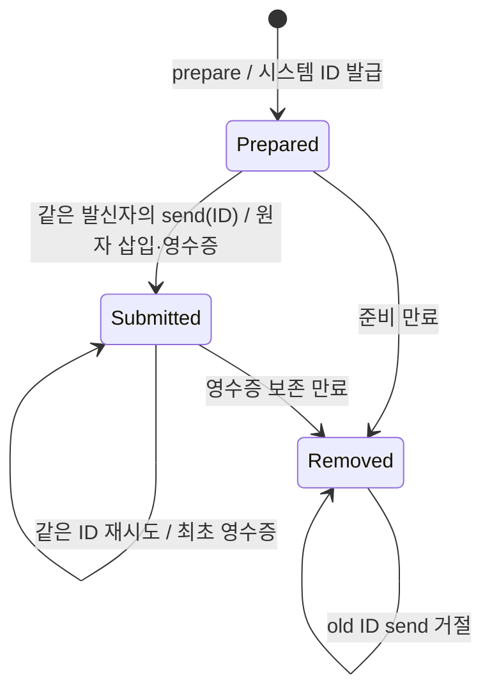
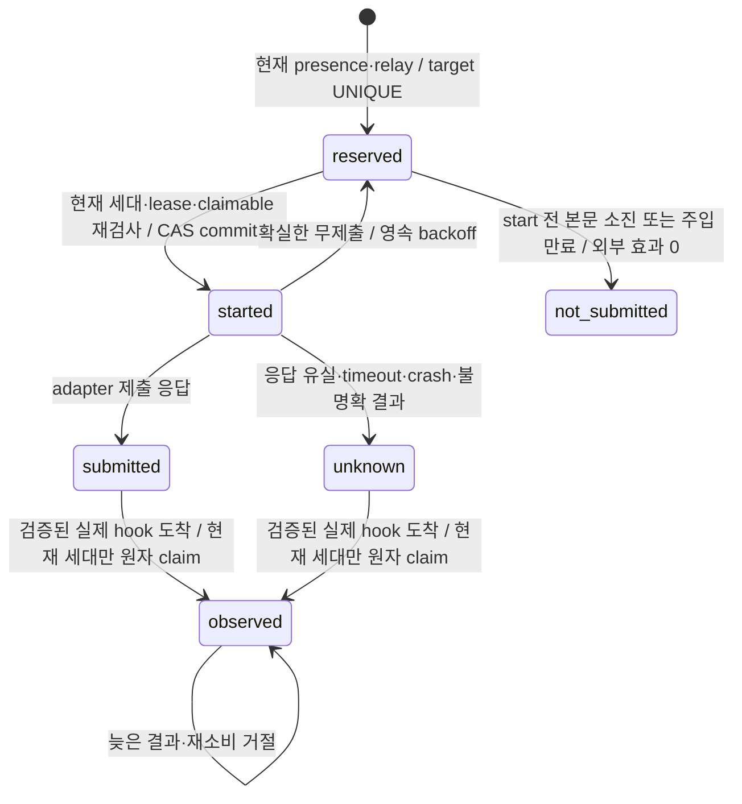

# 시스템 발급 메시지 ID와 재시도

릴레이의 기존 5초 주기는 `relay-tick` 한 요청으로 현재 세션 세대와 relay lease를 확인하고 두 heartbeat를 함께 갱신한다. pending 조회는 해당 transport가 필요한 경우만 포함한다. 오래된 세대·종료된 presence·만료된 lease는 갱신하지 않으며, heartbeat 자체는 실제 wake 관측이 아니다.

2.6.0의 새 메시지는 `prepare_session_message`로 준비하고 반환된 `messageId`만 `send_session_message`에 전달한다. 준비는 발신자·대상·본문·TTL을 고정하며 수신 큐·peer 관계·wake에 영향을 주지 않는다. ID는 공통 broker가 발급하고 기존 메시징 SQLite에 보존한다. caller가 ID를 만들거나 전송 때 내용을 바꿀 수 없다.



`schemaVersion: "1.0.0"`, `targetHost`, `targetSessionId`, `body`, 선택 `ttlSeconds`로 prepare를 호출한다. 이어 `schemaVersion`과 반환된 `messageId`로 send를 호출한다. 두 호출의 `_sessionBinding`은 기존 host hook이 결속하며 별도 사용자의 승인·principal을 만들지 않는다. 발급되지 않은 ID, 다른 sender, send의 추가 body/target/TTL은 큐 삽입 없이 거절한다.

prepare 응답이 유실되어 다시 준비하면 사용하지 않는 draft가 남을 수 있지만 전달은 일어나지 않는다. send 응답이 유실되면 이미 알고 있는 같은 발급 ID로 `get_session_message_status`를 조회하거나 send를 재시도한다. 최초 큐 삽입과 제출 상태·영수증 저장은 같은 `BEGIN IMMEDIATE` transaction으로 확정한다. broker 재시작이나 다른 연결의 동시 send에도 같은 ID로 다시 삽입하거나 expiry를 늘리지 않는다.

**unknown ID는 전송이 없었다는 증거가 아니다.** 이미 전송한 기록이 정리됐을 수 있으므로 보관한 영수증과 대조한다. 불명확한 전송을 무조건 새 prepare로 다시 보내지 않는다. 새 prepare는 새 전송 의도에 사용한다. 수신 모델의 업무를 exactly-once로 실행한다는 보장은 없다.

| 저장 대상 | 경계 |
| --- | --- |
| 미전송 draft | prepare부터 10분; sender별 100개, 전역 1000개 |
| 제출 영수증 | 최대 1000개; 최초 메시지 expiry 이후 1시간까지 보존 |
| draft·영수증 전체 | record JSON의 UTF-8 byte 합 최대 4 MiB; 전송 뒤 본문 중복 저장 제거 |
| 실제 수신 큐 | 기존 미ACK 메시지 최대 1000개·본문 합 4 MiB |
| 메시지 TTL | 첫 send부터 30~86400초, 기본 3600초 |

상한에서는 명시적으로 거절하며 미만료 기록을 강제로 지우지 않는다. 영수증이 정리된 ID도 unknown으로 거절해 새 메시지가 생기지 않는다. 영구 tombstone이나 별도 DB·daemon은 없다. status는 준비 상태, 기존 queued/delivered/acknowledged 상태 또는 큐 행이 정리된 뒤 제출 영수증과 `deliveryState: "unknown"`을 구별한다.

ACK 전 lease 재전달은 정상이며 같은 ID·본문을 유지한다. 중복 ACK는 최초 ACK 시각을 늘리지 않는다. ACK는 처리 확인으로, 업무 완료나 승인이 아니다. wake의 전달 결과가 불명확하면 기존 예약을 유지하고 새 wake 효과로 바꾸지 않는다. [peer 대기 판정](peer-wait-policy.md)의 nonce·generation·복귀 증거 만료 계약은 유지한다.

## hook 없는 CLI

`node mcp-server/dist/session-message-cli.mjs`의 stdin으로 아래 준비 요청을 보낸다.

```json
{"operation":"prepare","payload":{"sender":{"host":"spark","sessionId":"owner"},"target":{"host":"grok","sessionId":"worker"},"body":"검증 결과를 전달합니다.","ttlSeconds":600}}
```

성공 출력의 `data.messageId`를 보관하고 다음 전송 요청에 그대로 사용한다. 아래 ID 자리는 시스템이 반환한 실제 값으로 채운다.

```json
{"operation":"send","payload":{"sender":{"host":"spark","sessionId":"owner"},"messageId":"<returned-messageId>"}}
```

옛 send의 body/target/TTL이나 임의 ID 입력은 오류와 함께 종료하며 전달 효과가 없다. CLI도 broker와 같은 발급·보존·전이 계약을 사용한다. 본문과 비밀은 프로세스 인수에 넣지 않는다.

## 업데이트와 복구

기존 AGS MCP·relay·broker를 종료한 뒤 업데이트하고 재연결한다. 추가 `prepared_messages` 테이블은 기존 messages·키·nonce·presence 데이터를 보존한다. 기존 메시지는 계속 claim/status/ACK할 수 있지만 발급 이력이 없는 기존 ID로 새 send를 할 수 없다. 이전 broker와 섞이는 호환 경로는 이번 사용자 범위에서 제외했다.

문제가 생기면 운영 DB와 키를 지우지 않고 데이터를 보존해 조사한다. 구버전 재설치는 새 발급 ID·재시도 계약을 지킨다는 증거가 아니다. 새 테이블을 삭제하거나 DB를 덮어써서 복구하지 않는다. 실제 설치·실행 process의 후보 확인은 소스 검증과 별도로 수행한다.


## wake 알림 수명과 누적 억제

새 relay는 메시지 본문과 별도로 기존 `wake_nonces`에 managed 알림을 저장한다. 대상당 미관측 알림은 하나이며 뒤따르는 본문은 기존 `messages`에 남는다. 본문 claim, ACK, tool-boundary, turn-end는 managed 알림을 관측하거나 해제하지 않는다. board의 `consume-wake`는 nonce 소유 여부만 확인한다.



`not_submitted`는 저장값 `not-submitted`다. 외부 효과가 시작되기 전에 본문이 소진되었음을 확인한 종료 기록이며 host 관측으로 계산하지 않는다. reserved에서만 현재 lease 소유자가 기존 nonce와 attempt를 회수할 수 있다. relay 교체 뒤 옛 소유자의 start는 거절한다. definite failure의 재시도는 같은 attempt와 영속 backoff를 사용하며 새 dispatch epoch가 늦은 결과를 차단한다. started를 먼저 commit한 뒤에만 adapter를 호출한다. 시작 응답이 유실되었어도 재호출은 새 발송 권한을 만들지 않는다.

submitted는 host의 처리 ACK가 아니다. started 이후 불확실한 효과는 unknown으로 보존하고, relay나 broker 재시작, 본문 ACK, 메시지 만료, nonce 만료로 새 발송을 허용하지 않는다. nonce에는 대상, instance, presence의 birth generation, relay, attempt, dispatch epoch를 저장한다. 메모리 Map은 이 알림 수명의 원장이 아니다.

### hook 관측 경계

관측은 실제 `UserPromptSubmit` hook에서 adapter가 해석한 marker-only 입력과 기존 TrustStore의 비권위 source receipt를 함께 보낸다. broker는 저장된 서명·대상·정규화한 관측 digest·receipt TTL을 검증한 뒤 `BEGIN IMMEDIATE` 안에서 nonce, 현재 presence instance/birth generation과 claim 가능 본문을 확인한다. 일반 caller의 `approved`, normalized 입력 자칭, nonce 문자열만으로 managed observed를 만들 수 없다. 일반 peer 본문 receipt도 wake hook receipt로 사용할 수 없다. receipt 발급은 hook 코드에 있으며 공개 MCP 발급 도구는 없다.

receipt는 `authorityEffect: none`이다. 이 검사는 협력하는 로컬 hook 경로의 liveness provenance를 결속한다. 같은 OS 사용자가 코드를 실행하거나 source key를 변조할 수 없다는 보장, 사용자 승인·신원·업무 완료·W06 권위 채널 자격을 만들지 않는다. host payload에 instanceId가 없다는 한계를 숨기지 않고 nonce의 영속 결속과 현재 presence를 대조한다.

현재 세대의 관측과 본문 claim은 하나의 transaction이며 batch/response budget 오류가 나면 둘 다 rollback한다. nonce는 한 번만 관측되고, 현재 세대의 알림이 해당 시점의 claimable batch를 전달한다. Codex의 현재 세대 managed wake가 검증되어 `recognized: true`이고 원자 claim 결과가 비어 있으면, hook은 `UserPromptSubmit`의 `decision: block`으로 해당 marker prompt를 모델 요청 전에 중단한다. 내부 응답의 `managed` 값은 검증된 `WakeAttempt` binding의 존재만 나타내며 새 권한이나 host queue 제거 영수증이 아니다. 본문이 있으면 기존 peer envelope를 전달한다. legacy, 이미 관측한 중복, 옛 세대·만료 marker, 미등록 nonce, 잘못된 receipt, 일반 입력과 marker가 섞인 prompt, broker 오류는 이 차단 조건에 들어가지 않는다. 차단하지 않은 입력은 기존 fail-open 처리를 따르며, 검증된 옛 도착의 종료는 다음 문단의 별도 규칙을 적용한다. 지원 의미는 [공식 Codex Hooks 문서](https://learn.chatgpt.com/docs/hooks#userpromptsubmit)를 따른다. `Stop`의 같은 decision은 continuation을 뜻하므로 이 처리에 사용하지 않는다. batch 밖 본문과 ACK가 유실된 본문은 기존 claim lease 규칙에 따라 안전한 boundary에서 전달할 수 있다. 메시지 전달 자체를 exactly-once 업무 실행으로 확대하지 않는다.

만료 또는 옛 generation marker도 서명·대상·관측 digest·receipt TTL과 전체 nonce 검증을 통과한 실제 hook 도착이면 해당 managed attempt를 `observed`로 종료한다. `observedAt`, `consumed_at`과 `lateObservedAt`을 저장하지만 `recognized: false`, 빈 messages와 binding을 반환하므로 새 본문 claim, 현재 세대의 resume 관측이나 Codex prompt 차단을 허용하지 않는다. 이후 새 pending의 wake는 현재 presence·relay·claimable 검사를 거쳐 별도로 reserve/start한다. 옛 marker의 재소비나 늦은 outcome은 새 attempt를 바꾸지 못한다. 미등록 nonce가 섞인 batch, 잘못된 receipt·대상, 일반 입력이 섞인 prompt는 종료 근거가 아니며, 실제 도착이 없는 unknown은 ACK·세대 교체·lease·TTL만으로 해제하지 않는다. 관측 기한이 지난 미확정 상태는 `observation-overdue`로 표시한다. `wake-status`와 메시지 status의 `wake` diagnostic에 상태·generation·attempt·주입 만료·재시도 시각·관측 시각을 표시하며 본문이나 nonce는 포함하지 않는다.

### capability와 이관

| adapter | 주입과 idle 깨우기 | 제출 후 의미 |
| --- | --- | --- |
| claude-inbox | peer-wake·tool-boundary·turn-end, silent next | 실제 peer-wake hook 관측 필요 |
| codex-queue | peer-wake·tool-boundary, user-message | 실제 peer-wake hook 관측 필요 |
| codex-deferred | tool-boundary만, idle wake 없음 | idle 알림 발송 0 |

공통 relay는 outcome/capability/dispatch port만 사용한다. transport 등록과 vendor SDK·protocol은 adapter 모듈에 둔다. 다른 vendor도 같은 port를 주입할 수 있으며 공통 알림 상태에 vendor 분기를 추가하지 않는다. 이 경로는 host queue 목록·취소·삭제를 호출하지 않는다.

이관은 기존 DB에 컬럼과 active target UNIQUE를 transaction으로 추가한다. 기존 nonce는 `legacy`이며 옛 consumed_at을 observed로 가져오지 않는다. 기존 queued marker는 자연 소진한다. legacy 종료에는 새 누적 억제 보장을 소급하지 않는다. 활성 managed target 한도는 기존 1000개 budget을 재사용하고 초과는 명시적으로 거절한다. 미확정 행은 TTL prune에서 제외하며 종료 기록은 최대 1000개, 종료 후 1시간까지 보관한다. 관측 종료 기록의 보관 기산점은 `consumed_at`이며 과거 도착 시각과 복구 적용 시각을 혼동하지 않는다. 이관 실패는 추가 컬럼과 index를 rollback하며 기존 본문·nonce를 보존한다. 운영 DB 삭제·덮어쓰기나 구버전과 혼용한 자동 rollback은 제공하지 않는다.

### 과거 late 관측의 수동 복구

구버전이 실제 hook 도착을 `late_observed_at`에 기록하고도 `unknown`으로 남긴 이전 generation은 기존 CLI의 `reconcile-wake-observation`으로 종료할 수 있다. stdin payload는 `target: {host, sessionId}`, `attemptId`, 원본 `sourceReceiptId` 세 필드만 받는다. 시각·nonce·관측 객체·raw receipt·승인 boolean은 받지 않는다. CLI는 같은 인증된 broker에 요청만 전달하고, 공통 store와 provenance 검증이 판단한다. 자동 startup 복구, 벤더 분기와 MCP 복구 도구는 없다.

서버가 저장한 원본 binding·nonce·epoch·`unknown` 상태·late 기록을 읽는다. 기존 trust DB를 `readOnly`와 `query_only`로 열어 한 read transaction의 기존 키·영수증을 같은 서명 검증으로 확인한다. DB·키·영수증이 없거나 검증되지 않으면 종료하지 않으며 schema·키·영수증을 생성하거나 재발급하지 않는다. 이 불변 조건은 권위 데이터에 적용한다. SQLite가 read-only WAL 연결에도 생성할 수 있는 WAL/SHM 조정 파일은 별도로 관측하며, 그것을 새 receipt·key·schema 쓰기로 계산하거나 모든 WAL 변화를 무시하지 않는다. checkpoint·journal mode 변경·live DB의 immutable 우회는 사용하지 않는다. 별도 trust snapshot과 메시지 DB transaction을 두 DB의 원자적 변경이라고 설명하지 않는다.

`started ≤ 원본 observed ≤ 서버 late < receipt expiry ≤ 복구 적용 시각`과 exact target·adapter·authority `none`을 요구한다. 원본 nonce 하나로 기존 정규화를 재구성하고, 서명된 digest와 정확히 일치하는 actor 후보가 하나일 때만 인정한다. actor 기본값이나 nonce 부분집합을 추정하지 않으며 복원할 수 없는 다중 nonce 관측은 거절한다. 현재 hook의 receipt TTL 검사는 그대로 유지한다. 이 검사는 현재 키 snapshot으로 과거의 비권한 관측을 확인하며 승인·신원 증거를 만들지 않는다.

메시지 DB transaction 안에서 대상이 여전히 이전 instance/birth generation인지와 원본 binding·epoch·상태·late 값을 다시 검사해 해당 행만 `observed`로 CAS한다. `observed_at`은 원본 관측 시각, `consumed_at`은 복구 적용 시각이며 기존 late·outcome은 보존한다. 결과의 `evidence`에는 원본 source ID·digest·old binding과 세 시각이 남고 nonce·서명 키는 없다. 중복 호출은 `reconciled: false`를 반환한다. 복구는 본문 claim·현재 binding 관측·peer-wait resume·enqueue를 수행하지 않는다. 다음 pending은 현재 presence·relay·claimable 검사를 통과하는 기존 reserve/start로만 처리하며, 옛 attempt의 늦은 outcome은 재개방 근거가 아니다.

### 보장과 남은 조건

start 이후 본문 claim과 외부 enqueue 사이 경합에서는 host queue에 잔여 marker 최대 1개가 남을 수 있다. 현재 세대의 검증된 managed marker가 hook에 도착했을 때 전달할 본문이 없으면 앞의 prompt 차단으로 불필요한 모델 턴을 막는다. 이 처리는 제출된 queue 항목을 삭제·취소하지 않으며, receipt나 generation 검증이 거절된 입력까지 차단하지 않는다. 실행 중 여부를 추정하는 새 boolean·turn tracker·TTL은 추가하지 않는다. 제출 전에는 기존 reserve/start의 claimable 재검사로 본문이 이미 처리된 알림을 억제하고, idle의 미처리 본문은 기존 wake 경로를 유지한다. host가 submitted 또는 unknown marker를 끝내 처리하지 않으면 queue 관측·멱등 지원 없이 추가 누적 억제와 idle 자동 재깨움을 동시에 보장할 수 없다. 이 기능은 누적 억제를 택한다. nonce TTL은 주입 유효기간이고 메시지 TTL은 본문 전송 제외 기준이며 어느 TTL도 host queued marker 제거 증거가 아니다. 세대 교체 뒤 실제 옛 도착이 검증되면 이전 알림은 종료되지만 새 본문은 현재 세대의 별도 wake 관측에 조건부로 전달된다. 실제 도착 근거가 없는 unknown은 남은 한계로 드러낸다.

독립 process fixture와 번들 검사는 실제 host 설치·wake 관측을 대신하지 않는다. 실제 설치·양 host 실측은 별도 W07/출하 검증이며 로컬 PASS로 승격하지 않는다.
